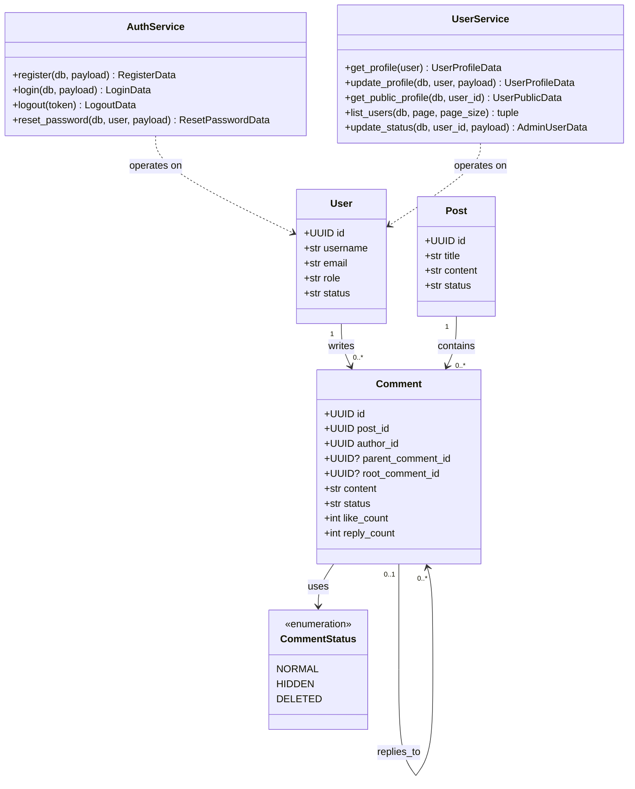
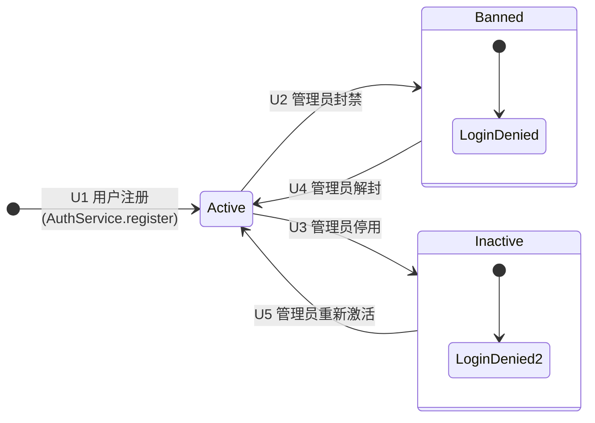
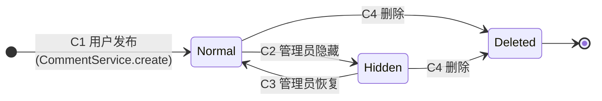
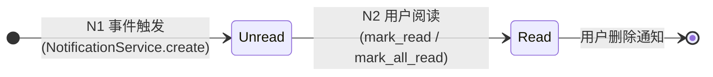

# 组件设计（详细设计）

> 本文档描述 Campus Bulletin Board System 各子系统内部模块的实现方案，涵盖设计元素确立、核心用例实现、精化类设计与对象状态建模四个部分。

---

## 1. 子系统内部设计元素确立

### 1.1 后端分层架构

本系统后端采用经典的三层架构（Three-Tier Architecture），将关注点严格分离为控制层（Router）、业务层（Service）和数据访问层（Model/DAO），各层之间通过依赖注入（Dependency Injection）实现松耦合。各层的职责与设计约束如下表所示。

| 层次 | 对应目录 | 职责 | 依赖方向 |
|:---|:---|:---|:---|
| **控制层** (Router) | `routers/` | 接收 HTTP 请求，校验输入参数，调用业务层，组装响应 | → Service + Schema + Deps |
| **业务层** (Service) | `services/` | 实现核心业务规则，编排事务，协调多个数据访问对象 | → Model + Schema |
| **数据访问层** (Model/DAO) | `models/` | 映射数据库表结构为 ORM 实体，封装持久化逻辑 | → database.py (Engine) |
| **横切关注点** (Cross-cutting) | `deps/`, `utils/`, `schemas/` | 认证鉴权、密码哈希、缓存、请求/响应数据结构定义 | 被各层单向引用 |

上述分层遵循**单向依赖原则**：上层可依赖下层，下层不可反向依赖上层。具体而言，Router 可依赖 Service 和 Model；Service 可依赖 Model；Model 不依赖任何上层模块。横切模块（`schemas`、`utils`、`deps`）被各层共同依赖，但其本身不依赖任何业务层。

### 1.2 帖子管理子系统的设计元素

以"帖子管理子系统"为例，依据 9.3 节的设计元素确立方法，识别出以下核心设计元素。

**控制层元素：**

| 元素 | 类型 | 职责描述 |
|:---|:---|:---|
| `PostRouter` | APIRouter 实例 | 定义帖子相关 RESTful 端点（CRUD + 置顶/加精），绑定路径、HTTP 方法与响应模型；本身不含业务逻辑，所有请求委托 `PostService` 处理 |
| `get_current_user` | 依赖注入函数 | 从请求头 Bearer Token 解析当前用户身份，注入路由处理函数 |
| `get_db` | 依赖注入函数 | 为每个请求创建独立的数据库会话，请求结束后自动释放 |

**业务层元素：**

| 元素 | 类型 | 职责描述 |
|:---|:---|:---|
| `PostService` | 业务服务类 | 封装帖子相关的全部业务逻辑：创建帖子时自动设置作者与发布时间；查询帖子时预加载作者信息并按置顶优先排序；更新帖子时校验字段变更集；软删除帖子时同步设置删除时间与状态标记 |

**数据访问层元素：**

| 元素 | 类型 | 职责描述 |
|:---|:---|:---|
| `Post` | ORM 实体类 | 映射 `posts` 表，定义字段、约束、外键及与 User/Board 的双向关联关系 |
| `PostStatus` | 枚举类 | 定义帖子生命周期状态常量：`NORMAL`（正常）、`HIDDEN`（隐藏）、`DELETED`（已删除） |

**数据传输元素：**

| 元素 | 类型 | 职责描述 |
|:---|:---|:---|
| `PostCreate` | 请求 Schema | 约束创建帖子的入参字段：`title`（标题）、`content`（正文）、`board_id`（目标板块） |
| `PostUpdate` | 请求 Schema | 约束更新帖子的可选入参字段，所有字段均非必填，仅提交变更部分 |
| `PostRead` | 响应 Schema | 定义帖子查询的出参结构，含嵌套的作者摘要 `AuthorInfo` 及 `from_attributes=True` 以支持 ORM 实例直接序列化 |

**子系统内部协作**：当客户端发起 `PATCH /api/v1/posts/{id}` 请求时，控制流依次经过 `PostRouter.update_post()` → `get_current_user`（鉴权）→ `PostService.get_by_id()`（查询实体）→ 权限校验（作者或管理员）→ `PostService.update()`（部分更新并持久化）→ 返回 `PostRead` 响应。各元素间的调用严格沿 Router → Service → Model 方向进行，不存在跨层直接访问。

### 1.3 认证子系统的设计元素

认证子系统负责用户身份的生命周期管理，涵盖注册、登录、登出及密码重置四个核心场景。其设计元素如下。

**控制层元素：**

| 元素 | 类型 | 职责描述 |
|:---|:---|:---|
| `AuthRouter` | APIRouter 实例 | 定义认证类 RESTful 端点，注册 OAuth2 密码凭证流（`OAuth2PasswordBearer`），所有请求委托 `AuthService` 处理 |
| `oauth2_scheme` | OAuth2PasswordBearer 实例 | 从请求头提取 Bearer Token，tokenUrl 指向 `/api/v1/auth/login` |

**业务层元素：**

| 元素 | 类型 | 职责描述 |
|:---|:---|:---|
| `AuthService` | 业务服务类 | 封装认证全流程：注册时校验用户名/邮箱唯一性并哈希密码；登录时支持用户名或邮箱双标识、校验密码并签发 JWT；登出时计算 Token 剩余有效期并写入 Redis 黑名单；密码重置时校验旧密码并写回新哈希 |

**数据访问层元素：**

| 元素 | 类型 | 职责描述 |
|:---|:---|:---|
| `User` | ORM 实体类 | 映射 `users` 表，存储用户身份凭证与状态信息 |

**数据传输元素：**

| 元素 | 类型 | 职责描述 |
|:---|:---|:---|
| `RegisterRequest` | 请求 Schema | 注册入参：`username`(3–32)、`email`(EmailStr)、`password`(≥8)、`nickname`(可选) |
| `LoginRequest` | 请求 Schema | 登录入参：`account`（用户名或邮箱）、`password` |
| `LoginData` | 响应 Schema | 登录出参：`access_token`、`token_type`("bearer")、`expires_in`(秒)、用户摘要 |
| `ResetPasswordRequest` | 请求 Schema | 改密入参：`old_password`、`new_password`(≥8) |

**横切元素：**

| 元素 | 类型 | 职责描述 |
|:---|:---|:---|
| `get_current_user` | 依赖注入函数 | JWT 认证链：校验黑名单 → 解码 Token → 查询用户 → 校验非封禁状态 → 返回 User 实例 |
| `require_admin` | 依赖注入函数 | 在 `get_current_user` 基础上追加 `role=="admin"` 校验 |
| `hash_password / verify_password` | 工具函数 | 基于 pwdlib `PasswordHash.recommended()` 的密码哈希与验证 |

### 1.4 管理后台子系统的设计元素

管理后台子系统为管理员提供用户管理、板块管理和系统统计功能，所有路由全局注入 `require_admin` 依赖。

**控制层元素：**

| 元素 | 类型 | 职责描述 |
|:---|:---|:---|
| `AdminRouter` | APIRouter 实例 | 定义管理类端点，全局依赖 `require_admin`，自身不含业务逻辑 |

**业务层元素：**

| 元素 | 类型 | 职责描述 |
|:---|:---|:---|
| `UserService` | 业务服务类 | 提供用户列表分页查询（管理视图）及用户状态变更（封禁/解封） |
| `BoardService` | 业务服务类 | 封装板块 CRUD 全部业务逻辑：`get_all`（按 sort_order 排序）、`get_by_id`、`get_by_slug`、`create`、`update`（部分更新）、`remove`（软删除） |

**数据传输元素：**

| 元素 | 类型 | 职责描述 |
|:---|:---|:---|
| `AdminStatsResponse` | 响应 Schema | 系统统计：`total_users`、`total_posts`、`total_comments`、`new_posts_today` |
| `BoardCreate` | 请求 Schema | 创建板块入参：`name`、`slug`、`description`(可选)、`sort_order` |
| `BoardUpdate` | 请求 Schema | 更新板块入参：全部字段可选，仅提交变更部分 |

**数据访问层元素：** 复用 `User`、`Board`、`Post`、`Comment` 四个 ORM 实体类。

### 1.5 评论与互动子系统的设计元素

评论与互动子系统负责帖子下的评论发布、楼中楼回复及点赞/取消点赞。当前子系统处于设计阶段，路由骨架已建立但业务逻辑尚未实现，以下为完整设计。

**控制层元素：**

| 元素 | 类型 | 职责描述 |
|:---|:---|:---|
| `CommentRouter` | APIRouter 实例 | 定义评论端点：按帖子列出评论、创建评论（一级/回复）、删除评论 |
| `LikeRouter` | APIRouter 实例 | 定义点赞端点：帖子点赞/取消、评论点赞/取消，支持乐观更新 |

**业务层元素：**

| 元素 | 类型 | 职责描述 |
|:---|:---|:---|
| `CommentService` | 业务服务类 | 创建一级评论（设置 root_comment_id 指向自身）；创建回复（继承 parent_comment_id 和 root_comment_id）；查询帖子评论列表（按时间排序，含嵌套回复组装）；软删除评论；同步更新帖子 comment_count 和父评论 reply_count |
| `LikeService` | 业务服务类 | 处理帖子/评论点赞与取消；写入/删除 post_likes 或 comment_likes 记录；同步更新目标对象的 like_count 计数器；确保同一用户对同一对象仅可点赞一次（UNIQUE 约束） |

**数据访问层元素：**

| 元素 | 类型 | 职责描述 |
|:---|:---|:---|
| `Comment` | ORM 实体类 | 映射 `comments` 表，支持自引用嵌套（parent_comment_id / root_comment_id） |
| `PostLike` | ORM 实体类 | 映射 `post_likes` 表，联合唯一约束 `(post_id, user_id)` |
| `CommentLike` | ORM 实体类 | 映射 `comment_likes` 表，联合唯一约束 `(comment_id, user_id)` |
| `CommentStatus` | 枚举类 | 定义评论生命周期状态：`NORMAL`、`HIDDEN`、`DELETED` |

**数据传输元素：**

| 元素 | 类型 | 职责描述 |
|:---|:---|:---|
| `CommentCreate` | 请求 Schema | 评论入参：`content`、`parent_comment_id`(可选，指定时表示回复) |
| `CommentRead` | 响应 Schema | 评论出参：含嵌套作者信息、点赞数、回复数、子回复列表 |

### 1.6 通知与消息子系统的设计元素

通知与消息子系统监听系统事件（评论、回复、点赞），生成通知记录并推送给目标用户，支持未读计数与已读管理。当前处于设计阶段。

**控制层元素：**

| 元素 | 类型 | 职责描述 |
|:---|:---|:---|
| `NotificationRouter` | APIRouter 实例 | 定义通知端点：获取通知列表、获取未读计数、单条已读标记、全部已读标记 |

**业务层元素：**

| 元素 | 类型 | 职责描述 |
|:---|:---|:---|
| `NotificationService` | 业务服务类 | 事件监听与通知生成（根据事件类型匹配通知模板）；通知列表查询（按接收人过滤、未读优先、时间倒序）；未读计数实时查询；单条/批量已读标记（设置 read_at 时间戳） |

**数据访问层元素：**

| 元素 | 类型 | 职责描述 |
|:---|:---|:---|
| `Notification` | ORM 实体类 | 映射 `notifications` 表，存储通知类型、标题、内容、关联对象、已读状态 |

**数据传输元素：**

| 元素 | 类型 | 职责描述 |
|:---|:---|:---|
| `NotificationRead` | 响应 Schema | 通知出参：`id`、`type`、`title`、`content`、`related_type`、`related_id`、`is_read`、`created_at` |

**事件-通知映射表**（由 `NotificationService` 在 CommentService/LikeService 调用后触发）：

| 触发事件 | 通知类型 | 接收人 | 通知内容模板 |
|:---------|:---------|:-------|:-------------|
| 用户 A 评论了用户 B 的帖子 | `comment` | B (帖子作者) | "{A.nickname} 评论了你的帖子 {post.title}" |
| 用户 A 回复了用户 B 的评论 | `reply` | B (被回复者) | "{A.nickname} 回复了你的评论" |
| 用户 A 点赞了用户 B 的帖子 | `like` | B (帖子作者) | "{A.nickname} 赞了你的帖子" |
| 用户 A 点赞了用户 B 的评论 | `like` | B (评论作者) | "{A.nickname} 赞了你的评论" |

### 1.7 搜索与推荐子系统的设计元素

搜索与推荐子系统是迭代二/三目标，MVP 阶段不实现。本节给出完整设计以保持系统设计文档的完整性。

**控制层元素：**

| 元素 | 类型 | 职责描述 |
|:---|:---|:---|
| `SearchRouter` | APIRouter 实例 | 定义搜索端点：关键词全文搜索（帖子标题+正文）、按板块/时间范围筛选、热门排序 |

**业务层元素：**

| 元素 | 类型 | 职责描述 |
|:---|:---|:---|
| `SearchService` | 业务服务类 | 接收用户查询关键词，构建 SQL 全文搜索（PostgreSQL `ts_vector` 或 ILIKE 模糊匹配）；支持按板块筛选、时间范围过滤、按热度/时间排序；记录搜索日志供推荐算法使用 |
| `RecommendationService` | 业务服务类 | 基于协同过滤或内容相似度推荐热门/相关帖子；`get_trending(limit)` 返回近期高互动帖子；`get_related(post_id, limit)` 返回同板块或同标签的相关帖子 |

**数据访问层元素：**

| 元素 | 类型 | 职责描述 |
|:---|:---|:---|
| `SearchLog` | ORM 实体类（待建） | 记录用户搜索历史：`user_id`、`keyword`、`searched_at`，用于趋势分析和个性化推荐 |

**数据传输元素：**

| 元素 | 类型 | 职责描述 |
|:---|:---|:---|
| `SearchRequest` | 请求 Schema | 搜索入参：`keyword`(必填)、`board_id`(可选)、`start_date/end_date`(可选)、`sort_by`(relevance/hot/new)、`page/page_size` |
| `SearchResult` | 响应 Schema | 搜索结果项：帖子摘要 + 相关性评分/高亮片段 |
| `TrendingPost` | 响应 Schema | 热门帖子摘要（含热度分），用于首页推荐位 |

**搜索与推荐技术选型（设计阶段）**：

| 阶段 | 方案 | 说明 |
|:---|:---|:---|
| MVP 后第一迭代（全文搜索） | PostgreSQL `ts_vector` + GIN 索引 | 中文分词可用 `zhparser` 扩展或 jieba 分词后存储 |
| 后续迭代（推荐） | 基于交互数据的协同过滤（隐式反馈：点赞、评论、浏览） | 可离线计算帖子相似度矩阵，在线实时查询 |

---

## 2. 核心用例实现方案

### 2.1 用例一：发布帖子（Create Post）

**用例名称**：发布帖子（Create Post）

**参与者**：已认证用户（Authenticated User）

**前置条件**：
1. 用户已登录且持有有效 JWT 令牌
2. 用户状态为 `active`（未被封禁或停用）
3. 目标板块存在且处于启用状态

**后置条件**：
1. 系统创建一条新的帖子记录，状态为 `normal`，`published_at` 记录当前时间
2. 帖子关联当前用户为作者、关联指定板块为所属板块
3. 返回完整的帖子信息（含作者摘要）

### 2.2 实现逻辑步骤

发布帖子用例的实现分为五个阶段，共八个步骤。以下结合代码层说明每一步的具体操作。

**阶段一：请求准入（步骤 1）**

FastAPI 接收到 `POST /api/v1/posts` 请求后，首先由 `get_current_user` 依赖函数执行准入控制：(a) 从 `Authorization` 头提取 Bearer Token；(b) 查询 Redis 黑名单，若 Token 已被登出则拒绝；(c) 解码 JWT 提取 `sub`（用户 ID）；(d) 查询 User 表确认用户存在且状态非 `banned`。任一步骤失败则返回 401 或 403，请求终止。

**阶段二：输入校验（步骤 2–3）**

Pydantic 自动将请求体反序列化为 `PostCreate` 实例，校验 `title`（字符串）、`content`（字符串）、`board_id`（UUID 格式）的类型与必填约束。若校验失败，FastAPI 自动返回 422 及字段级错误详情，无需手动编写校验代码。

**阶段三：数据封装（步骤 4）**

Router 将校验后的 `PostCreate` 对象及从 Token 中解析出的 `author_id` 传入 `PostService.create()`。Service 层调用 `obj_in.model_dump()` 获取字段字典，与 `author_id` 及 `published_at=datetime.now()` 合并，构造 `Post` ORM 实例。

**阶段四：持久化（步骤 5–6）**

`Post` 实例通过 `db.add()` 加入 SQLAlchemy 会话，随后 `db.commit()` 将 INSERT 语句发送至 PostgreSQL 执行。数据库自动生成主键 UUID（由 ORM 默认值 `uuid.uuid4()` 提供），触发器写入 `created_at` 和 `updated_at` 时间戳。`db.refresh()` 重新加载实例以获取数据库生成的完整字段。

**阶段五：响应输出（步骤 7–8）**

`PostService.create()` 将持久化后的 `Post` ORM 实例返回给 Router。FastAPI 根据路由声明的 `response_model=ApiResponse[PostRead]`，将 ORM 实例序列化为 `PostRead` Schema（通过 `from_attributes=True` 自动映射字段），嵌套的 `author` 关系被序列化为 `AuthorInfo` 对象，最终包装为 `{code: 201, message: "success", data: {...}}` 格式的 JSON 响应。

### 2.3 业务层实现伪代码

以下伪代码展示 `PostService.create()` 方法的核心逻辑，对应上述步骤 4–6，体现了业务层如何协调 ORM 实体与数据库会话。

```python
class PostService:
    """帖子业务服务 —— 封装帖子生命周期所有业务规则。"""

    def create(
        self,
        db: Session,
        *,
        obj_in: PostCreate,    # Pydantic 校验后的输入数据
        author_id: UUID        # 由 Router 从 JWT 中提取的作者标识
    ) -> Post:
        """
        创建帖子并持久化到数据库。

        前置条件：author_id 对应的用户已通过认证且状态为 active。
        后置条件：数据库 posts 表中新增一行，published_at 置为当前时刻。
        返回值：  数据库刷新后的 Post ORM 实例（含生成的主键和时间戳）。
        """
        # 步骤 4：将输入 Schema 字段与系统自动填充字段合并，构造 ORM 对象
        db_obj = Post(
            **obj_in.model_dump(),      # 展开 title, content, board_id
            author_id=author_id,        # 从 JWT 中提取的作者
            published_at=datetime.now()  # 自动设为当前时间
        )

        # 步骤 5：加入会话（INSERT 进入待提交队列）
        db.add(db_obj)

        # 步骤 6：提交事务（数据库执行 INSERT，生成 UUID 和时间戳）
        db.commit()

        # 步骤 6a：重新加载实例以同步数据库生成的默认值
        db.refresh(db_obj)

        # 步骤 7：返回已持久化的 ORM 实例（Router 层负责序列化输出）
        return db_obj
```

该设计体现了单一职责原则：`PostService` 仅关注帖子创建的业务逻辑（数据组装、持久化时机、默认值策略），而输入校验由 Pydantic（`PostCreate` Schema）完成，鉴权由 `deps/auth.py`（`get_current_user`）完成，响应序列化由 FastAPI 框架（`response_model`）完成。

### 2.4 用例二：管理员封禁用户（Admin Ban User）

**用例名称**：管理员封禁用户

**参与者**：管理员（Admin）

**前置条件**：
1. 管理员已登录且持有有效 JWT 令牌
2. 管理员角色为 `admin`
3. 目标用户存在且未被软删除

**后置条件**：
1. 目标用户的 `status` 字段变更为 `"banned"`
2. 目标用户无法再登录（`AuthService.login()` 拒绝非 `active` 状态用户）

**实现逻辑步骤**：

**阶段一：权限准入** — `require_admin` 依赖函数在 `get_current_user` 基础上追加角色校验：(a) 提取并校验 Bearer Token；(b) 确认当前用户角色为 `"admin"`，否则返回 403。

**阶段二：输入校验** — FastAPI 将 URL 路径参数 `{id}` 和请求体反序列化为 `UpdateUserStatusRequest`（含正则校验 `^(active|inactive|banned)$`）。若 `id` 非合法 UUID 格式或状态值不符正则，自动返回 422。

**阶段三：实体定位** — `UserService.update_status()` 将字符串 `user_id` 转换为 `UUID` 对象；若转换失败则返回 404。随后查询 User 表（过滤 `deleted_at IS NULL`），目标不存在同样返回 404。

**阶段四：状态变更与持久化** — 将 `user.status` 赋值为 `payload.status`，调用 `db.add(user)` 与会话，`db.commit()` 提交 UPDATE 至 PostgreSQL，触发器自动刷新 `updated_at`。

**阶段五：响应输出** — 返回 `AdminUserData` Schema（含 `id`、`username`、`email`、`role`、`status`、`last_login_at`、`created_at`），包装为 `ApiResponse[AdminUserData]` 格式的 JSON 响应。

**业务层实现伪代码**：

```python
class UserService:
    def update_status(
        self, db: Session, user_id: str, payload: UpdateUserStatusRequest
    ) -> AdminUserData:
        # 阶段三：字符串 → UUID，定位用户实体
        try:
            uid = UUID(user_id)
        except ValueError:
            raise HTTPException(status_code=404, detail="User not found")

        user = db.query(User).filter(
            User.id == uid, User.deleted_at.is_(None)
        ).first()
        if not user:
            raise HTTPException(status_code=404, detail="User not found")

        # 阶段四：变更状态并持久化
        user.status = payload.status
        db.add(user)
        db.commit()
        db.refresh(user)

        # 阶段五：返回管理视图数据
        return AdminUserData(
            id=str(user.id),
            username=user.username,
            email=user.email,
            nickname=user.nickname,
            avatar_url=user.avatar_url,
            role=user.role,
            status=user.status,
            last_login_at=user.last_login_at.isoformat() if user.last_login_at else None,
            created_at=user.created_at.isoformat(),
        )
```

该用例展示了不同于"创建帖子"的控制流模式：Service 层自行校验实体存在性并在失败时抛出 HTTP 异常（而非 Router 层校验），体现了"异常即控制流"的 FastAPI 惯用模式。

---

## 3. 精化类设计与类间关系

### 3.1 类间关系概述

帖子管理子系统的核心域类包括 `User`（用户）、`Board`（板块）和 `Post`（帖子）。它们之间的关联关系如下：

| 关联方向 | 关系类型 | 多重性 | ORM 实现 | 业务语义 |
|:---|:---|:---|:---|:---|
| User → Post | 双向一对多 | 1 : 0..* | `User.posts: list[Post]` ↔ `Post.author: User` | 一个用户可以发布零或多篇帖子；每篇帖子有且仅有一个作者 |
| Board → Post | 双向一对多 | 1 : 0..* | `Board.posts: list[Post]` ↔ `Post.board: Board` | 一个板块可以包含零或多篇帖子；每篇帖子属于且仅属于一个板块 |

上述两种关联均为**组合关系（Composition）**的弱化形式——帖子生命周期独立于用户（删除用户时不级联删除帖子，采用软删除保留数据），但帖子必须归属于某个板块。此外，控制类 `PostService` 与实体类 `Post` 之间为**依赖关系（Dependency）**——Service 方法接收 `Post` 实例作为参数或返回值，但不持有持久引用。

### 3.2 核心类精化

以下依次精化 `User`、`Board`、`Post` 三个实体类及 `PostService` 控制类，列出完整的属性与方法签名。

**User（用户实体）** —— 映射 `users` 表。

| 成员 | 可见性 | 类型 | 说明 |
|:---|:---|:---|:---|
| `id` | public | `UUID` | 主键，`gen_random_uuid()` 生成 |
| `username` | public | `str(32)` | 用户名，唯一约束，NOT NULL |
| `email` | public | `str(255)` | 邮箱地址，唯一约束，NOT NULL |
| `password_hash` | public | `str(255)` | 密码哈希值，NOT NULL |
| `nickname` | public | `str(64) \| None` | 展示昵称，可为空 |
| `avatar_url` | public | `str(1024) \| None` | 头像 URL，可为空 |
| `role` | public | `str(20)` | 角色，CHECK `'user' \| 'admin'`，默认 `'user'` |
| `status` | public | `str(20)` | 状态，CHECK `'active' \| 'inactive' \| 'banned'`，默认 `'active'` |
| `last_login_at` | public | `datetime \| None` | 最后登录时间 |
| `created_at` | public | `datetime(tz)` | 创建时间，`server_default=now()` |
| `updated_at` | public | `datetime(tz)` | 更新时间，`onupdate=now()` |
| `deleted_at` | public | `datetime(tz) \| None` | 软删除时间 |
| `posts` | public | `list[Post]` | 关联的帖子集合（ORM relationship） |

**Board（板块实体）** —— 映射 `boards` 表。

| 成员 | 可见性 | 类型 | 说明 |
|:---|:---|:---|:---|
| `id` | public | `UUID` | 主键 |
| `name` | public | `str(64)` | 板块名称，唯一约束，NOT NULL |
| `slug` | public | `str(64)` | URL 标识，唯一约束，NOT NULL |
| `description` | public | `str(255) \| None` | 板块描述，可为空 |
| `sort_order` | public | `int` | 排序值（越小越靠前），默认 0 |
| `created_at` / `updated_at` / `deleted_at` | （继承自 TimestampMixin） | | |
| `posts` | public | `list[Post]` | 关联的帖子集合（ORM relationship） |

**Post（帖子实体）** —— 映射 `posts` 表。

| 成员 | 可见性 | 类型 | 说明 |
|:---|:---|:---|:---|
| `id` | public | `UUID` | 主键 |
| `title` | public | `str(255)` | 帖子标题，NOT NULL |
| `content` | public | `str(Text)` | 帖子正文（纯文本内容），NOT NULL |
| `author_id` | public | `UUID` | 外键 → `users.id`，NOT NULL |
| `board_id` | public | `UUID` | 外键 → `boards.id`，NOT NULL |
| `is_pinned` | public | `bool` | 是否置顶，默认 `False` |
| `is_featured` | public | `bool` | 是否加精，默认 `False` |
| `status` | public | `str(20)` | 生命周期状态，默认 `"normal"` |
| `published_at` | public | `datetime(tz)` | 发布时间，默认当前时刻 |
| `created_at` / `updated_at` / `deleted_at` | （继承自 TimestampMixin） | | |
| `author` | public | `User` | 多对一关联到 User |
| `board` | public | `Board` | 多对一关联到 Board |

**PostService（帖子业务控制类）** —— 无状态，方法级依赖 `Session`。

| 方法签名 | 返回值 | 职责 |
|:---|:---|:---|
| `create(db: Session, *, obj_in: PostCreate, author_id: UUID)` | `Post` | 构造并持久化新帖子 |
| `get_multi(db: Session, *, board_id: UUID \| None, page: int, page_size: int)` | `tuple[list[Post], int]` | 分页查询帖子列表，支持按板块筛选，置顶优先排序，预加载作者信息，返回 `(items, total)` |
| `get_by_id(db: Session, id: UUID)` | `Post \| None` | 按主键查询单个帖子，预加载作者，过滤已删除记录 |
| `update(db: Session, *, db_obj: Post, obj_in: PostUpdate)` | `Post` | 部分更新帖子字段（仅更新 `exclude_unset` 的字段），刷新 `updated_at` |
| `update_special_status(db: Session, *, db_obj: Post, field: str, val: bool)` | `Post` | 切换帖子特殊标记（`is_pinned` / `is_featured`） |
| `remove(db: Session, *, db_obj: Post)` | `Post` | 软删除帖子：设置 `deleted_at=now()` 且 `status=DELETED` |

### 3.3 UML 设计类图

以下 Mermaid 类图展示帖子管理子系统核心类的属性、方法及类间关系。

```mermaid
classDiagram
    direction TB

    class User {
        +UUID id
        +str username
        +str email
        +str password_hash
        +str? nickname
        +str? avatar_url
        +str role
        +str status
        +datetime? last_login_at
        +datetime created_at
        +datetime updated_at
        +datetime? deleted_at
    }

    class Board {
        +UUID id
        +str name
        +str slug
        +str? description
        +int sort_order
        +datetime created_at
        +datetime updated_at
        +datetime? deleted_at
    }

    class Post {
        +UUID id
        +str title
        +str content
        +UUID author_id
        +UUID board_id
        +bool is_pinned
        +bool is_featured
        +str status
        +datetime published_at
        +datetime created_at
        +datetime updated_at
        +datetime? deleted_at
    }

    class PostStatus {
        <<enumeration>>
        NORMAL
        HIDDEN
        DELETED
    }

    class PostCreate {
        <<schema>>
        +str title
        +str content
        +UUID board_id
    }

    class PostUpdate {
        <<schema>>
        +str? title
        +str? content
        +bool? is_pinned
        +bool? is_featured
    }

    class PostRead {
        <<schema>>
        +UUID id
        +str title
        +str content
        +UUID board_id
        +UUID author_id
        +AuthorInfo author
        +bool is_pinned
        +bool is_featured
        +datetime created_at
    }

    class PostService {
        +create(db, obj_in, author_id) Post
        +get_multi(db, board_id?, page, page_size) tuple
        +get_by_id(db, id) Post?
        +update(db, db_obj, obj_in) Post
        +update_special_status(db, db_obj, field, val) Post
        +remove(db, db_obj) Post
    }

    class PostRouter {
        <<router>>
        +POST / create_post()
        +GET / list_posts()
        +GET /{id} get_post()
        +PATCH /{id} update_post()
        +DELETE /{id} delete_post()
        +PATCH /{id}/pin pin_post()
        +PATCH /{id}/feature feature_post()
    }

    User "1" --> "0..*" Post : publishes
    Board "1" --> "0..*" Post : contains
    Post --> PostStatus : uses
    PostService ..> Post : operates on
    PostService ..> PostCreate : receives
    PostService ..> PostUpdate : receives
    PostRouter ..> PostService : delegates to
    PostRouter ..> PostRead : outputs
```

**图注**：实线空心三角箭头 `▷` 表示继承（泛化），实线空心菱形 `◇` 表示聚合，虚线箭头 `..>` 表示依赖。为简化展示，`IDMixin` 和 `TimestampMixin` 基类的属性已展开至各实体类中。

### 3.4 评论子系统类设计

评论（`Comment`）是帖子管理之外的另一个核心域类，支持楼中楼嵌套回复。其设计与 `Post` 共享 `User` 作者关联，同时自引用实现父子关系。

**Comment（评论实体）** —— 映射 `comments` 表。

| 成员 | 可见性 | 类型 | 说明 |
|:---|:---|:---|:---|
| `id` | public | `UUID` | 主键 |
| `post_id` | public | `UUID` | 外键 → `posts.id`，NOT NULL |
| `author_id` | public | `UUID` | 外键 → `users.id`，NOT NULL |
| `parent_comment_id` | public | `UUID \| None` | 外键 → `comments.id`（父评论），可为空 |
| `root_comment_id` | public | `UUID \| None` | 外键 → `comments.id`（根评论/楼层），可为空 |
| `content` | public | `str(Text)` | 评论文本内容，NOT NULL |
| `status` | public | `str(20)` | 生命周期状态，CHECK `'normal' \| 'hidden' \| 'deleted'`，默认 `"normal"` |
| `like_count` | public | `int` | 点赞数，`BIGINT DEFAULT 0` |
| `reply_count` | public | `int` | 回复数，`BIGINT DEFAULT 0` |
| `created_at` / `updated_at` / `deleted_at` | （继承自 TimestampMixin） | | |
| `author` | public | `User` | 多对一关联到 User |
| `post` | public | `Post` | 多对一关联到 Post |

**CommentStatus 枚举**：

| 常量 | 值 | 说明 |
|:---|:---|:---|
| `NORMAL` | `"normal"` | 正常可见 |
| `HIDDEN` | `"hidden"` | 被管理员隐藏 |
| `DELETED` | `"deleted"` | 软删除终态 |

**类间关系扩展**：

| 关联方向 | 关系类型 | 多重性 | 业务语义 |
|:---|:---|:---|:---|
| User → Comment | 双向一对多 | 1 : 0..* | 一个用户可以发表零或多条评论 |
| Post → Comment | 双向一对多 | 1 : 0..* | 一篇帖子可以包含零或多条评论 |
| Comment → Comment（自引用） | 一对多 | 0..1 : 0..* | 一条评论可以有零或多条子回复；一条回复有零或一个父评论 |

### 3.5 扩展 UML 设计类图（评论与认证子系统）

以下 Mermaid 类图补充展示 `Comment` 实体、`CommentStatus` 枚举、`AuthService` 控制类及其与已有类的关联关系。



**图注**：Comment 的自引用关系通过 `parent_comment_id` 外键实现，支持无限层级嵌套但在业务层限制为两层（楼中楼模式）以保证可读性和查询性能。

### 3.6 通知与点赞实体精化

**Notification（通知实体）** —— 映射 `notifications` 表。

| 成员 | 可见性 | 类型 | 说明 |
|:---|:---|:---|:---|
| `id` | public | `UUID` | 主键 |
| `recipient_id` | public | `UUID` | 外键 → `users.id`，通知接收人，NOT NULL |
| `actor_id` | public | `UUID \| None` | 外键 → `users.id`，触发操作的用户 |
| `type` | public | `str(30)` | 通知类型，CHECK `'comment' \| 'reply' \| 'like' \| 'system'` |
| `title` | public | `str(120)` | 通知标题，NOT NULL |
| `content` | public | `str(500)` | 通知内容，NOT NULL |
| `related_type` | public | `str(20) \| None` | 关联对象类型（post/comment） |
| `related_id` | public | `UUID \| None` | 关联对象 ID |
| `is_read` | public | `bool` | 是否已读，默认 `False` |
| `read_at` | public | `datetime(tz) \| None` | 已读时间 |
| `created_at` / `updated_at` / `deleted_at` | （继承自 TimestampMixin） | | |
| `recipient` | public | `User` | 多对一关联到 User |
| `actor` | public | `User` | 多对一关联到 User |

**PostLike / CommentLike（点赞实体）** —— 关系表，不含 TimestampMixin（仅创建时间）。

| 成员 | 可见性 | 类型 | 说明 |
|:---|:---|:---|:---|
| `id` | public | `UUID` | 主键 |
| `post_id / comment_id` | public | `UUID` | 外键 → 目标对象 |
| `user_id` | public | `UUID` | 外键 → `users.id`，点赞用户 |
| `created_at` | public | `datetime(tz)` | 点赞时间 |
| — | — | UNIQUE(`target_id`, `user_id`) | 同一用户对同一对象仅可点赞一次 |

**CommentService / LikeService / NotificationService（业务控制类）** —— 无状态，Session 按方法注入。

| 类 | 关键方法 | 返回值 | 职责 |
|:---|:---|:---|:---|
| `CommentService` | `create(db, *, obj_in, author_id, post_id)` | `Comment` | 创建评论（一级或回复），同步 post.comment_count 和 parent.reply_count |
| | `get_by_post(db, post_id, page, page_size)` | `tuple[list, int]` | 按帖子查询评论列表，组装树形结构 |
| | `remove(db, *, db_obj)` | `Comment` | 软删除评论 |
| `LikeService` | `like_post(db, user_id, post_id)` | `PostLike` | 点赞帖子，like_count +1，唯一性约束防重复 |
| | `unlike_post(db, user_id, post_id)` | `None` | 取消点赞，like_count -1 |
| | `like_comment / unlike_comment` | 同上 | 评论点赞/取消 |
| `NotificationService` | `create(db, *, recipient_id, actor_id, type, ...)` | `Notification` | 创建通知记录（由 CommentService/LikeService 调用） |
| | `list_for_user(db, user_id, page, page_size)` | `tuple[list, int]` | 查询用户通知列表，未读优先 |
| | `mark_read(db, notification_id)` | `None` | 标记单条已读 |
| | `mark_all_read(db, user_id)` | `None` | 批量标记已读 |
| | `get_unread_count(db, user_id)` | `int` | 查询未读通知数量 |

---

## 4. 核心对象状态设计

### 4.1 帖子生命周期状态

帖子（`Post`）是系统中生命周期最丰富的核心实体。从创建到销毁，帖子经历六种逻辑状态，由 `Post.status`（枚举字段）和 `Post.is_pinned`、`Post.is_featured`（布尔标记字段）共同描述。

| 状态 | 判定条件 | 说明 |
|:---|:---|:---|
| **草稿** (Draft) | `status = "draft"` | 用户保存但尚未发布，仅作者和管理员可见，不出现在公开列表中 |
| **正常** (Normal) | `status = "normal"`, `is_pinned = False`, `is_featured = False` | 帖子发布后的默认状态，可见于板块列表 |
| **置顶** (Pinned) | `status = "normal"`, `is_pinned = True` | 管理员置顶，在列表中以最高优先级排序 |
| **加精** (Featured) | `status = "normal"`, `is_featured = True` | 管理员加精，标记为优质内容 |
| **隐藏** (Hidden) | `status = "hidden"` | 被管理员隐藏，对普通用户不可见但保留数据 |
| **已删除** (Deleted) | `status = "deleted"`, `deleted_at ≠ NULL` | 软删除终态，数据留存但不可恢复 |

> **注**：草稿（Draft）状态当前尚未在 `PostStatus` 枚举中实现，为设计规划状态。MVP 阶段帖子创建即为发布（直接进入 Normal），草稿功能列入后续迭代。

### 4.2 状态转移规则

帖子状态转移由用户操作触发，部分操作受角色权限约束。下表列出全部合法转移及触发条件。

| 转移编号 | 源状态 | 目标状态 | 触发操作 | 权限要求 | 调用方法 |
|:---|:---|:---|:---|:---|:---|
| T0 | —（保存草稿） | Draft | 用户点击"保存草稿" | 已认证用户 | `PostService.create(status="draft")` |
| T1 | Draft | Normal | 用户点击"发布" | 作者 | `PostService.update(status="normal", published_at=now)` |
| T2 | Normal / Featured | Pinned | 管理员点击"置顶" | Admin | `PostService.update_special_status(field="is_pinned", val=True)` |
| T3 | Pinned | Normal / Featured | 管理员取消置顶 | Admin | `PostService.update_special_status(field="is_pinned", val=False)` |
| T4 | Normal / Pinned | Featured | 管理员点击"加精" | Admin | `PostService.update_special_status(field="is_featured", val=True)` |
| T5 | Featured | Normal / Pinned | 管理员取消加精 | Admin | `PostService.update_special_status(field="is_featured", val=False)` |
| T6 | Normal / Pinned / Featured | Hidden | 管理员隐藏帖子 | Admin | `PostService.update()` 将 `status` 设为 `"hidden"` |
| T7 | Hidden | Normal | 管理员恢复显示 | Admin | `PostService.update()` 将 `status` 设为 `"normal"` |
| T8 | 任意非删除状态 | Deleted | 作者删除 / 管理员删除 | 作者或 Admin | `PostService.remove()`（设置 `deleted_at` 和 `status="deleted"`） |
| T9 | Draft | Deleted | 作者删除草稿 | 作者 | `PostService.remove()` |

**设计约束**：
- 置顶（Pinned）和加精（Featured）并非排他状态——一篇帖子可以同时处于置顶和加精状态（`is_pinned=True ∧ is_featured=True`）。
- 隐藏（Hidden）期间，帖子的置顶/加精标记保持不变，恢复显示时可还原。
- 已删除（Deleted）为终态，系统不提供恢复接口；如需恢复须由管理员直接操作数据库。
- 状态转移 T2–T7 的前置条件是帖子未被软删除（`deleted_at IS NULL`），该校验在 `PostService.get_by_id()` 的查询条件中完成：若帖子已删除，查询返回 `None`，Router 层返回 404，转移不会执行。

### 4.3 状态机图

以下 Mermaid 状态图描述帖子对象在整个生命周期中的状态变迁。

```mermaid
stateDiagram-v2
    direction LR

    [*] --> Draft : T0 保存草稿
    Draft --> Normal : T1 用户发布<br/>(publish)
    Draft --> Deleted : T9 删除草稿

    [*] --> Normal : T1 直接发布<br/>(PostService.create)

    state Normal {
        [*] --> Plain
        state Plain : 普通帖
    }

    state "置顶 + 加精 可叠加" as Decorated {
        state Pinned : 置顶<br/>is_pinned=true
        state Featured : 加精<br/>is_featured=true
        state PinnedAndFeatured : 置顶且加精<br/>is_pinned=true<br/>is_featured=true
    }

    Normal --> Pinned : T2 管理员置顶
    Normal --> Featured : T4 管理员加精
    Pinned --> Normal : T3 取消置顶
    Featured --> Normal : T5 取消加精
    Pinned --> PinnedAndFeatured : T4 加精
    Featured --> PinnedAndFeatured : T2 置顶
    PinnedAndFeatured --> Featured : T3 取消置顶
    PinnedAndFeatured --> Pinned : T5 取消加精

    Normal --> Hidden : T6 管理员隐藏
    Pinned --> Hidden : T6 管理员隐藏
    Featured --> Hidden : T6 管理员隐藏
    PinnedAndFeatured --> Hidden : T6 管理员隐藏
    Hidden --> Normal : T7 管理员恢复

    Normal --> Deleted : T8 删除
    Pinned --> Deleted : T8 删除
    Featured --> Deleted : T8 删除
    PinnedAndFeatured --> Deleted : T8 删除
    Hidden --> Deleted : T8 删除

    Deleted --> [*]
```

**图注**：`Normal` 状态内部包含一个子状态 `Plain`（普通帖），`is_pinned` 和 `is_featured` 两个布尔标记可在 Normal 状态下叠加组合形成四种可见性变体，图中将其独立绘制为 `Pinned`、`Featured` 及 `PinnedAndFeatured` 以展示状态转移路径。`Hidden` 状态下同样保留置顶/加精标记，恢复时还原。`Deleted` 为吸收态（Absorbing State），一旦进入不可离开。

### 4.4 用户对象状态设计

**用户生命周期状态**：用户（`User`）的状态由 `status` 字段控制，数据库 CHECK 约束限定了三种合法取值。用户状态变更仅能由管理员操作触发（普通用户无权自行变更）。

| 状态 | 判定条件 | 说明 |
|:---|:---|:---|
| **活跃** (Active) | `status = "active"` | 注册后的默认状态，可正常登录和使用系统 |
| **停用** (Inactive) | `status = "inactive"` | 由管理员手动停用，登录时被 `AuthService.login()` 拒绝（返回 403） |
| **封禁** (Banned) | `status = "banned"` | 由管理员封禁，登录被拒绝且 `get_current_user` 也会拦截现有 Token（返回 403） |

**用户状态转移规则**：

| 转移编号 | 源状态 | 目标状态 | 触发操作 | 权限要求 | 调用方法 |
|:---|:---|:---|:---|:---|:---|
| U1 | —（注册） | Active | 用户注册成功 | 公开 | `AuthService.register()` |
| U2 | Active | Banned | 管理员封禁用户 | Admin | `UserService.update_status(status="banned")` |
| U3 | Active | Inactive | 管理员停用用户 | Admin | `UserService.update_status(status="inactive")` |
| U4 | Banned | Active | 管理员解封用户 | Admin | `UserService.update_status(status="active")` |
| U5 | Inactive | Active | 管理员重新激活用户 | Admin | `UserService.update_status(status="active")` |

**用户状态机图**：



**图注**：`Active` 为正常运作状态，`Banned` 和 `Inactive` 均为受限状态——处于这两个状态的用户无法登录（`AuthService.login()` 返回 403 `"User is banned/inactive"`），但已签发的 JWT 在封禁前不会自动失效；`get_current_user` 在每次请求时校验 `status != "banned"` 作为补充拦截。与 Post 不同，User 不使用软删除（`deleted_at`），因为账户数据需长期留存以备审计。

### 4.5 评论对象状态设计

**评论生命周期状态**：评论（`Comment`）的状态由 `status` 字段控制，其状态流转模式与帖子高度一致但更为简化——评论不支持置顶与加精标记，仅包含基本的三态生命周期。

| 状态 | 判定条件 | 说明 |
|:---|:---|:---|
| **正常** (Normal) | `status = "normal"` | 评论发布后的默认状态，对用户可见 |
| **隐藏** (Hidden) | `status = "hidden"` | 被管理员隐藏，对普通用户不可见但保留数据 |
| **已删除** (Deleted) | `status = "deleted"`, `deleted_at ≠ NULL` | 软删除终态，数据留存但不可恢复 |

**评论状态转移规则**：

| 转移编号 | 源状态 | 目标状态 | 触发操作 | 权限要求 | 调用方法 |
|:---|:---|:---|:---|:---|:---|
| C1 | —（创建） | Normal | 用户发布评论/回复 | 已认证用户 | `CommentService.create()` |
| C2 | Normal | Hidden | 管理员隐藏评论 | Admin | `CommentService.update(status="hidden")` |
| C3 | Hidden | Normal | 管理员恢复显示 | Admin | `CommentService.update(status="normal")` |
| C4 | Normal / Hidden | Deleted | 作者删除 / 管理员删除 | 作者或 Admin | `CommentService.remove()` |

**评论状态机图**：



**图注**：`Deleted` 为吸收态，一旦进入不可离开。与 Post 不同，Comment 不存在置顶/加精的附加状态标记，状态机更为简洁。

### 4.6 通知对象状态设计

**通知生命周期状态**：通知（`Notification`）的状态由 `is_read` 布尔字段和 `read_at` 时间戳字段共同描述，生命周期极简——仅包含未读和已读两个语义状态。

| 状态 | 判定条件 | 说明 |
|:---|:---|:---|
| **未读** (Unread) | `is_read = False`, `read_at = NULL` | 通知已生成但用户尚未查阅，前端显示未读红点 |
| **已读** (Read) | `is_read = True`, `read_at ≠ NULL` | 用户已点击查阅，红点消失 |

**通知状态转移规则**：

| 转移编号 | 源状态 | 目标状态 | 触发操作 | 权限要求 | 调用方法 |
|:---|:---|:---|:---|:---|:---|
| N1 | —（事件触发） | Unread | 评论/回复/点赞事件发生 | 系统自动 | `NotificationService.create()` |
| N2 | Unread | Read | 用户点击通知 / 全部已读 | 通知接收人 | `NotificationService.mark_read()` / `mark_all_read()` |

**通知状态机图**：



**图注**：通知状态机的设计要点在于"写时创建、读时标记"的异步模式——通知的创建由 CommentService 和 LikeService 在完成业务操作后以同步方式调用 `NotificationService.create()` 完成，确保通知不丢失；而已读标记由前端用户交互驱动。通知不设软删除的 `deleted_at` 中间态，因为通知数据不具备恢复价值，用户删除即为物理删除。
