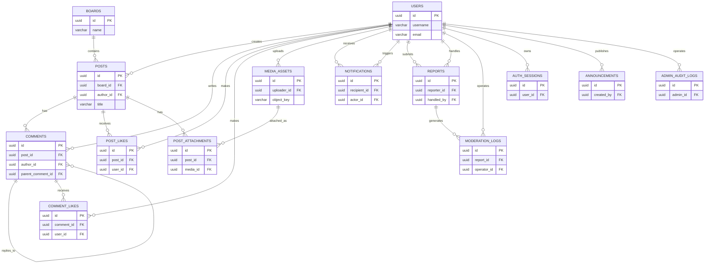

# Campus Bulletin Board System 数据库设计

## 1. 设计目标

- 数据库：PostgreSQL
- 原则：核心业务强一致（用户、帖子、评论、点赞），大文件走对象存储，数据库仅存元数据

## 2. 命名与通用约定

- 主键统一 `UUID DEFAULT gen_random_uuid()`
- 时间字段统一 `created_at / updated_at`（`TIMESTAMPTZ`）
- 软删除字段统一 `deleted_at TIMESTAMPTZ NULL`
- 计数字段统一非负 `BIGINT DEFAULT 0`

## 3. 核心关系 ER 图

## 4. 表设计
### 4.1 用户与认证

#### users - 用户表

| 字段 | 类型 | 约束 | 说明 |
| --- | --- | --- | --- |
| id | UUID | PK | 用户唯一标识 |
| username | VARCHAR(32) | UNIQUE, NOT NULL | 用户名 |
| email | VARCHAR(255) | UNIQUE, NOT NULL | 邮箱 |
| password_hash | VARCHAR(255) | NOT NULL | 密码哈希 |
| nickname | VARCHAR(64) | NOT NULL | 昵称 |
| avatar_url | VARCHAR(1024) |  | 头像 URL |
| role | VARCHAR(20) | NOT NULL, CHECK | 角色：user/admin |
| status | VARCHAR(20) | NOT NULL, CHECK | 状态：active/inactive/banned |
| last_login_at | TIMESTAMPTZ |  | 最后登录时间 |
| created_at | TIMESTAMPTZ | NOT NULL | 创建时间 |
| updated_at | TIMESTAMPTZ | NOT NULL | 更新时间 |
| deleted_at | TIMESTAMPTZ |  | 软删除时间 |

### 4.2 论坛内容

#### boards - 板块表

| 字段 | 类型 | 约束 | 说明 |
| --- | --- | --- | --- |
| id | UUID | PK | 板块唯一标识 |
| name | VARCHAR(64) | UNIQUE, NOT NULL | 板块名称 |
| slug | VARCHAR(64) | UNIQUE, NOT NULL | 板块英文标识 |
| description | VARCHAR(255) |  | 板块描述 |
| sort_order | INT | NOT NULL | 排序值（越小越靠前） |
| is_active | BOOLEAN | NOT NULL | 是否启用 |
| created_by | UUID | FK | 创建人 |
| created_at | TIMESTAMPTZ | NOT NULL | 创建时间 |
| updated_at | TIMESTAMPTZ | NOT NULL | 更新时间 |
| deleted_at | TIMESTAMPTZ |  | 软删除时间 |

#### posts - 帖子表

| 字段 | 类型 | 约束 | 说明 |
| --- | --- | --- | --- |
| id | UUID | PK | 帖子唯一标识 |
| board_id | UUID | FK, NOT NULL | 所属板块 ID |
| author_id | UUID | FK, NOT NULL | 作者 ID |
| title | VARCHAR(120) | NOT NULL | 帖子标题 |
| content_json | JSONB |  | 富文本结构化内容 |
| status | VARCHAR(20) | NOT NULL, CHECK | 状态：normal/hidden/deleted |
| is_pinned | BOOLEAN | NOT NULL | 是否置顶 |
| is_featured | BOOLEAN | NOT NULL | 是否加精 |
| like_count | BIGINT | NOT NULL, DEFAULT 0 | 点赞数 |
| comment_count | BIGINT | NOT NULL, DEFAULT 0 | 评论数 |
| view_count | BIGINT | NOT NULL, DEFAULT 0 | 浏览数 |
| published_at | TIMESTAMPTZ |  | 发布时间 |
| created_at | TIMESTAMPTZ | NOT NULL | 创建时间 |
| updated_at | TIMESTAMPTZ | NOT NULL | 更新时间 |
| deleted_at | TIMESTAMPTZ |  | 软删除时间 |

#### comments - 评论表

| 字段 | 类型 | 约束 | 说明 |
| --- | --- | --- | --- |
| id | UUID | PK | 评论唯一标识 |
| post_id | UUID | FK, NOT NULL | 所属帖子 ID |
| author_id | UUID | FK, NOT NULL | 评论作者 ID |
| parent_comment_id | UUID | FK | 父评论 ID（回复） |
| root_comment_id | UUID | FK | 根评论 ID（楼层） |
| content_json | JSONB |  | 评论富文本结构 |
| status | VARCHAR(20) | NOT NULL, CHECK | 状态：normal/hidden/deleted |
| like_count | BIGINT | NOT NULL, DEFAULT 0 | 点赞数 |
| reply_count | BIGINT | NOT NULL, DEFAULT 0 | 回复数 |
| created_at | TIMESTAMPTZ | NOT NULL | 创建时间 |
| updated_at | TIMESTAMPTZ | NOT NULL | 更新时间 |
| deleted_at | TIMESTAMPTZ |  | 软删除时间 |

### 4.3 互动与媒体

#### post_likes - 帖子点赞表

| 字段 | 类型 | 约束 | 说明 |
| --- | --- | --- | --- |
| id | UUID | PK | 记录唯一标识 |
| post_id | UUID | FK, NOT NULL | 帖子 ID |
| user_id | UUID | FK, NOT NULL | 点赞用户 ID |
| created_at | TIMESTAMPTZ | NOT NULL | 点赞时间 |

#### comment_likes - 评论点赞表

| 字段 | 类型 | 约束 | 说明 |
| --- | --- | --- | --- |
| id | UUID | PK | 记录唯一标识 |
| comment_id | UUID | FK, NOT NULL | 评论 ID |
| user_id | UUID | FK, NOT NULL | 点赞用户 ID |
| created_at | TIMESTAMPTZ | NOT NULL | 点赞时间 |

#### media_assets - 媒体资源表

| 字段 | 类型 | 约束 | 说明 |
| --- | --- | --- | --- |
| id | UUID | PK | 媒体唯一标识 |
| uploader_id | UUID | FK, NOT NULL | 上传用户 ID |
| bucket | VARCHAR(100) | NOT NULL | 对象存储桶名 |
| object_key | VARCHAR(512) | NOT NULL, UNIQUE(bucket, object_key) | 对象存储 Key |
| url | VARCHAR(1024) |  | 访问地址（可为空） |
| file_name | VARCHAR(255) | NOT NULL | 原始文件名 |
| mime_type | VARCHAR(100) | NOT NULL | 文件 MIME 类型 |
| file_size | BIGINT | NOT NULL | 文件大小（字节） |
| width | INT |  | 图片宽度 |
| height | INT |  | 图片高度 |
| sha256 | CHAR(64) |  | 文件哈希（去重） |
| source_type | VARCHAR(20) | NOT NULL, CHECK | 来源：post/comment/avatar |
| source_id | UUID |  | 关联业务 ID |
| is_public | BOOLEAN | NOT NULL | 是否公开 |
| created_at | TIMESTAMPTZ | NOT NULL | 创建时间 |
| updated_at | TIMESTAMPTZ | NOT NULL | 更新时间 |
| deleted_at | TIMESTAMPTZ |  | 软删除时间 |

#### post_attachments - 帖子附件关联表

| 字段 | 类型 | 约束 | 说明 |
| --- | --- | --- | --- |
| id | UUID | PK | 关联记录唯一标识 |
| post_id | UUID | FK, NOT NULL | 帖子 ID |
| media_id | UUID | FK, NOT NULL | 媒体 ID |
| sort_order | INT | NOT NULL | 附件排序 |
| created_at | TIMESTAMPTZ | NOT NULL | 创建时间 |

### 4.4 通知

#### notifications - 通知表

| 字段 | 类型 | 约束 | 说明 |
| --- | --- | --- | --- |
| id | UUID | PK | 通知唯一标识 |
| recipient_id | UUID | FK, NOT NULL | 接收人 ID |
| actor_id | UUID | FK | 触发人 ID |
| type | VARCHAR(30) | NOT NULL, CHECK | 类型：comment/reply/like/system |
| title | VARCHAR(120) | NOT NULL | 通知标题 |
| content | VARCHAR(500) | NOT NULL | 通知内容 |
| related_type | VARCHAR(20) |  | 关联对象类型 |
| related_id | UUID |  | 关联对象 ID |
| is_read | BOOLEAN | NOT NULL | 是否已读 |
| read_at | TIMESTAMPTZ |  | 已读时间 |
| created_at | TIMESTAMPTZ | NOT NULL | 创建时间 |
