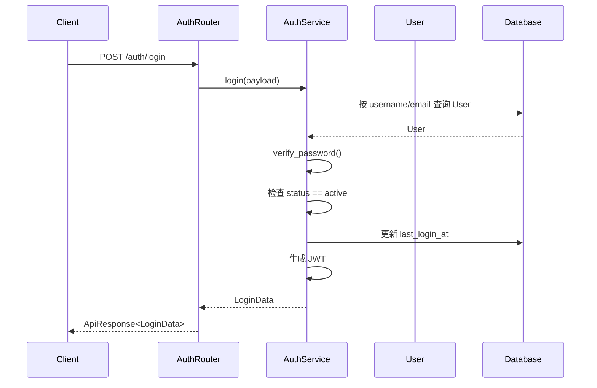
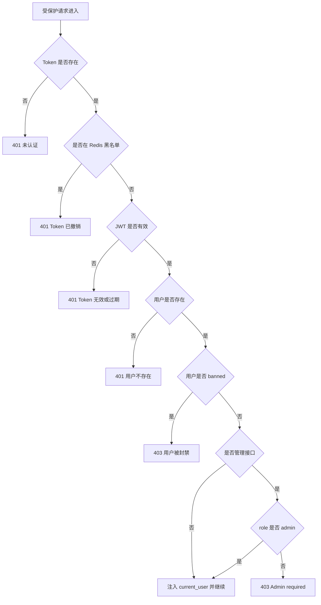
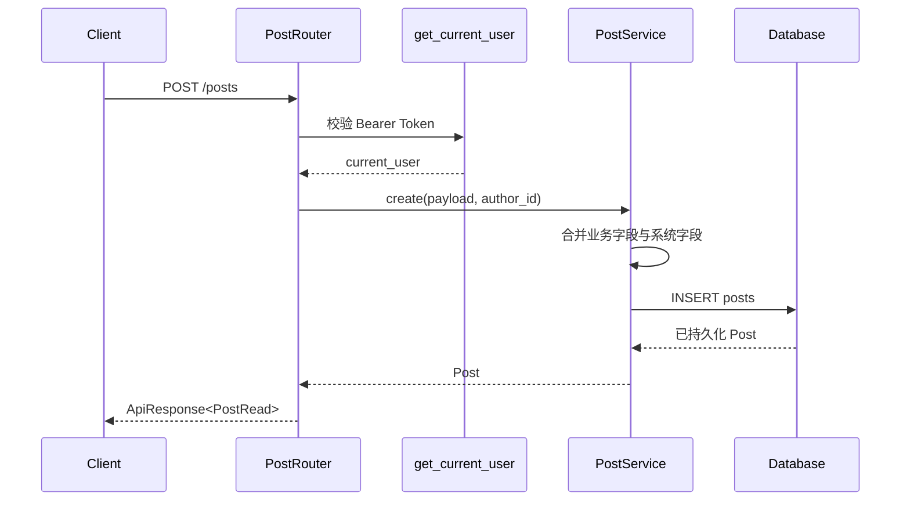
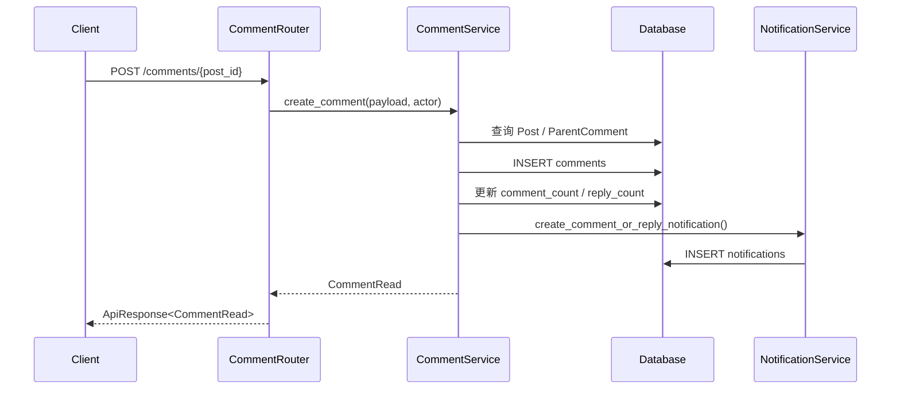
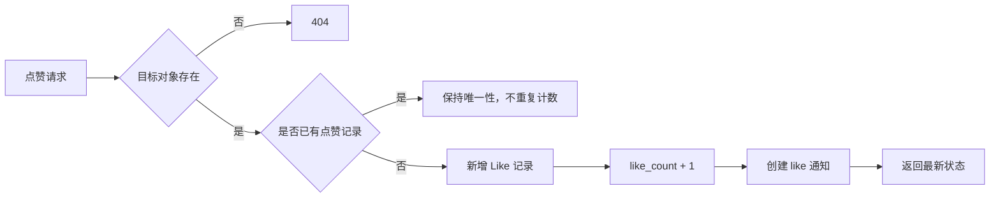
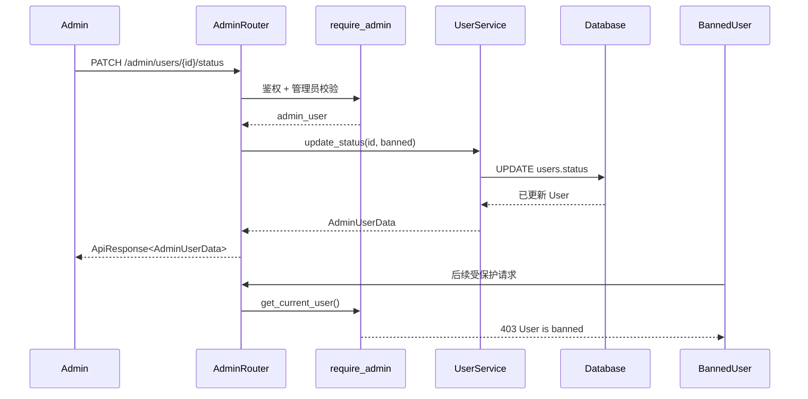
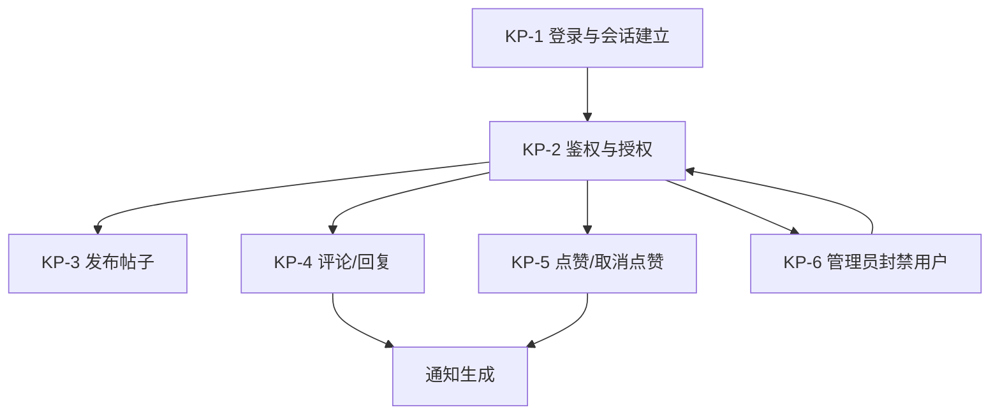

# Campus Bulletin Board System — 关键过程描述

## 一、文档目的与范围

本文档用于补充系统设计中的“关键过程描述”部分，说明系统中会穿过多个层次、改变核心业务状态或驱动跨子系统协作的业务流程。文档基于现有需求分析、组件设计、数据库设计与当前后端实现编写，重点回答以下问题：

1. 用户请求进入系统后，如何完成身份识别、权限判断与业务处理；
2. 关键对象在流程中如何变化；
3. 不同子系统之间如何协作；
4. 当前已实现流程与后续设计流程各自覆盖到什么程度。

本文档不重复列出所有 CRUD 接口，而选择对系统价值最高、约束最强、最能体现架构设计的过程进行描述。

## 二、关键过程总览

| 编号 | 关键过程 | 关联用例 | 当前状态 | 选择原因 |
|:---|:---|:---|:---|:---|
| KP-1 | 用户登录与会话建立 | UC-2 用户登录 | 已实现 | 是所有受保护功能的入口，决定认证链路是否成立 |
| KP-2 | 受保护请求鉴权与管理员授权 | UC-4 RBAC | 已实现 | 贯穿帖子、用户、管理后台等多个子系统 |
| KP-3 | 发布帖子 | UC-6 发帖 | 已实现 | 是论坛的核心内容生产流程 |
| KP-4 | 评论/回复与通知联动 | UC-9、UC-12、UC-13 | 设计阶段 | 同时涉及评论、帖子计数、通知三个子系统 |
| KP-5 | 点赞/取消点赞与计数同步 | UC-10、UC-11、UC-12 | 设计阶段 | 体现唯一约束、冗余计数和通知触发的协同设计 |
| KP-6 | 管理员封禁用户 | UC-15 用户管理 | 已实现 | 体现 RBAC、状态迁移和已签发 Token 的约束收敛 |

### 2.1 共同设计约束

| 约束 | 说明 |
|:---|:---|
| 身份来源可信 | 当前用户身份只从 JWT 中解析，不接受客户端自行提交 `author_id`、`actor_id` 等敏感标识 |
| 分层单向调用 | 请求处理遵循 Router → Service → Model/Database 的方向；鉴权、Schema、工具函数作为横切构件被复用 |
| 软删除优先 | 帖子、评论、板块等内容对象通过 `deleted_at` 标记删除；查询时统一过滤已删除数据 |
| 状态先于行为 | 用户、帖子、评论都以状态字段约束可执行操作；例如被封禁用户不可继续使用认证能力 |
| 统一响应封装 | 成功结果通过 `ApiResponse` / `PaginatedResponse` 输出，便于前端统一处理 |
| 计数冗余 | 点赞数、评论数、回复数在写入时同步维护，减少列表页和详情页的聚合查询成本 |

## 三、KP-1 用户登录与会话建立

### 3.1 过程目标

用户通过用户名或邮箱及密码完成身份校验，系统签发后续访问所需的 JWT，并更新最近登录时间。

### 3.2 参与元素

| 层次 | 元素 |
|:---|:---|
| Router | `POST /api/v1/auth/login`，`AuthRouter.login()` |
| Service | `AuthService.login()` |
| Schema | `LoginRequest`、`LoginData`、`AuthUserData` |
| Model | `User` |
| Utility | `verify_password()`、JWT 编码逻辑 |

### 3.3 前置条件与后置条件

| 类型 | 内容 |
|:---|:---|
| 前置条件 | 用户已注册；请求体包含合法 `account` 与 `password` |
| 后置条件 | 返回 `access_token`、`expires_in` 与用户摘要；`last_login_at` 被更新 |

### 3.4 主流程

1. 客户端提交账号与密码至登录接口；
2. FastAPI 使用 `LoginRequest` 完成字段校验；
3. `AuthService.login()` 按用户名或邮箱查询用户；
4. 使用密码哈希工具校验明文密码与 `password_hash`；
5. 检查 `user.status`，仅允许 `active` 用户登录；
6. 更新 `last_login_at` 并提交数据库事务；
7. 以 `user.id`、`user.role` 和过期时间生成 JWT；
8. 返回统一封装后的登录结果。

### 3.5 异常流程

| 场景 | 处理 |
|:---|:---|
| 用户不存在或密码错误 | 返回 `401 Invalid account or password` |
| 用户状态为 `inactive` 或 `banned` | 返回 `403 User is ...` |
| 请求字段缺失或格式不合法 | 由 Pydantic 返回 `422` |

### 3.6 关键数据变化

| 数据对象 | 变化 |
|:---|:---|
| `users.last_login_at` | 更新为当前时间 |
| JWT | 新建，默认携带 `sub`、`role`、`exp` |

## 四、KP-2 受保护请求鉴权与管理员授权

### 4.1 过程目标

对所有需要登录的接口建立统一准入控制，并在管理类接口上叠加管理员角色校验。

### 4.2 参与元素

| 层次 | 元素 |
|:---|:---|
| Dependency | `get_current_user()`、`require_admin()` |
| Utility | `is_token_blacklisted()`、`decode_access_token()` |
| Model | `User` |
| 典型接口 | `/users/me`、`/posts/*`、`/admin/*` |

### 4.3 主流程

1. 路由通过 `OAuth2PasswordBearer` 从请求头提取 Bearer Token；
2. `get_current_user()` 先查询 Redis 黑名单，已登出的 Token 直接拒绝；
3. 解码 JWT，解析 `sub` 并转换为用户 UUID；
4. 查询用户记录，确认用户存在；
5. 对普通受保护请求，确认用户未处于 `banned` 状态后放行；
6. 对管理后台请求，`require_admin()` 在前述步骤基础上继续判断 `role == "admin"`；
7. 鉴权通过后，当前 `User` 实例被注入业务处理函数。

### 4.4 关键设计说明

| 设计点 | 说明 |
|:---|:---|
| 登出立即生效 | `logout()` 将 Token 写入 Redis 黑名单，后续请求即使 Token 尚未过期也会被拒绝 |
| 封禁及时生效 | 当前实现中 `get_current_user()` 每次请求都会检查 `banned` 状态，因此管理员封禁后，用户旧 Token 也无法继续访问受保护接口 |
| 管理权限集中 | 管理后台 Router 统一声明 `dependencies=[Depends(require_admin)]`，避免每个接口重复编写角色判断 |

## 五、KP-3 发布帖子

### 5.1 过程目标

已登录用户在指定板块中发布新帖子，系统自动绑定作者并生成发布时间。

### 5.2 参与元素

| 层次 | 元素 |
|:---|:---|
| Router | `POST /api/v1/posts/`，`create_post()` |
| Dependency | `get_current_user()`、`get_db()` |
| Service | `PostService.create()` |
| Schema | `PostCreate`、`PostRead` |
| Model | `Post`、`User` |

### 5.3 前置条件与后置条件

| 类型 | 内容 |
|:---|:---|
| 前置条件 | 请求方已通过认证；请求体包含 `title`、`content`、`board_id` |
| 后置条件 | 新建 `Post`，自动写入 `author_id` 与 `published_at`，并返回帖子详情 |

### 5.4 主流程

1. 客户端提交发帖请求；
2. `get_current_user()` 校验 Token 并注入当前用户；
3. `PostCreate` 校验标题、正文和板块 ID；
4. Router 调用 `PostService.create()`，只传递业务字段与 `current_user.id`；
5. Service 合并输入字段、作者 ID 和当前发布时间，构造 `Post` ORM 对象；
6. 执行 `add → commit → refresh` 完成持久化；
7. FastAPI 按 `PostRead` 将 ORM 对象序列化，最终包装为统一响应返回。

### 5.5 异常与边界

| 场景 | 处理 |
|:---|:---|
| 未登录或 Token 无效 | 返回 `401` |
| 用户被封禁 | 返回 `403` |
| 请求体格式不合法 | 返回 `422` |
| 板块不存在或不可用 | 需求设计中应拒绝创建；当前实现层尚需补齐显式校验 |

### 5.6 关键数据变化

| 数据对象 | 变化 |
|:---|:---|
| `posts` | 新增一条记录 |
| `posts.author_id` | 由系统从 JWT 用户身份注入 |
| `posts.published_at` | 由系统自动写入 |

## 六、KP-4 评论/回复与通知联动

### 6.1 过程目标

用户对帖子发表评论或回复评论时，系统在保存评论的同时维护计数，并根据事件类型创建通知。

### 6.2 当前状态

评论与通知 Router 已建立，但当前仓库中尚未实现对应 Service 逻辑。以下内容描述目标设计，应作为后续开发与测试的过程规范。

### 6.3 参与元素

| 层次 | 元素 |
|:---|:---|
| Router | `CommentRouter`、`NotificationRouter` |
| Service | `CommentService`、`NotificationService` |
| Model | `Comment`、`Post`、`Notification` |
| 数据字段 | `parent_comment_id`、`root_comment_id`、`comment_count`、`reply_count`、`is_read` |

### 6.4 主流程

1. 已登录用户提交评论内容；
2. 系统校验目标帖子存在且未被删除；
3. 若 `parent_comment_id` 为空，则创建一级评论；保存后将 `root_comment_id` 指向自身；
4. 若 `parent_comment_id` 不为空，则查询父评论并继承其根评论编号，创建回复；
5. 在同一业务处理中同步更新帖子 `comment_count`；若是回复，则同时更新父评论 `reply_count`；
6. `CommentService` 根据事件类型调用 `NotificationService`：
   - 评论帖子时，通知帖子作者；
   - 回复评论时，通知被回复评论作者；
7. 创建 `notifications` 记录，默认 `is_read = false`；
8. 返回评论结果，前端后续可通过未读计数接口展示提醒。

### 6.5 异常流程

| 场景 | 处理 |
|:---|:---|
| 帖子不存在或已删除 | 返回 `404` |
| 父评论不存在或已删除 | 返回 `404` |
| 未登录 | 返回 `401` |
| 被封禁用户尝试评论 | 返回 `403` |

### 6.6 关键数据变化

| 数据对象 | 变化 |
|:---|:---|
| `comments` | 新增一级评论或回复 |
| `posts.comment_count` | `+1` |
| `comments.reply_count` | 回复场景下父评论 `+1` |
| `notifications` | 新增 `comment` 或 `reply` 类型通知 |

## 七、KP-5 点赞/取消点赞与计数同步

### 7.1 过程目标

用户对帖子或评论执行点赞与取消点赞，系统通过唯一约束防止重复点赞，并同步维护冗余计数和通知。

### 7.2 当前状态

点赞 Router 已建立，但当前仓库尚未实现 LikeService 及对应持久化逻辑。以下为目标设计。

### 7.3 主流程：点赞

1. 已登录用户请求点赞帖子或评论；
2. 系统确认目标对象存在且可见；
3. 检查当前用户是否已有点赞记录；
4. 若不存在，则新增 `post_likes` 或 `comment_likes` 记录；
5. 将目标对象的 `like_count` 加一；
6. 根据目标对象作者创建 `like` 类型通知；
7. 返回最新点赞状态与计数。

### 7.4 主流程：取消点赞

1. 已登录用户请求取消点赞；
2. 系统定位现有点赞记录；
3. 删除对应记录；
4. 将目标对象 `like_count` 减一，并保证结果不低于零；
5. 返回最新点赞状态与计数。

### 7.5 关键约束

| 约束 | 说明 |
|:---|:---|
| 幂等性 | 同一用户对同一对象只能保留一条有效点赞记录 |
| 一致性 | 点赞记录与 `like_count` 应在同一事务中更新，避免计数漂移 |
| 下界保护 | 取消点赞后计数不得小于零 |
| 读取效率 | 列表和详情页优先读取冗余计数，不在每次请求中实时聚合 |

### 7.6 关键数据变化

| 操作 | 数据变化 |
|:---|:---|
| 点赞 | 新增 `post_likes` / `comment_likes`；目标对象 `like_count + 1`；新增通知 |
| 取消点赞 | 删除点赞记录；目标对象 `like_count - 1` |

## 八、KP-6 管理员封禁用户

### 8.1 过程目标

管理员修改目标用户状态，使其无法继续正常登录，并在后续受保护请求中被拒绝。

### 8.2 参与元素

| 层次 | 元素 |
|:---|:---|
| Router | `PATCH /api/v1/admin/users/{id}/status` |
| Dependency | `require_admin()` |
| Service | `UserService.update_status()` |
| Schema | `UpdateUserStatusRequest`、`AdminUserData` |
| Model | `User` |

### 8.3 主流程

1. 管理员携带 Token 调用用户状态更新接口；
2. `require_admin()` 先完成当前用户认证，再校验其角色为 `admin`；
3. FastAPI 校验目标用户 ID 与请求体中的状态值；
4. `UserService.update_status()` 按 ID 定位目标用户；
5. 将目标用户 `status` 更新为 `banned` 并提交事务；
6. 返回更新后的管理视图数据；
7. 目标用户后续再次登录时会被 `AuthService.login()` 拒绝；
8. 若目标用户仍持有旧 Token，受保护请求也会被 `get_current_user()` 拦截。

### 8.4 异常流程

| 场景 | 处理 |
|:---|:---|
| 普通用户访问管理接口 | 返回 `403 Admin required` |
| 目标用户不存在 | 返回 `404 User not found` |
| 状态值非法 | 返回 `422` |
| 管理员 Token 无效 | 返回 `401` |

### 8.5 关键数据变化

| 数据对象 | 变化 |
|:---|:---|
| `users.status` | 从 `active` / `inactive` 改为 `banned` |
| 访问控制结果 | 登录与后续受保护请求均被拒绝 |

## 九、关键过程之间的协作关系

| 协作关系 | 说明 |
|:---|:---|
| KP-1 → KP-2 | 登录签发的 JWT 是后续鉴权链路的输入 |
| KP-2 → KP-3/KP-4/KP-5/KP-6 | 所有受保护业务都依赖统一认证结果 |
| KP-4/KP-5 → 通知子系统 | 评论、回复、点赞事件均会触发通知 |
| KP-6 → KP-2 | 用户被封禁后，统一鉴权链路会立即收紧其访问能力 |

## 十、实现现状与后续落地建议

| 过程 | 当前代码依据 | 后续工作 |
|:---|:---|:---|
| KP-1 | `routers/auth.py`、`services/auth_service.py`、认证测试已覆盖 | 可补充登录限流与更细粒度审计 |
| KP-2 | `deps/auth.py`、Redis 黑名单、管理后台全局依赖已完成 | 可统一处理 `inactive` 状态在请求期的策略 |
| KP-3 | `routers/posts.py`、`services/post_service.py` 已完成主体逻辑 | 补齐目标板块存在性与启用状态校验 |
| KP-4 | `comments.py`、`notifications.py` 仅有路由骨架 | 实现 CommentService、NotificationService 及事务测试 |
| KP-5 | `likes.py` 仅有路由骨架 | 实现唯一约束、计数同步、并发场景测试 |
| KP-6 | `routers/admin.py`、`services/user_service.py`、管理测试已覆盖 | 可补充封禁操作审计日志 |

## 十一、与其他设计文档的对应关系

| 本文档内容 | 关联文档 |
|:---|:---|
| 业务目标与用例来源 | `docs/RequirementAnalysis.md` |
| 分层结构、类设计、状态机 | `docs/ComponentDesign.md` |
| 表结构、通知与计数字段 | `docs/DatabaseDesign.md` |
| REST 风格与响应格式 | `docs/DevelopmentSpecification.md` |

通过上述六个关键过程，可以从“认证入口、业务处理、跨子系统协作、后台管控”四个维度覆盖当前校园论坛系统的核心运行机制，并为后续评论、点赞、通知模块的实现提供统一过程基线。
