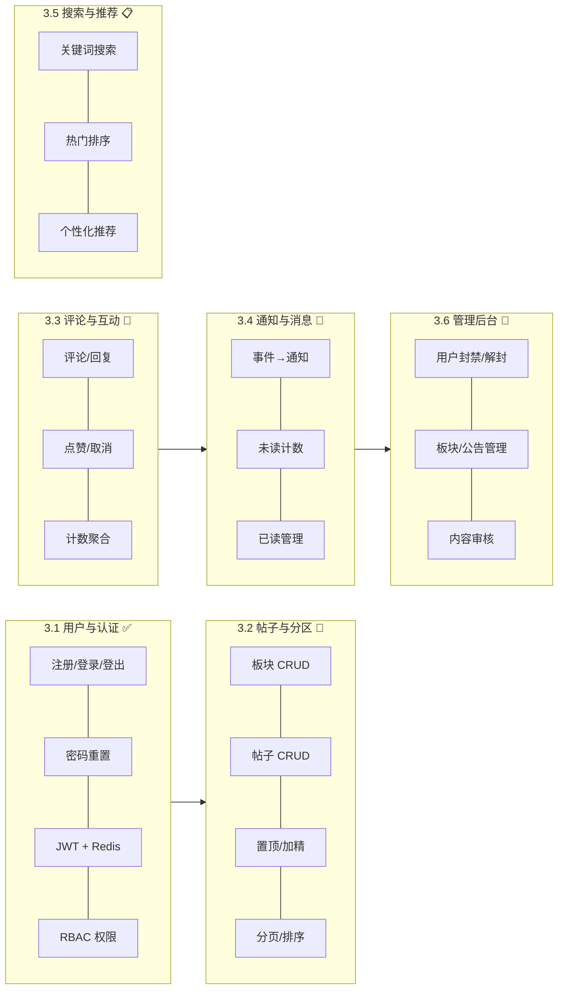
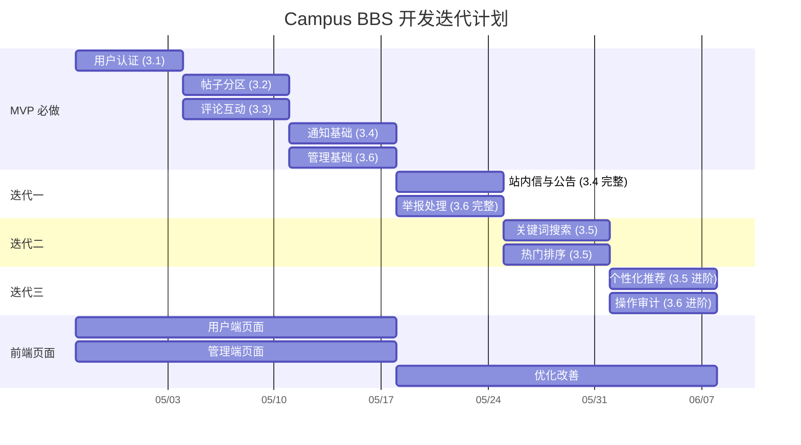
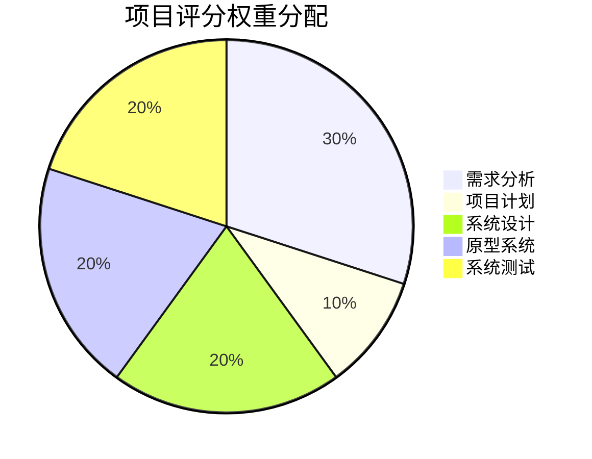

# Campus Bulletin Board System — 项目计划文档

---

## 一、文档质量体系

### 1.1 文档结构

| 文档 | 路径 | 内容 |
|:-----|:-----|:-----|
| DatabaseDesign.md | docs/ | 数据库表结构设计、ER 图、字段约束说明 |
| DevelopmentSpecification.md | docs/ | 代码规范（命名/格式/注释）、API 设计规范、Git 工作流 |
| RequirementAnalysis.md | docs/ | 需求分析文档 |
| ProjectPlan.md | docs/ | 项目计划文档 |

### 1.2 质量保障措施

| 层面 | 措施 |
|:-----|:-----|
| API 文档 | FastAPI 自动生成 OpenAPI 交互式文档（/docs 和 /redoc），随代码同步更新 |
| 版本控制 | 所有文档纳入 Git 管理，变更可追溯 |
| 代码格式化 | 提交前通过 `black` 自动格式化（Husky pre-commit hook） |
| 静态检查 | 提交前通过 `ruff check --fix` 自动修复常见问题 |
| PR 审查 | 所有合并至 develop 的 PR 必须经过代码审查 |
| 文档同步 | 需求变更必须同步更新 RequirementAnalysis.md；数据库变更必须更新 DatabaseDesign.md 并生成 Alembic 迁移 |

### 1.3 质量检查清单

PR 合并前必须满足以下所有条件：

- [ ] 代码审查通过
- [ ] 自动化测试全部通过（pytest）
- [ ] 相关文档已同步更新
- [ ] `black` 格式化检查通过
- [ ] `ruff` 静态检查通过

---

## 二、项目范围

### 2.1 MVP 必做范围

MVP 阶段聚焦核心闭环：**注册 → 登录 → 浏览板块 → 发帖 → 评论 → 点赞 → 通知 → 管理**

| 优先级 | 子系统 | 核心交付 |
|:-------|:-------|:---------|
| MVP | Part1 用户与认证 | 注册（用户名/邮箱唯一性校验）、登录（账号密码 + JWT）、登出（Token 黑名单）、密码重置、RBAC（user/admin） |
| MVP | Part2 帖子与分区 | 板块列表展示（按 sort_order 排序）、发帖（标题 + 正文）、帖子编辑/删除（作者权限）、置顶/加精（管理员权限）、列表分页查询（置顶优先） |
| MVP | Part3 评论与互动 | 评论发布与回复（楼中楼，parent/root 树形结构）、点赞/取消点赞（帖子 + 评论）、计数聚合（冗余存储） |
| MVP | Part4 通知（基础） | 评论/回复/点赞触发通知生成、通知列表分页查询（未读优先）、未读计数、单条/全部已读标记 |
| MVP | Part6 管理后台（基础） | 用户管理（列表/封禁/解封/角色调整）、板块管理（CRUD + 排序）、帖子管理（置顶/加精/隐藏）、系统统计面板 |

### 2.2 迭代扩展范围

| 迭代 | 周期 | 交付内容 |
|:-----|:-----|:---------|
| 迭代一 | 第 4 周 | Part4 完整：系统公告发布与站内信；Part6 完整：公告管理、举报处理（含 ModerationLog） |
| 迭代二 | 第 5 周 | Part5：帖子标题/正文关键词搜索（ILIKE + 全文索引）、热门帖子排序（按互动数 + 时间衰减） |
| 迭代三 | 第 6 周 | Part5 进阶：个性化推荐（基于用户历史行为）；Part6 进阶：操作审计日志（AdminAuditLog）、数据统计报表 |

### 2.3 范围约束（明确不做）

| 约束项 | 说明 |
|:-------|:-----|
| 即时聊天（IM） | 不实现实时消息功能 |
| 第三方支付 | 不涉及支付集成 |
| 对象存储（MVP） | 图片/附件功能仅预留 media_assets + post_attachments 表结构和接口骨架，不接入真实 S3/OSS |
| 国际化（i18n） | 仅支持中文 |
| 移动端 App | 仅做响应式 Web，不开发 Native App |

---

## 三、开发过程模型

### 3.1 迭代式开发模型

采用短周期迭代式开发，每个迭代 **1 周**，产出可演示的增量版本。

**迭代流程：**

1. **迭代启动**（周一）：明确本周要交付的功能点，从 backlog 中拆分任务到 Issue
2. **开发执行**（周一至周五）：组员认领 Issue，在 feature 分支开发，提交 PR
3. **集成与 Review**（周五至周六）：开发者交叉初审 → 副组长二审 → 组长终审（仅架构敏感 PR），合并至 develop；文档同步更新
4. **迭代回顾**（周日）：小组会议，演示本周产出，回顾问题，微调下周计划

### 3.2 敏捷实践

| 实践 | 说明 |
|:-----|:-----|
| Git 分支模型 | feature → develop → main 三层模型；所有合并走 Pull Request |
| Issue 驱动 | GitHub Issues 管理任务分配，组员自主认领 |
| 持续集成 | Husky pre-commit hooks（lint-staged：black + ruff）；pytest 自动化测试 |
| 文档驱动 | API 文档与数据库设计文档随迭代同步更新，不以口头约定代替 |
| 每周 Review | 迭代结束进行小组 Code Review 与需求微调；副组长汇报进度数据 |

### 3.3 Git 分支策略

```plaintext
main                        # 生产环境（受保护）
│
├── develop                 # 开发主分支（受保护）
│   │
│   ├── feat/<子系统>-<功能>-<日期>    # 功能分支
│   ├── fix/<子系统>-<描述>-<日期>     # 修复分支
│   └── refactor/<子系统>-<描述>-<日期> # 重构分支
└── docs/<描述>-<日期>                # 文档分支
```

**分支保护规则：**

| 分支 | 规则 |
|:-----|:-----|
| main | 受保护，仅组长从 develop 合并，每次合并需 Tag 版本号 |
| develop | 受保护，提交 PR 后组长审核通过才能合并 |
| feat/* | 组员自行管理，建议定期与 develop 同步避免冲突 |

**Commit 规范：**

```
<type>(<scope>): <subject>

类型：feat / fix / refactor / docs / test / chore
范围：user / board / post / comment / auth / admin / deps
示例：
  feat(post): add post CRUD API
  fix(auth): resolve token expiration handling
  docs: update API specification
  test(users): add user module integration tests
```

---

## 四、规模估算

### 4.1 功能点估算

| 子系统 | 功能点（FP） | 复杂度 | 说明 |
|:-------|:------------|:-------|:-----|
| Part1 用户与认证 | ~8 FP | 中 | 注册、登录、登出、改密、JWT、RBAC、Token 黑名单、速率限制 |
| Part2 帖子与分区 | ~10 FP | 中 | 板块 CRUD、发帖、编辑、删除、置顶、加精、分页查询、列表排序、详情查询、草稿 |
| Part3 评论与互动 | ~8 FP | 中 | 评论发布、楼中楼回复、删除、帖子点赞、评论点赞、计数同步、点赞状态查询 |
| Part4 通知与消息 | ~6 FP | 中 | 评论通知、回复通知、点赞通知、未读计数、已读管理、系统公告 |
| Part5 搜索与推荐 | ~6 FP | 高 | 关键词搜索、热门排序、个性化推荐、全文索引 |
| Part6 管理后台 | ~8 FP | 中 | 用户管理、板块管理、内容审核、举报处理、统计面板、操作审计 |
| **合计** | **~46 FP** | — | — |

### 4.2 代码规模估算

| 层级 | 语言 | 预估行数 | 说明 |
|:-----|:-----|:--------|:-----|
| 后端业务代码 | Python | 4,000–5,000 LOC | models、routers、services、schemas、deps、utils |
| 前端页面代码 | TypeScript (Vue) | 6,000–8,000 LOC | 组件、页面、状态管理、API 调用层 |
| 测试代码 | Python | 1,500–2,000 LOC | 单元测试 + 集成测试 |
| 文档与配置 | Markdown/YAML/Docker | ~2,000 LOC | 设计文档、API 文档、Docker Compose、CI 配置 |
| **合计** | — | **~13,500–17,000 LOC** | — |

### 4.3 工期估算

| 阶段 | 周期 | 产出 |
|:-----|:-----|:-----|
| MVP 阶段 | 第 1–3 周（5/1–5/21） | Part1 + Part2 + Part3 + Part4 基础 + Part6 基础 |
| 迭代一 | 第 4 周（5/21–5/28） | Part4 完整（公告/站内信）+ Part6 完整（举报处理） |
| 迭代二 | 第 5 周（5/28–6/7） | Part5（关键词搜索 + 热门排序） |
| 迭代三（含缓冲） | 第 6 周（6/7–6/15） | Part5 进阶（推荐）+ Part6 进阶（审计日志）+ 测试回归 |
| **总工期** | **~6 周** | — |
| 团队规模 | 6 人 | — |
| 每人每周投入 | ~6 小时 | — |
| **总工作量** | **~216 人时** | 6 人 × 6 周 × 6 小时/周 |

---

## 五、资源配置

### 5.1 人力资源（组内分工）

借助AI，开发代码的入手难度大大降低，因此我们将不局限于前后端分工的模式，而是采用更灵活的功能模块分工，鼓励组员参与项目的各个方面。

| 角色 | 人数 | 职责 |
|:-----|:-----|:-----|
| 组长 | 1 人 | 架构设计、代码审核、Git 仓库管理、数据库表结构定义、文档撰写与维护 |
| 副组长 | 1 人 | 进度追踪、Issue 分类/拆解/打标签、第一轮代码审核、CI/CD |
| 系统测试 | 1 人 | 测试用例设计与编写、测试报告撰写 |
| 开发者 | 3 人 | 认领 Issue、完成开发、PR时进行总结 |
| **合计** | **6 人** | — |

**子系统负责矩阵：**



### 5.2 软硬件环境

| 类别 | 选型 |
|:-----|:-----|
| 后端语言 | Python >= 3.14 |
| 后端框架 | FastAPI |
| 主数据库 | PostgreSQL（Docker 部署） |
| 缓存/会话 | Redis（Docker 部署） |
| 前端框架 | Vue 3 + TypeScript |
| 包管理 | uv（后端 Python）/ pnpm（前端 Node.js） |
| 容器化 | Docker Compose（一键启动 PostgreSQL + Redis） |
| 版本控制 | Git + GitHub |
| 代码质量 | Husky pre-commit hooks（lint-staged：black + ruff） |

### 5.3 工具链

| 用途 | 工具 | 说明 |
|:-----|:-----|:-----|
| 代码格式化 | black | Python 代码统一风格 |
| 静态检查 | ruff | 替代 flake8/isort，高速检查 |
| 测试框架 | pytest + pytest-asyncio + httpx | 异步测试支持，真实 HTTP 请求模拟 |
| 数据库迁移 | Alembic | Schema 版本管理，自动生成迁移脚本 |
| API 文档 | FastAPI 内置 (/docs) | OpenAPI 规范，交互式 Swagger UI |
| 依赖管理 | uv（后端）/ pnpm（前端） | 快速、可靠的依赖解析 |
| 密码哈希 | pwdlib (Argon2) | 抗 GPU 破解的现代哈希算法 |
| JWT | PyJWT | HS256 签名，含过期和黑名单机制 |

---

## 六、交付物定义

| 阶段 | 交付物 | 形式 | 验收标准 |
|:-----|:-------|:-----|:---------|
| 第一阶段（需求分析） | 需求分析文档 | Markdown + PDF | 覆盖全部功能性/非功能性需求；包含完整 UML 建模 |
| 第一阶段（需求分析） | 项目计划文档 | Markdown + PDF | 范围/工期/资源/风险完整定义 |
| 第二阶段（MVP 开发） | 后端源代码 | Git 仓库 | 核心接口可运行，通过集成测试 |
| 第二阶段（MVP 开发） | 前端基础页面 | Git 仓库 | 核心页面可交互，与后端联调通过 |
| 第二阶段（MVP 开发） | 数据库迁移脚本 | Alembic 迁移文件 | 可升级、可回滚 |
| 第二阶段（MVP 开发） | API 文档 | FastAPI 自动生成 | 所有端点有文档，可在线测试 |
| 第三阶段（结项） | 完整源代码 | Git 仓库 | 全部功能实现，通过回归测试 |
| 第三阶段（结项） | 设计文档 | Markdown | UML 图、数据库设计、需求文档终版 |
| 第三阶段（结项） | 测试报告 | Markdown / 网页 | 单元测试 + 集成测试覆盖率和结果 |

---

## 七、任务与计划

### 7.1 功能优先级矩阵

| 优先级 | 子系统 | 包含功能点 | 负责人员 |
|:-------|:-------|:-----------|:---------|
| **MVP 必做** | Part1 用户认证 | 注册、登录、登出、改密、JWT、RBAC | 开发者（Issue 认领） |
| **MVP 必做** | Part2 帖子分区 | 板块 CRUD、发帖、编辑、删除、置顶、加精、分页查询 | 开发者（Issue 认领） |
| **MVP 必做** | Part3 评论互动 | 评论发布/回复（楼中楼）、点赞/取消、计数同步 | 开发者（Issue 认领） |
| **MVP 必做** | Part4 通知（基础） | 评论/回复/点赞通知、未读计数、已读标记 | 开发者（Issue 认领） |
| **MVP 必做** | Part6 管理后台（基础） | 用户管理、板块管理、内容审核 | 开发者（Issue 认领） |
| **迭代一** | Part4 通知（完整） | 系统公告、站内信 | 开发者（Issue 认领） |
| **迭代一** | Part6 管理后台（完整） | 公告管理、举报处理 | 开发者（Issue 认领） |
| **迭代二** | Part5 搜索 | 关键词搜索、热门排序 | 开发者（Issue 认领） |
| **迭代三** | Part5 搜索（进阶） | 个性化推荐 | 开发者（Issue 认领） |
| **迭代三** | Part6 管理后台（进阶） | 操作审计与日志 | 开发者（Issue 认领） |

### 7.2 迭代路线图（甘特图）



### 7.3 MVP 阶段详细任务分解

#### 第 1 周（5/1–5/7）：基础设施 + Part1 用户认证

| 任务 | 负责人 | 产出 |
|:-----|:-------|:-----|
| 项目初始化（Git 仓库、目录结构、配置） | 组长 | 可运行的 FastAPI 骨架 |
| Docker Compose（PostgreSQL + Redis） | 组长 | 一键启动的开发环境 |
| 数据库基类与 User 模型 | 组长 | Base、IDMixin、TimestampMixin、User Model |
| Alembic 迁移配置 | 组长 | 初始迁移脚本 |
| 注册/登录/登出 API | 开发者（Issue 认领） | Auth router 完整实现 |
| JWT 鉴权与 RBAC 中间件 | 开发者（Issue 认领） | get_current_user、require_admin |
| 密码重置 API | 开发者（Issue 认领） | 完整密码修改流程 |
| Token 黑名单（Redis） | 开发者（Issue 认领） | 登出即时失效 |
| 认证模块测试 | 系统测试 | test_auth.py |

#### 第 2 周（5/7–5/14）：Part2 帖子分区 + Part3 评论互动

| 任务 | 负责人 | 产出 |
|:-----|:-------|:-----|
| Board 模型 + Service + Router | 开发者（Issue 认领） | 板块 CRUD API |
| Post 模型 + Service + Router | 开发者（Issue 认领） | 帖子 CRUD + 置顶/加精 API |
| 分页查询（置顶优先排序） | 开发者（Issue 认领） | 帖子列表 API |
| Comment 模型 + Service + Router | 开发者（Issue 认领） | 评论/回复 CRUD API |
| PostLike / CommentLike 模型 + API | 开发者（Issue 认领） | 点赞/取消点赞 API |
| 计数同步逻辑 | 开发者（Issue 认领） | 点赞数/评论数/回复数自动更新 |
| 板块/帖子模块测试 | 系统测试 | test_boards.py, test_posts.py |
| 前端：登录/注册页面 | 开发者（Issue 认领） | 登录注册 UI |
| 前端：首页板块列表 | 开发者（Issue 认领） | 板块卡片布局 |

#### 第 3 周（5/14–5/21）：Part4 通知 + Part6 管理后台

| 任务 | 负责人 | 产出 |
|:-----|:-------|:-----|
| Notification 模型 + Service + Router | 开发者（Issue 认领） | 通知生成、列表、已读 API |
| 评论/回复/点赞触发通知 | 开发者（Issue 认领） | 事件 → 通知自动创建 |
| 未读计数 + 批量已读 | 开发者（Issue 认领） | 通知管理 API |
| 管理后台：用户管理（列表/封禁/解封） | 开发者（Issue 认领） | Admin router 用户管理部分 |
| 管理后台：板块管理（CRUD） | 开发者（Issue 认领） | Admin router 板块管理部分 |
| 管理后台：系统统计 | 开发者（Issue 认领） | /admin/stats API |
| 通知/管理模块测试 | 系统测试 | test_notifications.py, test_admin.py |
| 前端：帖子列表/详情页 | 开发者（Issue 认领） | 帖子浏览 UI |
| 前端：发帖/编辑页 | 开发者（Issue 认领） | 发帖编辑 UI |
| 前端：管理后台基础页面 | 开发者（Issue 认领） | 用户管理/板块管理 UI |

### 7.4 关键依赖关系

```
Part1（用户认证）
  └── Part2（帖子分区）── 依赖认证获取当前用户
  └── Part3（评论互动）── 依赖认证获取当前用户
        └── Part4（通知）── 依赖评论/点赞事件触发
Part2 + Part3 ── 同时开发，无强依赖
Part6（管理后台）── 依赖 Part1（require_admin）+ Part2/3 数据模型
Part5（搜索）── 依赖 Part2/3 数据完成
```

**关键路径：** Part1 → Part2/Part3（并行）→ Part4 → Part6 管理功能 → Part5 搜索推荐

---

## 八、风险分析

| 风险项 | 概率 | 影响 | 应对措施 |
|:-------|:-----|:-----|:---------|
| **组员时间冲突** | 中 | 高 | Issue 驱动，组员自主承接任务，灵活安排时间；核心接口预留冗余人力；每周 Review 及时暴露进度偏差 |
| **数据库性能瓶颈** | 低 | 中 | 索引优化（created_at, board_id, user_id）；计数冗余减少聚合查询；Redis 缓存热点数据；预留读写分离扩展方案 |
| **需求变更** | 中 | 中 | 迭代规划预留 20% 缓冲时间（迭代三含缓冲）；优先保障 MVP 核心闭环；变更在 Review 时讨论并调整优先级 |
| **前后端接口不一致** | 低 | 中 | FastAPI 自动生成 API 文档作为唯一事实来源；前后端共用 schemas 定义（Pydantic → TypeScript 类型映射）；联调前先对文档 |
| **技术学习成本** | 低 | 低 | FastAPI/Vue 生态成熟、文档丰富；组长提供初始项目骨架和示例代码；组内分享开发经验 |

**风险应对总结：**

- 最高优先级风险为**组员时间冲突**，应对核心是降低个人阻塞团队的概率
- **需求变更**通过「迭代规划 + MVP 优先」策略控制
- 技术类风险通过成熟的框架选型和文档驱动降低

---

## 九、项目评分体系

本课程项目评分构成：



| 评分维度 | 权重 | 评分方式 | 对应交付物 |
|:---------|:-----|:---------|:-----------|
| 需求分析 | 30% | 教师打分（汇报 + 提交物质量） | 需求分析文档 + PPT 汇报 |
| 项目计划 | 10% | 教师打分 | 项目计划文档 + PPT 汇报 |
| 系统设计 | 20% | 教师打分 | 设计文档 + 数据库设计 + UML 图 |
| 原型系统 | 20% | 教师打分 | 可运行的源代码 + 演示 |
| 系统测试 | 20% | 教师打分 | 测试报告 + 测试用例 + CI/CD 配置 |

**评分公式：**

- 组得分 = 教师打分 × 50% + (各组长打分的平均值) / 组数 × 50%
- 组员得分 = 组员贡献率 × 该项组得分 × 组人数
- 组员总得分 = Σ(各项组员得分 × 各项占比)

---

## 十、当前进展与下一步计划

### 10.1 已完成

| 完成项 | 说明 |
|:-------|:-----|
| Part1 用户与认证 | 完整实现：注册、登录（用户名/邮箱双模式）、登出（Redis 黑名单）、密码重置（旧密码校验）、JWT + RBAC |
| 数据库基础设施 | Base / IDMixin / TimestampMixin 基类完成；Alembic 迁移框架就绪 |
| Post 模型 + Service + Router | 帖子 CRUD、置顶/加精、分页查询已实现 |
| Admin 基础 | 用户管理（列表/封禁/解封）、板块 CRUD、系统统计已实现 |
| 测试体系 | pytest + httpx + fakeredis 配置完成；auth 和 users 测试已编写 |
| API 响应规范 | ApiResponse / PaginatedResponse / ErrorResponse 统一封装 |
| 前端设计 | 全部 9 个核心页面线框图设计完成 |
| 项目文档 | ProjectRequirements.md / DatabaseDesign.md / DevelopmentSpecification.md 已编写 |
| Git Hooks | Husky pre-commit（lint-staged：black + ruff）已配置 |

### 10.2 进行中

| 进行中项 | 说明 |
|:---------|:-----|
| Part2 Board 模型 | Board model / service 文件待补充（路由已定义，import 已预留） |
| Part3 Comment 模型 | Comment model / service 文件待补充 |
| 前端页面开发 | 用户端和管理端页面待启动开发 |

### 10.3 下一步计划

| 优先级 | 计划事项 | 负责人员 | 目标时间 |
|:-------|:---------|:---------|:---------|
| P0 | 补充 Board 和 Comment 的 Model + Service + Router 实现 | 开发者（Issue 认领） | 第 2 周 (5/14 前) |
| P0 | 完成 Notification 模型与通知生成逻辑 | 开发者（Issue 认领） | 第 3 周 (5/21 前) |
| P1 | 启动前端用户端页面开发（登录/首页/帖子） | 开发者（Issue 认领） | 第 2 周起 |
| P1 | 启动前端管理端页面开发（用户管理/板块管理） | 开发者（Issue 认领） | 第 3 周起 |
| P1 | 编写 Comment / Board / Notification 模块测试 | 开发者（Issue 认领） | 第 2–3 周 |
| P2 | 前后端联调 | 全员 | 第 3 周末 |
| P3 | CI/CD 流程配置 | 副组长 | 第 4 周 |

---

## 附录：参考文档索引

| 文档 | 路径 |
|:-----|:-----|
| 数据库设计 | docs/DatabaseDesign.md |
| 开发规范 | docs/DevelopmentSpecification.md |
| 需求分析| docs/RequirementAnalysis.md |
| 项目计划| docs/ProjectPlan.md |
| Mermaid 图源文件 | docs/diagrams/*.mmd |
