# Campus Bulletin Board System — 需求分析文档

---

## 一、项目背景

### 1.1 目标用户

| 用户群体 | 描述 |
|:---------|:-----|
| 在校大学生 | 主要使用群体，发布信息、参与讨论、获取校园资讯 |
| 教职工 | 发布通知、参与学术讨论、管理社团事务 |
| 校园社团组织者 | 发布活动宣传、管理社团分区、组织线上线下活动 |

### 1.2 项目目标

构建一个功能完善、易于维护的校园论坛系统，核心目标包括：

- **话题分区**：支持按不同主题（课程、社团、生活、学术等）创建独立板块
- **互动讨论**：提供发帖、评论、回复（楼中楼）、点赞等完整互动链路
- **内容管理**：提供管理后台，支持审核、置顶、加精、封禁等运营操作
- **通知触达**：实时通知用户关注的事件（新评论、回复、点赞等）

### 1.3 预期收益

- **信息流通效率**：打破微信群/QQ 群的信息孤岛，建立统一的信息发布与检索平台
- **可检索知识库**：论坛帖子形成持久化的校园知识沉淀，后续学生可通过搜索找到历史讨论
- **社团与学术交流**：为社团活动和学术讨论提供专属空间，降低宣传和组织成本

---

## 二、项目概述

| 项目信息 | 详情 |
|:---------|:-----|
| 项目名称 | Campus Bulletin Board System（校园论坛） |
| 项目描述 | 面向大学校园的在线论坛系统 |
| 技术栈 | Python 3.14 + FastAPI + PostgreSQL + Redis（后端），Vue + TypeScript + pnpm（前端） |
| 仓库地址 | https://github.com/Nek0Charm/Campus-Bulletin-Board-System |

核心功能全景：

- 用户注册、登录、登出、密码重置
- 板块浏览、发帖、帖子管理（编辑/删除/置顶/加精）
- 评论发布、楼中楼回复、点赞/取消点赞
- 通知推送、未读计数、已读标记
- 管理后台（用户管理、板块管理、内容审核、举报处理）
- 搜索与推荐（迭代目标）

---

## 三、功能性需求

### 3.1 子系统划分

系统按业务边界划分为六个子系统：

| 编号 | 子系统名称 | 职责简介 |
|:-----|:-----------|:---------|
| Part1 | 用户与认证子系统 | 用户身份管理与访问控制 |
| Part2 | 帖子与分区子系统 | 论坛分区与主题帖全生命周期管理 |
| Part3 | 评论与互动子系统 | 帖子下的评论、回复和点赞行为 |
| Part4 | 通知与消息子系统 | 关键事件推送与消息管理 |
| Part5 | 搜索与推荐子系统 | 提升内容发现效率（迭代目标） |
| Part6 | 管理后台子系统 | 平台运营与维护入口 |

### 3.2 用例详述

#### 3.2.1 用户与认证（Part1）

**UC-1 用户注册**

| 属性 | 内容 |
|:-----|:-----|
| 参与者 | 访客 |
| 前置条件 | 未登录状态 |
| 主流程 | 1. 用户访问注册页面；2. 填写用户名（3-32 字符）、邮箱、密码（8-128 字符）、昵称（可选）；3. 提交注册表单；4. 服务端校验用户名和邮箱唯一性；5. 密码使用 Argon2 哈希后存储；6. 创建用户记录（默认角色 user，状态 active，email_verified = false）；7. 签发邮箱验证 Token（JWT，24 小时有效期）并通过 SMTP 发送验证邮件；8. 返回注册成功及用户信息 |
| 后置条件 | 用户需完成邮箱验证后方可登录 |
| 异常情况 | 用户名已存在 → 409 Conflict；邮箱已注册 → 409 Conflict；参数不合法 → 422 Unprocessable Entity；邮件发送失败 → 500 Internal Server Error |

**UC-1.1 邮箱验证**

| 属性 | 内容 |
|:-----|:-----|
| 参与者 | 注册用户 |
| 前置条件 | 已注册但邮箱未验证（email_verified = false） |
| 主流程 | 1. 用户点击邮件中的验证链接；2. 服务端解码并校验验证 Token（JWT，含 type="email_verify"）；3. 查找对应用户；4. 设置 email_verified = true；5. 返回验证成功 |
| 后置条件 | 用户可使用注册凭据登录 |
| 异常情况 | Token 无效 → 400 Bad Request；Token 过期 → 400 Bad Request；用户不存在 → 404 Not Found；邮箱已验证 → 409 Conflict |

**UC-2 用户登录**

| 属性 | 内容 |
|:-----|:-----|
| 参与者 | 注册用户 / 管理员 |
| 前置条件 | 拥有有效的用户名/邮箱和密码 |
| 主流程 | 1. 用户输入账号（用户名或邮箱）和密码；2. 服务端查询匹配用户；3. 使用 Argon2 验证密码哈希；4. 检查用户状态（status 为 active 且 email_verified 为 true 方可登录）；5. 生成 JWT Token（HS256，默认 60 分钟有效期）；6. 更新 last_login_at；7. 返回 Token、过期时间和用户信息 |
| 后置条件 | 后续请求携带 JWT Token 进行身份认证 |
| 异常情况 | 账号或密码错误 → 401；用户被 banned → 403；邮箱未验证 → 403 |

**UC-3 密码重置**

| 属性 | 内容 |
|:-----|:-----|
| 参与者 | 已登录用户 |
| 前置条件 | 已认证 |
| 主流程 | 1. 输入旧密码和新密码；2. 服务端验证旧密码正确性；3. 新密码 Argon2 哈希后更新 storage；4. 返回成功 |
| 异常情况 | 旧密码不正确 → 401 |

**UC-4 角色与权限控制（RBAC）**

| 属性 | 内容 |
|:-----|:-----|
| 参与者 | 系统 |
| 前置条件 | 用户已认证 |
| 主流程 | 系统根据 `user.role`（user/admin）在接口级别控制访问。`require_admin` 依赖注入守卫管理类接口，普通用户请求管理接口返回 403 |
| 角色定义 | **user**：浏览、发帖、评论、点赞、管理自己的内容；**admin**：用户管理、板块管理、内容审核、举报处理 |

#### 3.2.2 帖子与分区（Part2）

**UC-5 板块浏览**

| 属性 | 内容 |
|:-----|:-----|
| 参与者 | 所有用户（含访客） |
| 前置条件 | 无 |
| 主流程 | 1. 请求板块列表；2. 服务端返回所有启用板块（is_active=true），按 sort_order 升序排列；3. 每个板块包含名称、slug、描述、帖子总数 |
| 后置条件 | 用户可点击板块查看其下帖子列表 |

**UC-6 发帖**

| 属性 | 内容 |
|:-----|:-----|
| 参与者 | 已登录用户 |
| 前置条件 | 已认证，目标板块存在且启用 |
| 主流程 | 1. 用户选择板块，填写标题（≤255 字符）和内容（支持富文本）；2. 提交创建；3. 服务端创建帖子记录（author_id 取自当前用户，published_at 设为当前时间）；4. 返回帖子详情 |
| 后置条件 | 帖子出现在板块帖子列表中 |
| 扩展 | 支持保存草稿（后续迭代） |

**UC-7 帖子管理**

| 属性 | 内容 |
|:-----|:-----|
| 参与者 | 帖子作者 / 管理员 |
| 前置条件 | 已认证 |
| 主流程-作者操作 | 编辑自己的帖子（标题、内容）；软删除自己的帖子（设置 deleted_at，状态标记为 deleted） |
| 主流程-管理员操作 | 置顶/取消置顶（is_pinned）；加精/取消加精（is_featured）；隐藏/恢复帖子（管理员权限） |

**UC-8 帖子列表查询**

| 属性 | 内容 |
|:-----|:-----|
| 参与者 | 所有用户 |
| 主流程 | 1. 请求帖子列表，可指定 board_id 筛选板块、page/page_size 分页；2. 服务端查询排序：置顶帖优先，同优先级按 created_at 倒序；3. 返回帖子摘要（不含完整正文），包含作者信息、点赞数、评论数 |

#### 3.2.3 评论与互动（Part3）

**UC-9 评论发布与回复（楼中楼）**

| 属性 | 内容 |
|:-----|:-----|
| 参与者 | 已登录用户 |
| 前置条件 | 目标帖子存在且未被删除 |
| 主流程-一级评论 | 对帖子发表评论，parent_comment_id 为空，root_comment_id 指向自身 |
| 主流程-回复 | 对某条评论进行回复，parent_comment_id 指向被回复评论，root_comment_id 指向根评论（楼层） |
| 后置条件 | 帖子评论数 +1；被回复用户收到通知 |
| 异常情况 | 帖子不存在 → 404；评论被删除 → 404 |

**UC-10 点赞/取消点赞**

| 属性 | 内容 |
|:-----|:-----|
| 参与者 | 已登录用户 |
| 前置条件 | 目标帖子/评论存在 |
| 主流程-点赞 | 创建 post_like/comment_like 记录，目标对象 like_count +1 |
| 主流程-取消点赞 | 删除对应记录，目标对象 like_count -1（不低于 0） |
| 约束 | 同一用户对同一对象仅可点赞一次（UNIQUE 约束） |

**UC-11 实时计数聚合**

| 属性 | 内容 |
|:-----|:-----|
| 策略 | 在 posts 表冗余 like_count、comment_count、view_count；comments 表冗余 like_count、reply_count。写入点赞/评论时同步更新计数，而非每次读取时实时聚合查询 |

#### 3.2.4 通知与消息（Part4）

**UC-12 事件触发通知**

| 触发事件 | 通知类型 | 通知内容 |
|:---------|:---------|:---------|
| 用户评论我的帖子 | comment | "{actor} 评论了你的帖子 {title}" |
| 用户回复我的评论 | reply | "{actor} 回复了你的评论" |
| 用户给我点赞 | like | "{actor} 赞了你的帖子/评论" |
| 管理员发布公告 | system | 系统公告标题和内容 |

**UC-13 未读计数与已读标记**

| 属性 | 内容 |
|:-----|:-----|
| 未读计数 | 前端导航栏显示当前用户 `is_read=false` 的通知总数 |
| 已读标记 | 支持单条标记已读（设置 read_at 时间戳）；支持"全部已读"操作 |

**UC-14 系统公告与站内信**

| 属性 | 内容 |
|:-----|:-----|
| 参与者 | 管理员发布，所有用户可见 |
| 功能 | 公告支持标题、正文、有效期限；站内信支持点对点发送（迭代一目标） |

#### 3.2.5 管理后台（Part6）

**UC-15 用户管理**

| 功能 | 描述 |
|:-----|:-----|
| 查看用户列表 | 分页展示所有用户（含搜索/筛选），显示用户名、邮箱、角色、状态、最后登录时间 |
| 封禁/解封 | 修改用户 status 为 banned/active，被 banned 用户在所有认证请求中返回 403 |
| 调整角色 | 修改用户 role（user ↔ admin） |

**UC-16 板块/公告管理**

| 功能 | 描述 |
|:-----|:-----|
| 板块 CRUD | 创建板块（name/slug/description/sort_order/is_active）；编辑板块信息；软删除板块 |
| 公告管理 | 发布、编辑、下架系统公告 |

**UC-17 内容审核**

| 操作 | 描述 |
|:-----|:-----|
| 隐藏/恢复 | 将帖子或评论状态设为 hidden，对普通用户不可见；可恢复为 normal |
| 软删除 | 设置 deleted_at 时间戳，数据保留但是对所有人不可见 |

**UC-18 举报处理**

| 功能 | 描述 |
|:-----|:-----|
| 查看举报列表 | 按时间倒序展示所有用户提交的举报 |
| 处理举报 | 标记为已处理，记录处理人和处理结果 |
| 处理记录 | 关联 ModerationLog 记录操作轨迹 |

---

## 四、系统建模

### 4.1 用例图

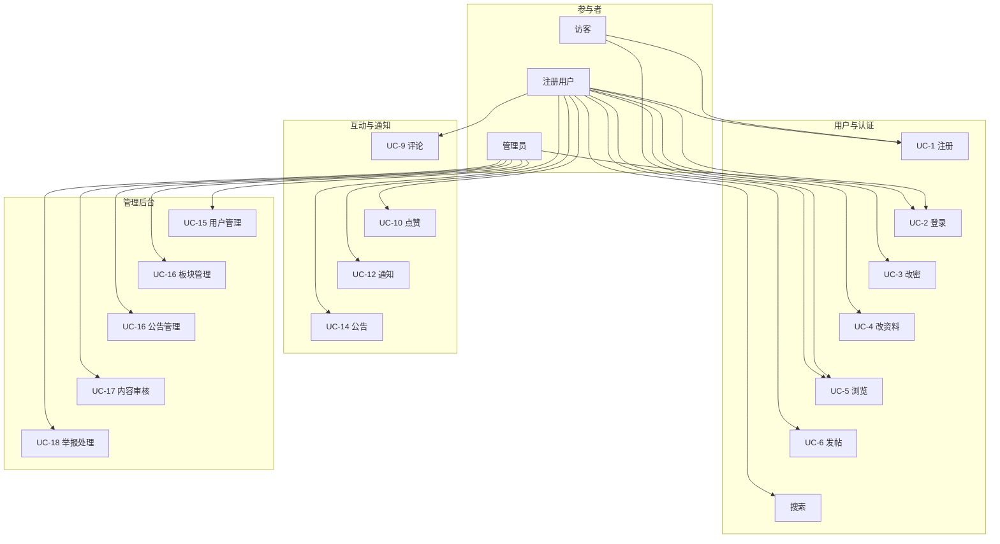

**参与者说明：**

| 参与者 | 权限范围 |
|:-------|:---------|
| 访客 | 浏览板块和帖子列表、注册账号 |
| 注册用户 | 登录、发帖、评论、点赞、接收通知、管理自己的内容 |
| 管理员 | 继承注册用户权限 + 用户管理、板块管理、内容审核、举报处理 |

### 4.2 系统上下文数据流图（Context DFD）

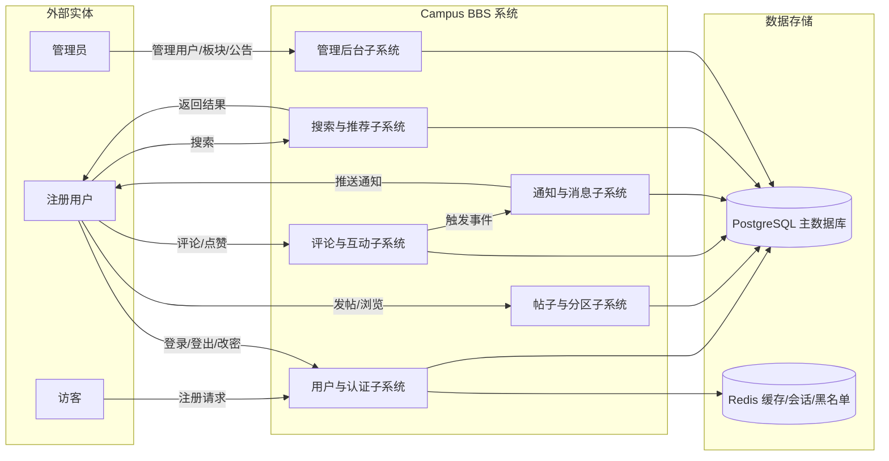

**外部实体定义：** 访客、注册用户、管理员是系统的三类交互对象。访客仅能访问注册和公开浏览功能，注册用户可使用核心业务功能，管理员额外拥有后台管理权限。

**数据存储：** PostgreSQL 作为主数据库存储所有业务数据；Redis 用于 Token 黑名单、热点计数缓存和会话管理。

### 4.3 第 0 层数据流图（Level 0 DFD）

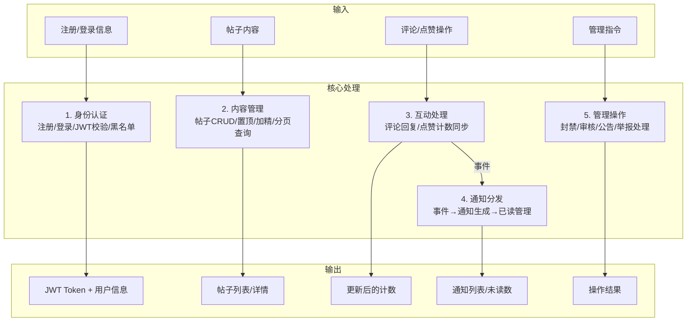

**处理模块说明：**

| 模块 | 输入数据 | 处理逻辑 | 输出数据 |
|:-----|:---------|:---------|:---------|
| 身份认证 | 用户名/邮箱/密码 | 注册唯一性校验 + Argon2 哈希；登录密码校验 + JWT 生成；Token 黑名单管理 | JWT Token、用户信息 |
| 内容管理 | 标题/正文/板块ID | 帖子 CRUD；置顶/加精排序；分页查询（软删除过滤） | 帖子列表/详情 |
| 互动处理 | 评论内容/点赞操作 | 评论 CRUD（楼中楼 parent/root）；点赞计数同步更新 | 更新后的计数 |
| 通知分发 | 触发事件 | 事件类型匹配 → 创建通知记录（未读） | 通知列表/未读计数 |
| 管理操作 | 管理指令 | 封禁/解封；板块 CRUD；内容审核状态变更 | 操作结果 |

### 4.4 状态图

#### 4.4.1 用户生命周期

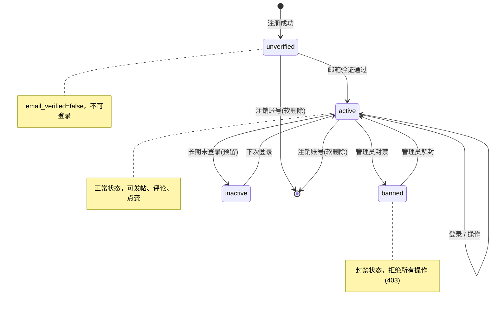

**状态说明：**

| 状态 | email_verified | 说明 | 允许操作 |
|:-----|:---------------|:-----|:---------|
| unverified | false | 刚注册，邮箱未验证 | 仅可验证邮箱，不可登录 |
| active | true | 正常状态 | 全部功能 |
| inactive | true | 非活跃状态（预留） | 仅可登录，登录后自动恢复 active |
| banned | — | 被封禁，由管理员操作 | 所有认证请求返回 403 |
| deleted | — | 软删除（deleted_at 非空） | 不可登录，数据保留 |

#### 4.4.2 帖子与评论状态

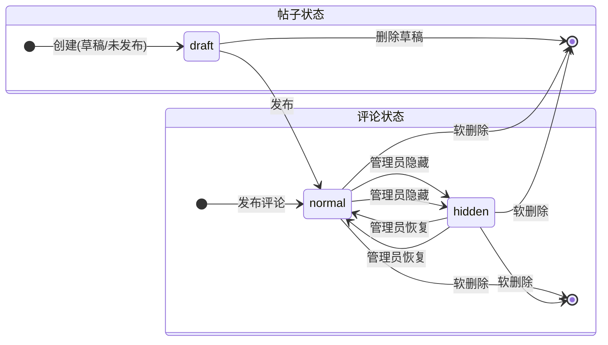

**状态流转规则：**

| 状态 | 对普通用户可见 | 对管理员可见 | 可恢复 |
|:-----|:-------------|:-----------|:------|
| draft（草稿） | 不可见 | 仅作者可见 | — |
| normal（正常） | 可见 | 可见 | — |
| hidden（隐藏） | 不可见 | 可见 | 可恢复为 normal |
| deleted（已删除） | 不可见 | 不可见（deleted_at 非空） | 不可恢复（软删除保留数据） |

#### 4.4.3 通知生命周期

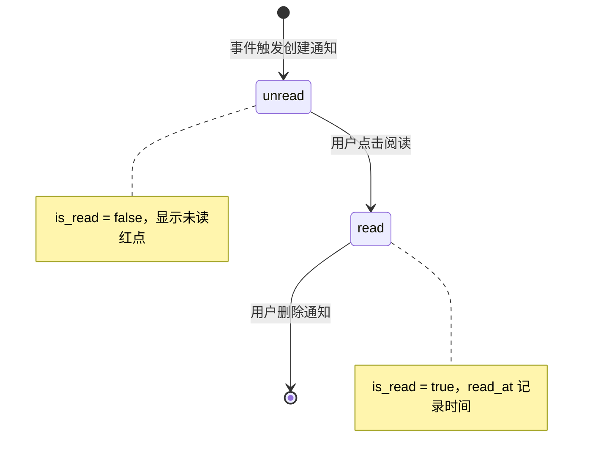

### 4.5 类图 — 后端核心模型

```mermaid
classDiagram
    direction TB

    class IDMixin {
        +UUID id PK
    }

    class TimestampMixin {
        +datetime created_at
        +datetime updated_at
        +datetime? deleted_at
    }

    class User {
        +str username UK
        +str email UK
        +str password_hash
        +str? nickname
        +str? avatar_url
        +str role
        +str status
        +bool email_verified
        +datetime? last_login_at
    }

    class Board {
        +str name UK
        +str slug UK
        +str? description
        +int sort_order
        +bool is_active
        +UUID created_by FK
    }

    class Post {
        +UUID board_id FK
        +UUID author_id FK
        +str title
        +text content
        +str status
        +bool is_pinned
        +bool is_featured
        +bigint like_count
        +bigint comment_count
        +bigint view_count
        +datetime? published_at
    }

    class Comment {
        +UUID post_id FK
        +UUID author_id FK
        +UUID? parent_comment_id FK
        +UUID? root_comment_id FK
        +jsonb content_json
        +str status
        +bigint like_count
        +bigint reply_count
    }

    class PostLike {
        +UUID post_id FK
        +UUID user_id FK
    }

    class CommentLike {
        +UUID comment_id FK
        +UUID user_id FK
    }

    class Notification {
        +UUID recipient_id FK
        +UUID? actor_id FK
        +str type
        +str title
        +str content
        +str? related_type
        +UUID? related_id
        +bool is_read
        +datetime? read_at
    }

    IDMixin <|-- User
    IDMixin <|-- Board
    IDMixin <|-- Post
    IDMixin <|-- Comment
    IDMixin <|-- PostLike
    IDMixin <|-- CommentLike
    IDMixin <|-- Notification
    TimestampMixin <|-- User
    TimestampMixin <|-- Board
    TimestampMixin <|-- Post
    TimestampMixin <|-- Comment

    User "1" --> "*" Post : author
    Board "1" --> "*" Post : contains
    Post "1" --> "*" Comment : has
    User "1" --> "*" Comment : author
    Comment "0..1" --> "*" Comment : replies (parent)
    User "1" --> "*" PostLike : likes
    Post "1" --> "*" PostLike : liked_by
    User "1" --> "*" CommentLike : likes
    Comment "1" --> "*" CommentLike : liked_by
    User "1" --> "*" Notification : receives (recipient)
    User "1" --> "*" Notification : triggers (actor)
```

**关键关系说明：**

| 关系 | 说明 |
|:-----|:-----|
| User 1→* Post | 一个用户可发布多篇帖子 |
| Board 1→* Post | 一个板块包含多篇帖子 |
| Post 1→* Comment | 一篇帖子拥有多条评论 |
| Comment 0..1→* Comment | 评论自引用，支持楼中楼回复结构（parent_comment_id） |
| User 1→* Notification | 用户接收和发送多条通知 |

### 4.6 CRC Cards

#### 4.6.1 实体类

**User（用户）**

| Responsibilities | Collaborators |
|:-----------------|:--------------|
| 维护用户基本信息（username, email, password_hash） | AuthService |
| 记录角色（user/admin）与状态（active/inactive/banned） | Post, Comment |
| 维护最后登录时间（last_login_at） | Notification |
| 支持软删除（deleted_at） | Board |

**Post（帖子）**

| Responsibilities | Collaborators |
|:-----------------|:--------------|
| 存储帖子标题、内容、状态（normal/hidden/deleted） | User（作者） |
| 维护置顶标记（is_pinned）和加精标记（is_featured） | Board（所属板块） |
| 聚合点赞数（like_count）、评论数（comment_count）、浏览数（view_count） | Comment, PostLike |
| 记录发布时间（published_at） | PostService |

**Comment（评论）**

| Responsibilities | Collaborators |
|:-----------------|:--------------|
| 存储评论内容和状态（normal/hidden/deleted） | User（作者）, Post |
| 支持楼中楼回复：parent_comment_id（父评论）、root_comment_id（根评论/楼层） | Comment（自身，自引用） |
| 聚合点赞数（like_count）、回复数（reply_count） | CommentLike |
| 维护软删除与隐藏状态 | CommentService |

**Notification（通知）**

| Responsibilities | Collaborators |
|:-----------------|:--------------|
| 记录通知类型：comment / reply / like / system | User（接收人 recipient、触发人 actor） |
| 维护已读状态（is_read）和已读时间（read_at） | Post, Comment（关联对象） |
| 存储关联对象信息（related_type, related_id） | — |
| 支持未读计数查询和批量已读操作 | NotificationService |

**Board（板块）**

| Responsibilities | Collaborators |
|:-----------------|:--------------|
| 存储板块名称（name）、英文标识（slug）、描述（description）、排序值（sort_order） | User（创建人 created_by） |
| 维护板块启用状态（is_active） | Post（所含帖子） |
| 支持按 sort_order 排序展示 | AdminPanel（管理操作） |

**PostLike / CommentLike（点赞记录）**

| Responsibilities | Collaborators |
|:-----------------|:--------------|
| 记录点赞关系（user_id + post_id/comment_id） | User, Post / Comment |
| 确保同一用户对同一对象仅可点赞一次（UNIQUE 约束） | — |
| 点赞时同步更新目标对象的 like_count | PostService / CommentService |

#### 4.6.2 服务层

**AuthService（认证服务）**

| Responsibilities | Collaborators |
|:-----------------|:--------------|
| 用户注册：校验用户名/邮箱唯一性，签发验证 Token 并调用 EmailService 发送验证邮件 | User, EmailService |
| 邮箱验证：解码验证 Token（JWT，24h 有效期），设置 email_verified = true | EmailService, User |
| 密码加密存储（Argon2 via pwdlib） | security.py |
| 用户登录：验证密码、检查状态（active + email_verified）、生成 JWT Token（HS256） | User, security.py |
| 用户登出：Token 加入 Redis 黑名单，设置 TTL 与 JWT 过期时间一致 | Redis |
| 密码重置：验证旧密码、更新为新哈希 | User, security.py |

**UserService（用户服务）**

| Responsibilities | Collaborators |
|:-----------------|:--------------|
| 获取/更新当前用户资料 | User |
| 获取用户公开资料（供其他用户查看） | User |
| 管理员查询：用户列表分页查询（按 created_at 倒序） | User |
| 管理员操作：更新用户状态（active/inactive/banned）、调整角色 | User, Notification |

**PostService（帖子服务）**

| Responsibilities | Collaborators |
|:-----------------|:--------------|
| 创建帖子：校验板块存在性、设置 author_id 和 published_at | User, Board |
| 帖子列表查询：支持板块筛选（board_id）、分页、置顶优先排序 | Post |
| 帖子详情查询：关联加载作者信息（joinedload） | Post |
| 更新帖子：部分更新（PATCH 语义，exclude_unset） | Post |
| 软删除帖子：设置 deleted_at 和 status=deleted | Post |
| 管理员标记：置顶/取消置顶、加精/取消加精 | Post |

**BoardService（板块服务）**

| Responsibilities | Collaborators |
|:-----------------|:--------------|
| 板块 CRUD：创建（name/slug 唯一性校验）、编辑、软删除 | Board |
| 板块查询：按 sort_order 排序、按 is_active 过滤 | Board |
| 板块 slug 唯一性校验 | Board |
| 获取所有启用的板块列表 | Board |

**CommentService（评论服务）**

| Responsibilities | Collaborators |
|:-----------------|:--------------|
| 创建一级评论：关联 post_id，设置 root_comment_id 为自身 | Comment, Post |
| 创建回复：关联 parent_comment_id，继承 root_comment_id | Comment, Post |
| 评论列表：按帖子查询、支持树形结构组装 | Comment |
| 更新/软删除评论 | Comment |
| 计数同步：更新帖子的 comment_count 和父评论的 reply_count | Post, Comment |

**NotificationService（通知服务）**

| Responsibilities | Collaborators |
|:-----------------|:--------------|
| 事件监听：当评论/回复/点赞发生时自动创建通知记录 | CommentService, LikeService |
| 通知查询：按接收人查询、分页、未读优先排序 | Notification |
| 已读管理：单条标记已读、全部标记已读 | Notification |
| 未读计数：实时返回当前用户未读通知数量 | Notification |

---

## 五、非功能性需求

### 5.1 安全性分析

#### 5.1.1 认证与授权安全

| 措施 | 实现方式 |
|:-----|:---------|
| 密码哈希 | Argon2 算法（pwdlib），抗 GPU 暴力破解 |
| JWT Token | HS256 签名，默认 60 分钟有效期，含 role 声明 |
| Token 黑名单 | 登出时 Token 加入 Redis 黑名单，TTL 对齐 JWT 过期时间 |
| RBAC | 接口级角色校验（require_admin 依赖注入），区分 user/admin |
| 认证守卫 | OAuth2PasswordBearer + get_current_user 依赖注入，所有受保护接口自动校验 |

#### 5.1.2 数据与传输安全

| 措施 | 实现方式 |
|:-----|:---------|
| 软删除 | 核心业务表统一使用 deleted_at 字段，数据可追溯可恢复 |
| SQL 注入防护 | SQLAlchemy ORM 参数化查询，框架层面杜绝注入 |
| 传输加密 | 预留 HTTPS 部署方案，生产环境强制 TLS |

#### 5.1.3 接口安全

| 措施 | 实现方式 |
|:-----|:---------|
| 速率限制 | 登录/注册接口使用 slowapi 进行速率限制，防暴力破解 |
| 输入校验 | Pydantic 模型严格校验所有入参（类型、长度、格式、正则约束） |
| 错误响应 | 统一错误格式（ErrorResponse），不泄漏内部堆栈信息 |

### 5.2 性能需求

#### 5.2.1 响应时间指标

| 接口类型 | 目标响应时间 |
|:---------|:------------|
| 帖子列表查询 | < 200ms |
| 数据库单表分页查询 | < 100ms |
| 登录/注册 | < 300ms |
| 帖子详情 | < 150ms |

#### 5.2.2 并发与容量

| 指标 | 目标 |
|:-----|:-----|
| 并发用户支持（MVP） | 500+ |
| 图片/附件 | MVP 阶段预留对象存储接口，不接入真实存储 |
| Redis 缓存 | Token 黑名单、热点计数、会话缓存 |

#### 5.2.3 数据库优化

| 优化策略 | 说明 |
|:---------|:-----|
| 索引优化 | created_at、board_id、user_id 等高频查询字段建索引 |
| 分页策略 | 使用 OFFSET/LIMIT 分页，后续可升级为游标分页避免深页性能衰减 |
| 计数冗余 | post.like_count、post.comment_count、comment.like_count、comment.reply_count 冗余存储，减少 COUNT 聚合查询 |

#### 5.2.4 可用性目标

| 指标 | 目标 |
|:-----|:-----|
| 系统可用性 | 99.9% |
| 健康检查 | /health 端点供监控和自动告警 |
| 数据恢复 | 软删除机制确保核心数据可恢复 |

### 5.3 可维护性需求

| 需求 | 说明 |
|:-----|:-----|
| API 文档 | FastAPI 自动生成 OpenAPI 文档（/docs），随代码同步更新 |
| 代码规范 | black 统一格式化，ruff 静态检查，PEP 8 遵循 |
| 数据库迁移 | Alembic 管理所有 schema 变更，版本可追踪可回滚 |
| 日志规范 | 关键操作记录日志，禁止在日志中输出密码等敏感信息 |

---

## 六、UI 设计

### 6.1 页面流程图

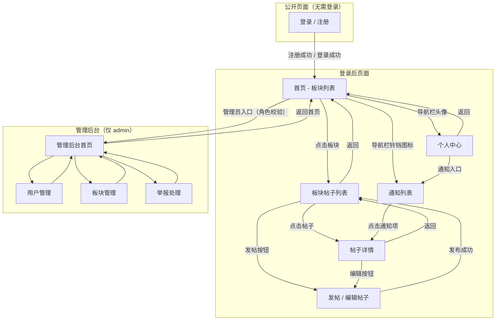

**核心导航路径：**

1. **注册登录流**：公开页面 → 注册/登录 → 首页板块列表
2. **浏览发帖流**：首页 → 板块 → 帖子列表 → 帖子详情 / 发帖编辑
3. **通知流**：导航栏铃铛图标 → 通知列表 → 点击跳转帖子详情
4. **管理流**：首页 →（角色校验）→ 管理后台首页 → 各管理页面

### 6.2 核心页面线框图说明

| 页面 | 编号 | 核心布局 |
|:-----|:-----|:---------|
| 登录/注册 | P1 | 居中表单：用户名、邮箱、密码字段；登录/注册切换Tab |
| 首页（板块列表） | P2 | 卡片式布局展示板块列表，每卡片含板块名称、描述、帖子数统计 |
| 板块帖子列表 | P3 | 顶部板块信息栏；帖子列表（标题、作者、时间、互动数据）；浮动发帖按钮 |
| 帖子详情页 | P4 | 标题 + 作者信息 + 正文内容区；评论树形列表（楼中楼缩进）；底部评论输入框 |
| 发帖/编辑帖子 | P5 | 板块选择器；标题输入框；富文本编辑器；保存草稿/发布按钮 |
| 个人中心 | P6 | 用户基本信息展示；修改密码入口；我的帖子/我的评论快捷入口 |
| 通知列表 | P7 | 时间倒序通知列表；未读标记（红点）；支持全部已读操作；点击跳转关联内容 |
| 管理后台-用户管理 | P8 | 表格视图（用户名、邮箱、角色、状态、最后登录时间）；操作按钮（封禁/解封/改角色） |
| 管理后台-板块管理 | P9 | 板块列表表格；创建/编辑/删除操作；排序值调整 |

### 6.3 核心页面线框图展示

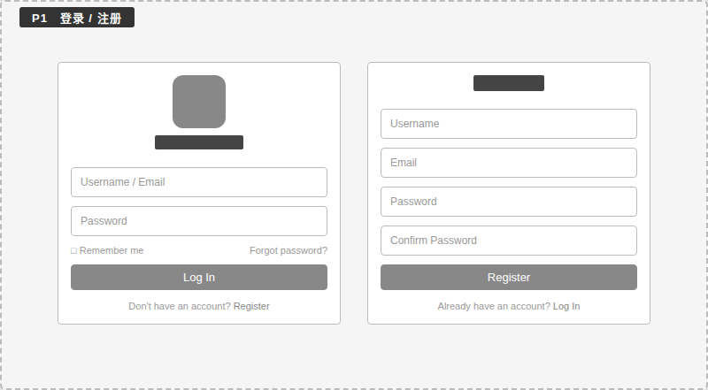
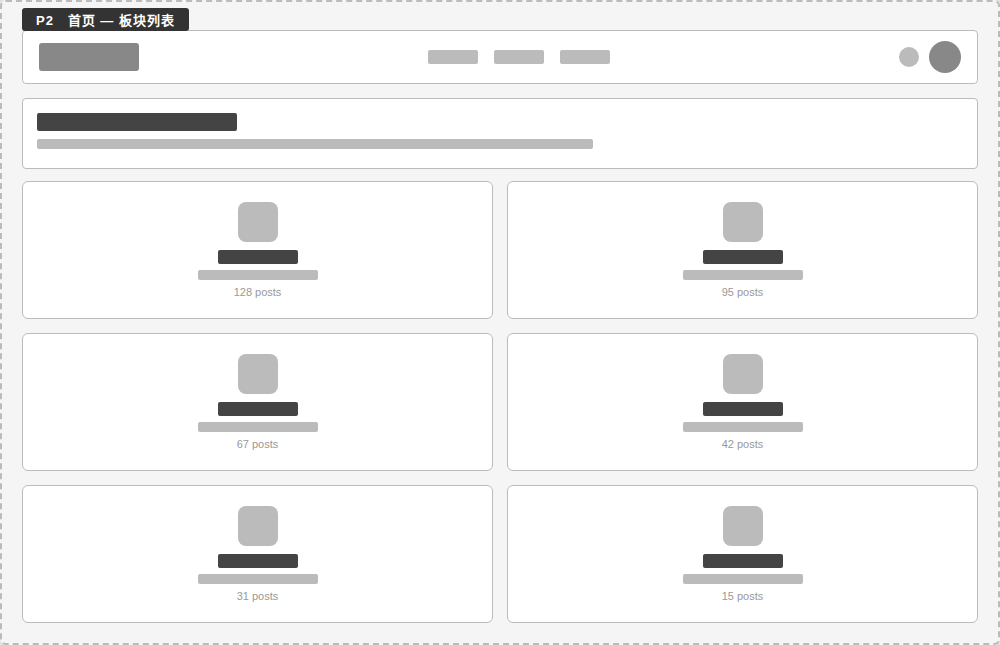
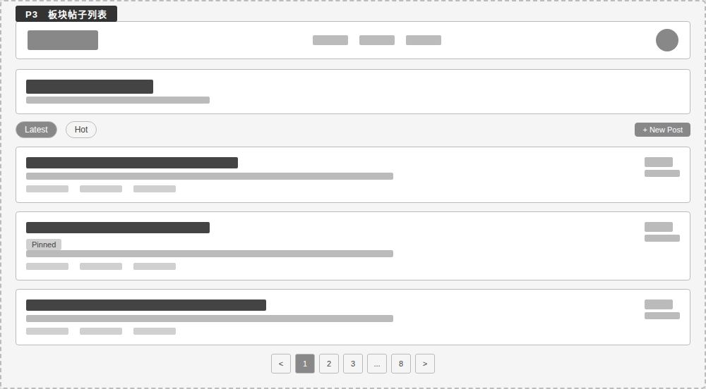
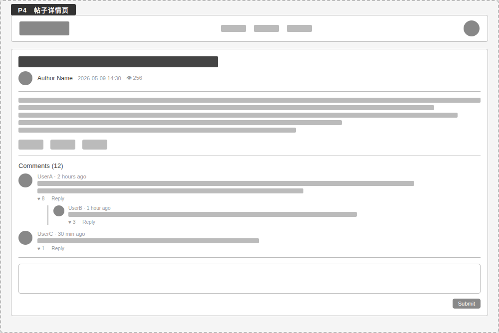
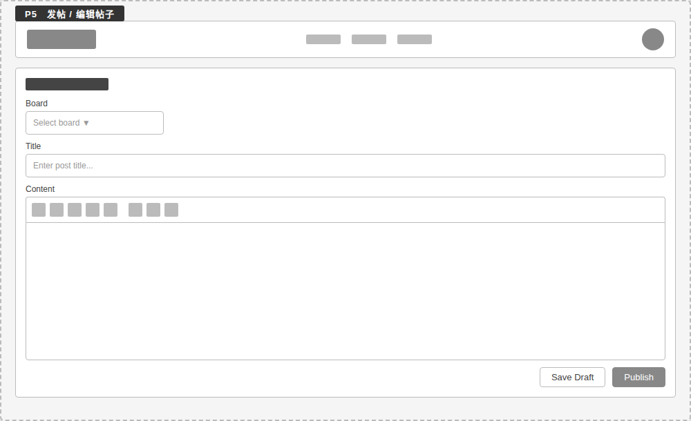
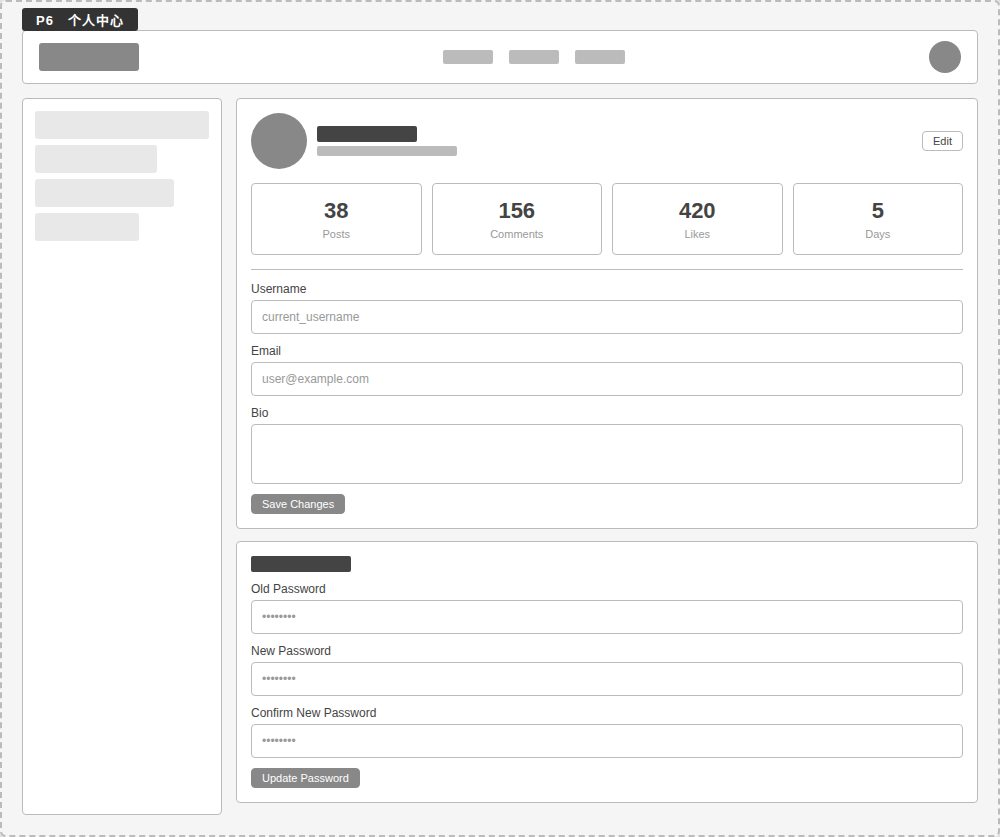
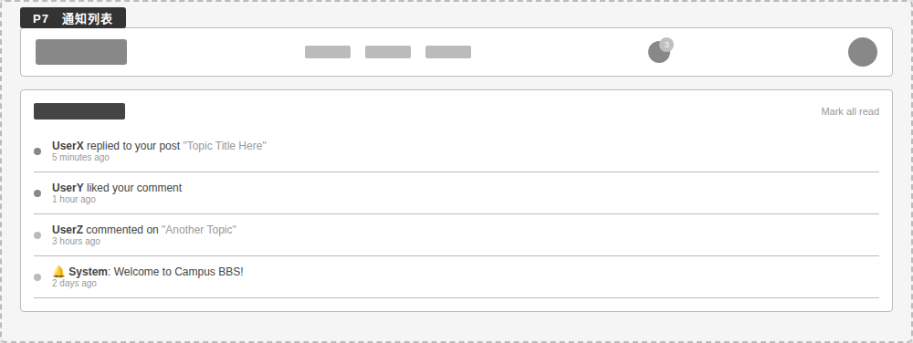
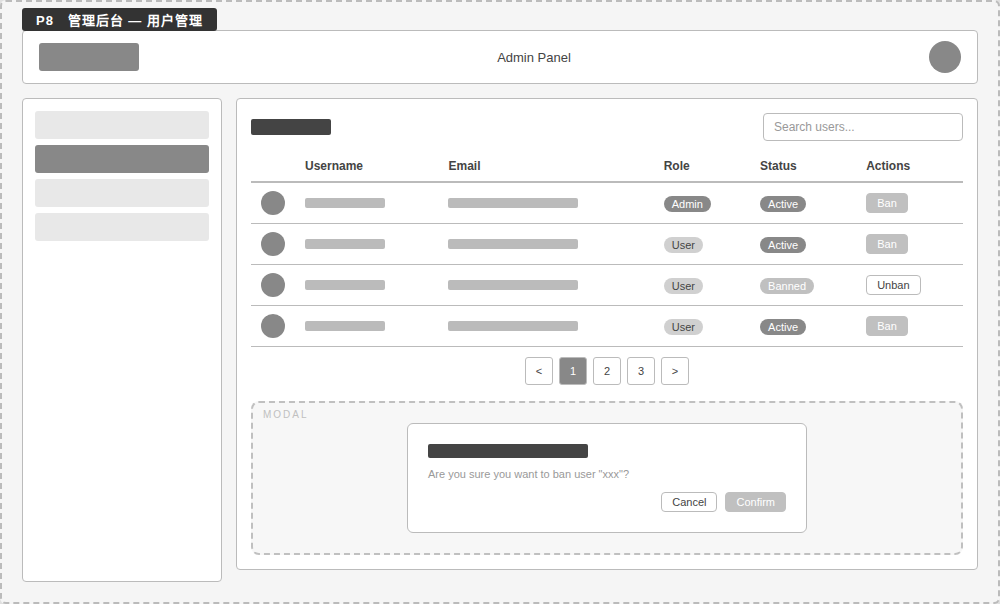
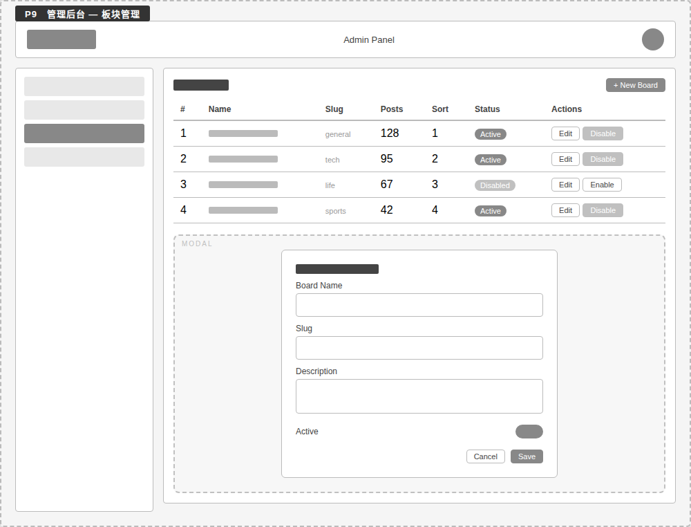

---

## 七、当前实现状态

### 7.1 子系统实现进度

| 子系统 | 状态 | 说明 |
|:-------|:-----|:-----|
| Part1 用户与认证 | ✅ 已实现 | 注册（含邮箱验证）、登录（支持用户名/邮箱/邮箱验证拦截）、登出（Token 黑名单）、密码重置、RBAC |
| Part2 帖子与分区 | 🔧 路由已定义 | 帖子 CRUD、置顶/加精、分页查询已实现；板块 Model/Service 待补充 |
| Part3 评论与互动 | 🔧 路由已定义 | 路由骨架完成，业务逻辑待实现 |
| Part4 通知 | 🔧 路由已定义 | 路由骨架完成，通知生成与读取逻辑待实现 |
| Part5 搜索与推荐 | 📋 迭代目标 | 迭代二/三实现 |
| Part6 管理后台 | 🔧 基础实现 | 用户管理（列表/封禁/解封）、板块 CRUD、系统统计已完成；举报处理待实现 |

### 7.2 已有基础设施

| 组件 | 说明 |
|:-----|:-----|
| 数据库模型基类 | Base、IDMixin（UUID PK）、TimestampMixin（created_at/updated_at/deleted_at） |
| Alembic 迁移 | 数据库版本管理，支持迁移生成、升级、回滚 |
| JWT 认证 | HS256 Token 生成/解码，OAuth2PasswordBearer 集成，Redis 黑名单 |
| EmailService | 邮箱验证 Token 签发/解码（JWT, 24h 有效期），SMTP 邮件发送（开发环境使用 Mailpit） |
| API 响应格式 | ApiResponse、PaginatedResponse、ErrorResponse 统一封装 |
| 测试框架 | pytest + httpx + fakeredis，auth 和 users 模块已有测试 |
| Git Hooks | Husky pre-commit（lint-staged：black + ruff） |
| Docker Compose | PostgreSQL + Redis 一键启动 |
