# Campus Bulletin Board System — 系统设计文档

## 一、Campus BBS 系统体系结构

### 1.1 系统上下文图

系统上下文图描述 Campus Bulletin Board System 与外部角色、外部系统之间的边界与交互关系。

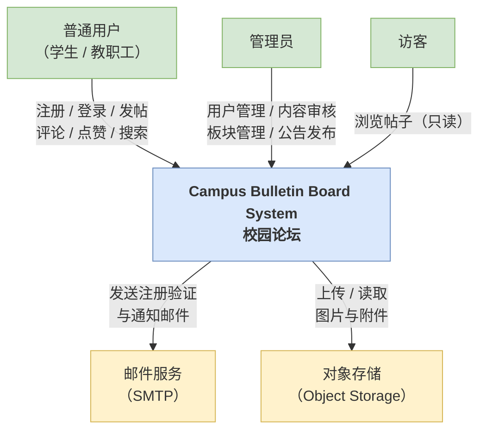

---

### 1.2 架构概览

本系统采用**前后端分离**的三层 Web 应用架构，前端 SPA 通过 RESTful API 与后端通信，后端依赖 PostgreSQL 作为主数据库、Redis 作为缓存与会话存储。

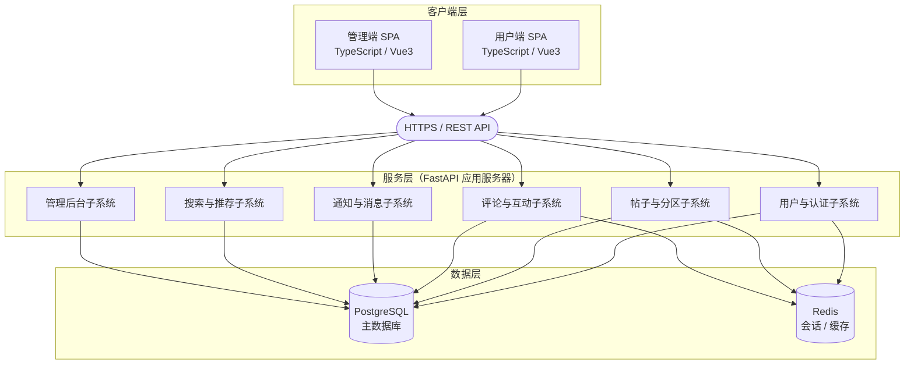

---

### 1.3 分层说明

#### 1.3.1 客户端层

| 模块       | 技术               | 职责                                    |
| ---------- | ------------------ | --------------------------------------- |
| 用户端 SPA | TypeScript + Vue3 | 注册/登录、发帖、评论、点赞、通知、搜索 |
| 管理端 SPA | TypeScript + Vue3 | 用户管理、板块管理、举报审核、公告管理  |

- 两个前端均以 **SPA（单页应用）** 形式部署，通过 HTTP 请求调用后端 REST API。
- 所有请求携带 **JWT** 令牌进行身份认证。

#### 1.3.2 服务层

后端使用 **Python + FastAPI** 构建，ORM 层采用 **SQLAlchemy**，数据校验采用 **Pydantic**，密码安全采用 **pwdlib**，令牌签发采用 **PyJWT**。

按业务领域划分为六个子系统（模块），各模块内部遵循 **Router → Service → Model** 三层职责分离：

| 子系统           | 核心职责                                 |
| ---------------- | ---------------------------------------- |
| 用户与认证子系统 | 注册（含邮箱验证）、登录、JWT 签发与刷新、角色权限控制 |
| 帖子与分区子系统 | 板块管理、帖子 CRUD、置顶/加精、分页查询 |
| 评论与互动子系统 | 评论树管理、点赞/取消点赞、互动计数维护  |
| 通知与消息子系统 | 事件驱动通知生成、站内信、未读计数       |
| 搜索与推荐子系统 | 关键词全文检索、热度排序、帖子推荐       |
| 管理后台子系统   | 封禁用户、内容审核、举报处理、操作审计   |

#### 1.3.3 数据存储层

| 组件       | 用途                                               |
| ---------- | -------------------------------------------------- |
| PostgreSQL | 所有业务数据的持久化主存储，使用 UUID 主键、软删除 |
| Redis      | JWT 黑名单（登出/吊销）、热点数据缓存、计数器加速  |

---

### 1.4 子系统交互关系

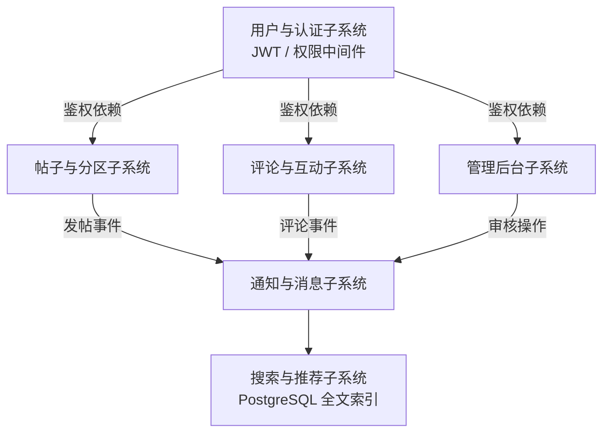

**关键交互说明**：

- 帖子/评论操作完成后，**异步**触发通知子系统生成站内通知。
- 帖子写入后，搜索子系统通过 PostgreSQL 全文索引实时可见。
- 管理后台的封禁操作通过更新 `users.status` 字段，由认证中间件在下次请求时拦截。

---

### 1.5 部署架构

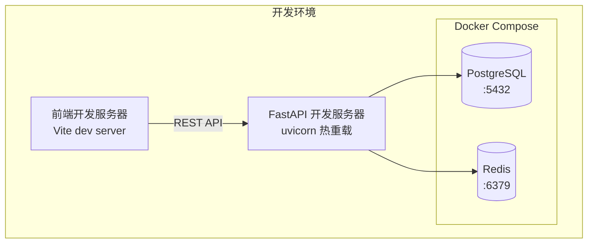

- 依赖服务（PostgreSQL、Redis）通过 **Docker Compose** 统一管理，一键启动（`make deps-up`）。
- 后端使用 **uv** 管理 Python 虚拟环境，`uvicorn` 启动开发服务器。
- 前端使用 **pnpm** 管理依赖，Vite 提供热模块替换。

---

### 1.6 关键技术决策

| 决策     | 选型                              | 理由                                   |
| -------- | --------------------------------- | -------------------------------------- |
| 认证方案 | JWT + Redis 黑名单                | 无状态扩展性好；Redis 支持主动吊销令牌 |
| 主键策略 | UUID (`gen_random_uuid()`)        | 避免 ID 枚举攻击，便于分布式扩展       |
| 软删除   | `deleted_at TIMESTAMPTZ NULL`     | 保留审计追踪，支持数据恢复             |
| 媒体存储 | 对象存储（桶/Key），DB 仅存元数据 | 避免大文件入库，降低 DB 压力           |
| 搜索     | PostgreSQL 全文检索               | 无需引入额外搜索引擎，满足校园级规模   |
| 代码质量 | black + ruff + pytest + Husky     | 统一风格，自动门禁，减少 CR 摩擦       |

---

## 二、数据库设计

### 2.1 设计目标与命名约定

数据库选用 **PostgreSQL**，遵循以下原则：

- **强一致优先**：用户、帖子、评论、点赞等核心业务数据由 PostgreSQL 保证 ACID
- **大文件分离**：图片与附件走对象存储，数据库仅存元数据引用
- **计数字段冗余**：`like_count`、`comment_count`、`reply_count`、`view_count` 冗余存储在父记录上，避免高频读操作的 COUNT 聚合
- **软删除统一**：核心业务表使用 `deleted_at TIMESTAMPTZ NULL`，数据可追溯可恢复

**通用约定：**

| 约定 | 说明 |
|:-----|:-----|
| 主键 | `id UUID DEFAULT gen_random_uuid()`，避免 ID 枚举攻击，便于分布式扩展 |
| 时间戳 | `created_at` / `updated_at` 统一为 `TIMESTAMPTZ NOT NULL` |
| 软删除 | `deleted_at TIMESTAMPTZ NULL`，非空表示已删除 |
| 计数器 | 非负整型 `BIGINT DEFAULT 0`，写入时同步更新 |
| 状态字段 | 使用 `VARCHAR(20) + CHECK` 约束，避免 ENUM 类型迁移成本 |

---

### 2.2 实体关系图（ER 图）

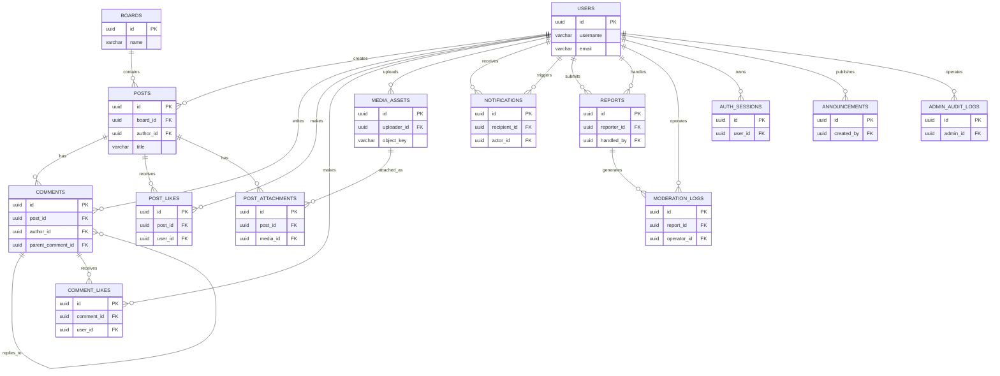

**实体关系概要：**

| 关系 | 基数 | 说明 |
|:-----|:-----|:-----|
| User → Post | 1:N | 一个用户可发布多篇帖子 |
| Board → Post | 1:N | 一个板块包含多篇帖子 |
| Post → Comment | 1:N | 一篇帖子拥有一条或多条评论 |
| Comment → Comment | 0..1:N | 评论自引用，支持楼中楼回复（parent_comment_id） |
| User → Comment | 1:N | 一个用户可发表多条评论 |
| User → PostLike | 1:N | 一个用户可点赞多篇帖子 |
| User → CommentLike | 1:N | 一个用户可点赞多条评论 |
| User → Notification | 1:N | 用户接收和触发多条通知（recipient / actor） |
| User → Report | 1:N | 用户提交举报（reporter）和处理举报（handler） |
| Report → ModerationLog | 1:N | 一次举报产生多条审核操作记录 |

---

### 2.3 核心表设计

#### 2.3.1 用户与认证

**users — 用户表**

| 字段 | 类型 | 约束 | 说明 |
|:-----|:-----|:-----|:-----|
| id | UUID | PK | 用户唯一标识 |
| username | VARCHAR(32) | UNIQUE, NOT NULL | 用户名，登录凭据之一 |
| email | VARCHAR(255) | UNIQUE, NOT NULL | 邮箱，登录凭据之一 |
| password_hash | VARCHAR(255) | NOT NULL | pwdlib (Argon2) 密码哈希 |
| nickname | VARCHAR(64) | NULL | 对外展示昵称，可为空 |
| avatar_url | VARCHAR(1024) | NULL | 头像 URL |
| role | VARCHAR(20) | NOT NULL, CHECK IN ('user', 'admin') | 角色，默认 'user' |
| status | VARCHAR(20) | NOT NULL, CHECK IN ('active', 'inactive', 'banned') | 账号状态，默认 'active' |
| last_login_at | TIMESTAMPTZ | NULL | 最后登录时间 |
| created_at | TIMESTAMPTZ | NOT NULL | 创建时间 |
| updated_at | TIMESTAMPTZ | NOT NULL | 更新时间 |
| deleted_at | TIMESTAMPTZ | NULL | 软删除时间 |

**auth_sessions — 认证会话表（预留）**

| 字段 | 类型 | 约束 | 说明 |
|:-----|:-----|:-----|:-----|
| id | UUID | PK | 会话唯一标识 |
| user_id | UUID | FK → users.id, NOT NULL | 所属用户 |
| refresh_token_hash | VARCHAR(255) | NOT NULL | Refresh Token 哈希 |
| ip_address | VARCHAR(45) | NULL | 登录 IP |
| user_agent | VARCHAR(512) | NULL | 客户端 User-Agent |
| expires_at | TIMESTAMPTZ | NOT NULL | 过期时间 |
| created_at | TIMESTAMPTZ | NOT NULL | 创建时间 |

> **实现说明**：当前 MVP 阶段使用 JWT + Redis 黑名单（登出时加入黑名单，TTL 对齐 JWT 过期时间）实现令牌吊销，`auth_sessions` 表为迭代二预留，用于支持 Refresh Token 轮换与多设备会话管理。

---

#### 2.3.2 论坛内容

**boards — 板块表**

| 字段 | 类型 | 约束 | 说明 |
|:-----|:-----|:-----|:-----|
| id | UUID | PK | 板块唯一标识 |
| name | VARCHAR(64) | UNIQUE, NOT NULL | 板块名称（如"课程交流"） |
| slug | VARCHAR(64) | UNIQUE, NOT NULL | URL 友好标识（如 "courses"） |
| description | VARCHAR(255) | NULL | 板块描述 |
| sort_order | INT | NOT NULL, DEFAULT 0 | 排序值，越小越靠前 |
| is_active | BOOLEAN | NOT NULL, DEFAULT true | 是否启用 |
| created_by | UUID | FK → users.id | 创建人 |
| created_at | TIMESTAMPTZ | NOT NULL | 创建时间 |
| updated_at | TIMESTAMPTZ | NOT NULL | 更新时间 |
| deleted_at | TIMESTAMPTZ | NULL | 软删除时间 |

**posts — 帖子表**

| 字段 | 类型 | 约束 | 说明 |
|:-----|:-----|:-----|:-----|
| id | UUID | PK | 帖子唯一标识 |
| board_id | UUID | FK → boards.id, NOT NULL | 所属板块 |
| author_id | UUID | FK → users.id, NOT NULL | 作者 |
| title | VARCHAR(255) | NOT NULL | 帖子标题 |
| content | TEXT | NOT NULL | 帖子正文（支持纯文本和 Markdown） |
| status | VARCHAR(20) | NOT NULL, CHECK IN ('normal', 'hidden', 'deleted') | 帖子状态，默认 'normal' |
| is_pinned | BOOLEAN | NOT NULL, DEFAULT false | 是否置顶 |
| is_featured | BOOLEAN | NOT NULL, DEFAULT false | 是否加精 |
| like_count | BIGINT | NOT NULL, DEFAULT 0 | 点赞数（冗余计数器） |
| comment_count | BIGINT | NOT NULL, DEFAULT 0 | 评论数（冗余计数器） |
| view_count | BIGINT | NOT NULL, DEFAULT 0 | 浏览数（冗余计数器） |
| published_at | TIMESTAMPTZ | NOT NULL | 发布时间 |
| created_at | TIMESTAMPTZ | NOT NULL | 创建时间 |
| updated_at | TIMESTAMPTZ | NOT NULL | 更新时间 |
| deleted_at | TIMESTAMPTZ | NULL | 软删除时间 |

> **设计要点**：
> - `content` 使用 TEXT 存储，支持纯文本和 Markdown 格式，前端编辑器输出由前端负责渲染
> - `like_count`、`comment_count`、`view_count` 是冗余计数器，写入点赞/评论时同步增减，避免每次帖子列表查询执行 COUNT 聚合
> - 列表查询排序规则：`is_pinned DESC → created_at DESC`，软删除记录（`deleted_at IS NOT NULL`）默认过滤

**comments — 评论表**

| 字段 | 类型 | 约束 | 说明 |
|:-----|:-----|:-----|:-----|
| id | UUID | PK | 评论唯一标识 |
| post_id | UUID | FK → posts.id, NOT NULL | 所属帖子 |
| author_id | UUID | FK → users.id, NOT NULL | 评论作者 |
| parent_comment_id | UUID | FK → comments.id, NULL | 父评论 ID（楼中楼回复） |
| root_comment_id | UUID | FK → comments.id, NULL | 根评论 ID（楼层） |
| content_json | JSONB | NULL | 评论富文本结构 |
| status | VARCHAR(20) | NOT NULL, CHECK IN ('normal', 'hidden', 'deleted') | 状态，默认 'normal' |
| like_count | BIGINT | NOT NULL, DEFAULT 0 | 点赞数（冗余计数器） |
| reply_count | BIGINT | NOT NULL, DEFAULT 0 | 回复数（冗余计数器） |
| created_at | TIMESTAMPTZ | NOT NULL | 创建时间 |
| updated_at | TIMESTAMPTZ | NOT NULL | 更新时间 |
| deleted_at | TIMESTAMPTZ | NULL | 软删除时间 |

> **楼中楼回复机制**：
> - 一级评论（楼层）：`parent_comment_id IS NULL`，`root_comment_id` 指向自身
> - 子回复（楼中楼）：`parent_comment_id` 指向被回复的评论，`root_comment_id` 指向一级楼层
> - 删除一级评论时，其所有子回复一并软删除；删除子回复仅影响自身
> - 回复创建时，同步更新父评论的 `reply_count` 和帖子的 `comment_count`

---

#### 2.3.3 互动

**post_likes — 帖子点赞表**

| 字段 | 类型 | 约束 | 说明 |
|:-----|:-----|:-----|:-----|
| id | UUID | PK | 记录唯一标识 |
| post_id | UUID | FK → posts.id, NOT NULL | 被点赞帖子 |
| user_id | UUID | FK → users.id, NOT NULL | 点赞用户 |
| created_at | TIMESTAMPTZ | NOT NULL | 点赞时间 |

**comment_likes — 评论点赞表**

| 字段 | 类型 | 约束 | 说明 |
|:-----|:-----|:-----|:-----|
| id | UUID | PK | 记录唯一标识 |
| comment_id | UUID | FK → comments.id, NOT NULL | 被点赞评论 |
| user_id | UUID | FK → users.id, NOT NULL | 点赞用户 |
| created_at | TIMESTAMPTZ | NOT NULL | 点赞时间 |

> **点赞约束**：两张表均设 `UNIQUE(post_id, user_id)` / `UNIQUE(comment_id, user_id)`，确保同一用户对同一对象仅可点赞一次。点赞时 `INSERT` 记录并同步 `UPDATE` 目标对象的 `like_count + 1`；取消点赞时 `DELETE` 记录并同步 `like_count - 1`（不低于 0）。

---

#### 2.3.4 通知

**notifications — 通知表**

| 字段 | 类型 | 约束 | 说明 |
|:-----|:-----|:-----|:-----|
| id | UUID | PK | 通知唯一标识 |
| recipient_id | UUID | FK → users.id, NOT NULL | 接收人 |
| actor_id | UUID | FK → users.id, NULL | 触发人（系统通知时为空） |
| type | VARCHAR(30) | NOT NULL, CHECK IN ('comment', 'reply', 'like', 'system') | 通知类型 |
| title | VARCHAR(120) | NOT NULL | 通知标题 |
| content | VARCHAR(500) | NOT NULL | 通知内容 |
| related_type | VARCHAR(20) | NULL | 关联对象类型（post / comment） |
| related_id | UUID | NULL | 关联对象 ID |
| is_read | BOOLEAN | NOT NULL, DEFAULT false | 是否已读 |
| read_at | TIMESTAMPTZ | NULL | 已读时间 |
| created_at | TIMESTAMPTZ | NOT NULL | 创建时间 |

> **通知触发规则（对应需求 UC-12）**：
>
> | 触发事件 | type | 通知内容模板 |
> |:---------|:-----|:-------------|
> | 用户评论我的帖子 | `comment` | "{actor.nickname} 评论了你的帖子《{post.title}》" |
> | 用户回复我的评论 | `reply` | "{actor.nickname} 回复了你的评论" |
> | 用户给我点赞 | `like` | "{actor.nickname} 赞了你的帖子/评论" |
> | 管理员发布公告 | `system` | 公告标题和内容摘要 |

** 通知推送为异步操作**：帖子/评论/点赞写入成功后，通过后台任务（FastAPI BackgroundTasks 或消息队列）创建通知记录，不阻塞用户请求的响应返回。

---

#### 2.3.5 审核与管理

**reports — 举报表**

| 字段 | 类型 | 约束 | 说明 |
|:-----|:-----|:-----|:-----|
| id | UUID | PK | 举报唯一标识 |
| reporter_id | UUID | FK → users.id, NOT NULL | 举报人 |
| target_type | VARCHAR(20) | NOT NULL, CHECK IN ('post', 'comment') | 举报对象类型 |
| target_id | UUID | NOT NULL | 举报对象 ID |
| reason | VARCHAR(500) | NOT NULL | 举报原因 |
| status | VARCHAR(20) | NOT NULL, CHECK IN ('pending', 'resolved', 'dismissed') | 处理状态，默认 'pending' |
| handled_by | UUID | FK → users.id, NULL | 处理人 |
| handled_at | TIMESTAMPTZ | NULL | 处理时间 |
| result_note | VARCHAR(500) | NULL | 处理备注 |
| created_at | TIMESTAMPTZ | NOT NULL | 创建时间 |

**moderation_logs — 审核操作日志表**

| 字段 | 类型 | 约束 | 说明 |
|:-----|:-----|:-----|:-----|
| id | UUID | PK | 日志唯一标识 |
| report_id | UUID | FK → reports.id, NULL | 关联举报（NULL 表示管理员直接操作） |
| operator_id | UUID | FK → users.id, NOT NULL | 操作人 |
| action | VARCHAR(30) | NOT NULL | 操作类型：ban_user / unban_user / hide_post / restore_post / delete_post / hide_comment / restore_comment |
| target_type | VARCHAR(20) | NOT NULL | 操作对象类型 |
| target_id | UUID | NOT NULL | 操作对象 ID |
| detail | VARCHAR(500) | NULL | 操作详情 |
| created_at | TIMESTAMPTZ | NOT NULL | 操作时间 |

> **审计追踪**：所有管理员操作（封禁/解封、隐藏/恢复、删除）均记录到 `moderation_logs`，支持事后审计和问题溯源。对应需求 UC-18（举报处理）和 UC-17（内容审核）。

**announcements — 公告表**

| 字段 | 类型 | 约束 | 说明 |
|:-----|:-----|:-----|:-----|
| id | UUID | PK | 公告唯一标识 |
| title | VARCHAR(120) | NOT NULL | 公告标题 |
| content | TEXT | NOT NULL | 公告正文 |
| is_published | BOOLEAN | NOT NULL, DEFAULT false | 是否已发布 |
| starts_at | TIMESTAMPTZ | NULL | 生效时间 |
| ends_at | TIMESTAMPTZ | NULL | 失效时间 |
| created_by | UUID | FK → users.id, NOT NULL | 创建人 |
| created_at | TIMESTAMPTZ | NOT NULL | 创建时间 |
| updated_at | TIMESTAMPTZ | NOT NULL | 更新时间 |
| deleted_at | TIMESTAMPTZ | NULL | 软删除时间 |

**admin_audit_logs — 管理操作审计表**

| 字段 | 类型 | 约束 | 说明 |
|:-----|:-----|:-----|:-----|
| id | UUID | PK | 日志唯一标识 |
| admin_id | UUID | FK → users.id, NOT NULL | 操作管理员 |
| action | VARCHAR(50) | NOT NULL | 操作类型描述 |
| target_type | VARCHAR(30) | NULL | 操作对象类型 |
| target_id | UUID | NULL | 操作对象 ID |
| detail | JSONB | NULL | 操作详情（结构化存储） |
| ip_address | VARCHAR(45) | NULL | 操作来源 IP |
| created_at | TIMESTAMPTZ | NOT NULL | 操作时间 |

---

#### 2.3.6 媒体资源

**media_assets — 媒体资源表**

| 字段 | 类型 | 约束 | 说明 |
|:-----|:-----|:-----|:-----|
| id | UUID | PK | 媒体唯一标识 |
| uploader_id | UUID | FK → users.id, NOT NULL | 上传者 |
| bucket | VARCHAR(100) | NOT NULL | 对象存储桶名 |
| object_key | VARCHAR(512) | NOT NULL | 存储对象 Key |
| url | VARCHAR(1024) | NULL | 访问地址 |
| file_name | VARCHAR(255) | NOT NULL | 原始文件名 |
| mime_type | VARCHAR(100) | NOT NULL | MIME 类型 |
| file_size | BIGINT | NOT NULL | 文件大小（字节） |
| width | INT | NULL | 图片宽度 |
| height | INT | NULL | 图片高度 |
| sha256 | CHAR(64) | NULL | 文件 SHA-256 哈希（用于去重） |
| source_type | VARCHAR(20) | NOT NULL, CHECK IN ('post', 'comment', 'avatar') | 来源类型 |
| source_id | UUID | NULL | 关联业务 ID |
| is_public | BOOLEAN | NOT NULL, DEFAULT true | 是否公开可访问 |
| created_at | TIMESTAMPTZ | NOT NULL | 创建时间 |
| updated_at | TIMESTAMPTZ | NOT NULL | 更新时间 |
| deleted_at | TIMESTAMPTZ | NULL | 软删除时间 |

> **约束**：`UNIQUE(bucket, object_key)` 确保同一桶内 Key 唯一。MVP 阶段预留表结构与接口，不接入真实对象存储。

**post_attachments — 帖子附件关联表**

| 字段 | 类型 | 约束 | 说明 |
|:-----|:-----|:-----|:-----|
| id | UUID | PK | 关联唯一标识 |
| post_id | UUID | FK → posts.id, NOT NULL | 帖子 |
| media_id | UUID | FK → media_assets.id, NOT NULL | 媒体 |
| sort_order | INT | NOT NULL, DEFAULT 0 | 附件展示排序 |
| created_at | TIMESTAMPTZ | NOT NULL | 创建时间 |

> **多对多关联**：一篇帖子可包含多个附件，一个媒体资源可被多篇帖子引用（去重场景）。

---

### 2.4 索引策略

| 表 | 索引字段 | 索引类型 | 用途 |
|:---|:---------|:---------|:-----|
| users | username, email | UNIQUE | 登录查找，唯一性校验 |
| users | deleted_at | INDEX | 过滤已删除用户 |
| boards | slug | UNIQUE | 通过 URL 标识查找板块 |
| boards | sort_order, is_active | INDEX | 板块列表排序与筛选 |
| posts | board_id | INDEX | 按板块筛选帖子 |
| posts | author_id | INDEX | 查询用户发帖列表 |
| posts | created_at | INDEX | 按时间排序 |
| posts | (board_id, is_pinned DESC, created_at DESC) | COMPOSITE | 板块帖子列表核心查询 |
| posts | deleted_at | INDEX | 过滤已删除帖子 |
| comments | post_id | INDEX | 按帖子查询评论 |
| comments | parent_comment_id | INDEX | 楼中楼子回复查询 |
| comments | root_comment_id | INDEX | 按楼层聚合评论 |
| comments | author_id | INDEX | 查询用户评论列表 |
| post_likes | (post_id, user_id) | UNIQUE | 防重点赞 + 查询点赞用户 |
| post_likes | user_id | INDEX | 查询用户点赞列表 |
| comment_likes | (comment_id, user_id) | UNIQUE | 防重点赞 + 查询点赞用户 |
| comment_likes | user_id | INDEX | 查询用户点赞列表 |
| notifications | recipient_id, is_read, created_at | COMPOSITE | 未读通知查询（未读优先+时间排序） |
| notifications | recipient_id | INDEX | 用户通知列表 |
| reports | status, created_at | COMPOSITE | 待处理举报列表 |
| media_assets | (bucket, object_key) | UNIQUE | 对象存储去重 |
| media_assets | uploader_id | INDEX | 查询用户上传列表 |

**索引设计原则：**
- 高频查询条件的单列或组合列建索引，覆盖帖子列表、评论树、通知列表等核心查询
- 所有 `UNIQUE` 约束自动创建唯一索引，兼顾数据一致性和查询性能
- 软删除过滤字段（`deleted_at`）建索引，确保 `WHERE deleted_at IS NULL` 查询走索引
- 复合索引按查询频率与筛选选择性排列字段顺序

---

### 2.5 数据库关键设计决策

| 决策 | 选型 | 理由 |
|:-----|:-----|:-----|
| 主键策略 | UUID (`gen_random_uuid()`) | 避免自增 ID 枚举攻击；去中心化生成，便于分布式扩展；无需 SEQUENCE 竞争 |
| 软删除 | `deleted_at TIMESTAMPTZ NULL` | 数据可追溯、可恢复；所有查询默认添加 `WHERE deleted_at IS NULL` 过滤 |
| 计数器冗余 | post.like_count / comment_count / view_count；comment.like_count / reply_count | 以写入时额外一次 UPDATE 换取列表查询免去 COUNT 聚合，支撑高并发读场景 |
| 内容存储 | `content TEXT` | 支持纯文本和 Markdown 格式；前端编辑器负责渲染，后端无需解析内容结构 |
| 状态字段 | VARCHAR + CHECK | 避免 ENUM 的 ALTER TYPE 迁移成本；CHECK 约束保证数据完整性 |
| 评论树模型 | `parent_comment_id` + `root_comment_id` | 一次查询即可获取所有楼层（`root_comment_id` 分组），再按 `parent_comment_id` 组装树，避免递归 CTE |
| 点赞幂等 | UNIQUE(user_id, target_id) + 计数同步 | 数据库约束保证不重复点赞；应用层事务内同步更新计数 |
| 通知异步化 | 后台任务创建通知记录 | 评论/点赞请求不因通知写入而阻塞，用户响应延迟不受通知链路影响 |
| 大文件分离 | DB 仅存元数据，文件走对象存储 | 避免 BLOB 入库导致表膨胀、备份缓慢；对象存储天然支持 CDN 加速 |
| 迁移管理 | Alembic | 版本化追踪所有 schema 变更，支持升级、回滚、历史查看 |


## 三、关键过程描述

### 3.1 文档目的与范围

本文档用于补充系统设计中的“关键过程描述”部分，说明系统中会穿过多个层次、改变核心业务状态或驱动跨子系统协作的业务流程。文档基于现有需求分析、组件设计、数据库设计与当前后端实现编写，重点回答以下问题：

1. 用户请求进入系统后，如何完成身份识别、权限判断与业务处理；
2. 关键对象在流程中如何变化；
3. 不同子系统之间如何协作；
4. 当前已实现流程与后续设计流程各自覆盖到什么程度。

本文档不重复列出所有 CRUD 接口，而选择对系统价值最高、约束最强、最能体现架构设计的过程进行描述。

### 3.2 关键过程总览

| 编号 | 关键过程 | 关联用例 | 当前状态 | 选择原因 |
|:---|:---|:---|:---|:---|
| KP-1 | 用户登录与会话建立 | UC-2 用户登录 | 已实现 | 是所有受保护功能的入口，决定认证链路是否成立 |
| KP-2 | 受保护请求鉴权与管理员授权 | UC-4 RBAC | 已实现 | 贯穿帖子、用户、管理后台等多个子系统 |
| KP-3 | 发布帖子 | UC-6 发帖 | 已实现 | 是论坛的核心内容生产流程 |
| KP-4 | 评论/回复与通知联动 | UC-9、UC-12、UC-13 | 设计阶段 | 同时涉及评论、帖子计数、通知三个子系统 |
| KP-5 | 点赞/取消点赞与计数同步 | UC-10、UC-11、UC-12 | 设计阶段 | 体现唯一约束、冗余计数和通知触发的协同设计 |
| KP-6 | 管理员封禁用户 | UC-15 用户管理 | 已实现 | 体现 RBAC、状态迁移和已签发 Token 的约束收敛 |

#### 3.2.1 共同设计约束

| 约束 | 说明 |
|:---|:---|
| 身份来源可信 | 当前用户身份只从 JWT 中解析，不接受客户端自行提交 `author_id`、`actor_id` 等敏感标识 |
| 分层单向调用 | 请求处理遵循 Router → Service → Model/Database 的方向；鉴权、Schema、工具函数作为横切构件被复用 |
| 软删除优先 | 帖子、评论、板块等内容对象通过 `deleted_at` 标记删除；查询时统一过滤已删除数据 |
| 状态先于行为 | 用户、帖子、评论都以状态字段约束可执行操作；例如被封禁用户不可继续使用认证能力 |
| 统一响应封装 | 成功结果通过 `ApiResponse` / `PaginatedResponse` 输出，便于前端统一处理 |
| 计数冗余 | 点赞数、评论数、回复数在写入时同步维护，减少列表页和详情页的聚合查询成本 |

### 3.3 KP-1 用户登录与会话建立

#### 3.3.1 过程目标

用户通过用户名或邮箱及密码完成身份校验，系统签发后续访问所需的 JWT，并更新最近登录时间。

#### 3.3.2 参与元素

| 层次 | 元素 |
|:---|:---|
| Router | `POST /api/v1/auth/login`，`AuthRouter.login()` |
| Service | `AuthService.login()` |
| Schema | `LoginRequest`、`LoginData`、`AuthUserData` |
| Model | `User` |
| Utility | `verify_password()`、JWT 编码逻辑 |

#### 3.3.3 前置条件与后置条件

| 类型 | 内容 |
|:---|:---|
| 前置条件 | 用户已注册；请求体包含合法 `account` 与 `password` |
| 后置条件 | 返回 `access_token`、`expires_in` 与用户摘要；`last_login_at` 被更新 |

#### 3.3.4 主流程

1. 客户端提交账号与密码至登录接口；
2. FastAPI 使用 `LoginRequest` 完成字段校验；
3. `AuthService.login()` 按用户名或邮箱查询用户；
4. 使用密码哈希工具校验明文密码与 `password_hash`；
5. 检查 `user.status`，仅允许 `active` 用户登录；
6. 更新 `last_login_at` 并提交数据库事务；
7. 以 `user.id`、`user.role` 和过期时间生成 JWT；
8. 返回统一封装后的登录结果。

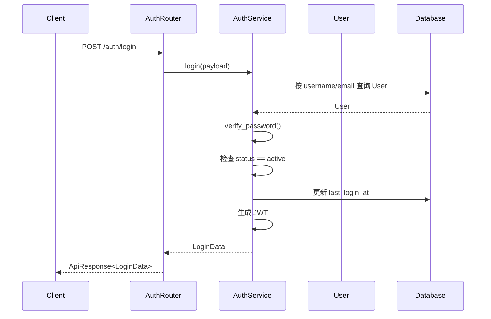

#### 3.3.5 异常流程

| 场景 | 处理 |
|:---|:---|
| 用户不存在或密码错误 | 返回 `401 Invalid account or password` |
| 用户状态为 `inactive` 或 `banned` | 返回 `403 User is ...` |
| 请求字段缺失或格式不合法 | 由 Pydantic 返回 `422` |

#### 3.3.6 关键数据变化

| 数据对象 | 变化 |
|:---|:---|
| `users.last_login_at` | 更新为当前时间 |
| JWT | 新建，默认携带 `sub`、`role`、`exp` |

### 3.4 KP-2 受保护请求鉴权与管理员授权

#### 3.4.1 过程目标

对所有需要登录的接口建立统一准入控制，并在管理类接口上叠加管理员角色校验。

#### 3.4.2 参与元素

| 层次 | 元素 |
|:---|:---|
| Dependency | `get_current_user()`、`require_admin()` |
| Utility | `is_token_blacklisted()`、`decode_access_token()` |
| Model | `User` |
| 典型接口 | `/users/me`、`/posts/*`、`/admin/*` |

#### 3.4.3 主流程

1. 路由通过 `OAuth2PasswordBearer` 从请求头提取 Bearer Token；
2. `get_current_user()` 先查询 Redis 黑名单，已登出的 Token 直接拒绝；
3. 解码 JWT，解析 `sub` 并转换为用户 UUID；
4. 查询用户记录，确认用户存在；
5. 对普通受保护请求，确认用户未处于 `banned` 状态后放行；
6. 对管理后台请求，`require_admin()` 在前述步骤基础上继续判断 `role == "admin"`；
7. 鉴权通过后，当前 `User` 实例被注入业务处理函数。

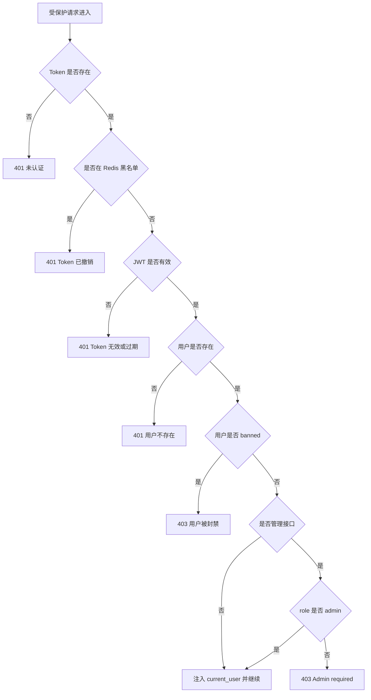

#### 3.4.4 关键设计说明

| 设计点 | 说明 |
|:---|:---|
| 登出立即生效 | `logout()` 将 Token 写入 Redis 黑名单，后续请求即使 Token 尚未过期也会被拒绝 |
| 封禁及时生效 | 当前实现中 `get_current_user()` 每次请求都会检查 `banned` 状态，因此管理员封禁后，用户旧 Token 也无法继续访问受保护接口 |
| 管理权限集中 | 管理后台 Router 统一声明 `dependencies=[Depends(require_admin)]`，避免每个接口重复编写角色判断 |

### 3.5 KP-3 发布帖子

#### 3.5.1 过程目标

已登录用户在指定板块中发布新帖子，系统自动绑定作者并生成发布时间。

#### 3.5.2 参与元素

| 层次 | 元素 |
|:---|:---|
| Router | `POST /api/v1/posts/`，`create_post()` |
| Dependency | `get_current_user()`、`get_db()` |
| Service | `PostService.create()` |
| Schema | `PostCreate`、`PostRead` |
| Model | `Post`、`User` |

#### 3.5.3 前置条件与后置条件

| 类型 | 内容 |
|:---|:---|
| 前置条件 | 请求方已通过认证；请求体包含 `title`、`content`、`board_id` |
| 后置条件 | 新建 `Post`，自动写入 `author_id` 与 `published_at`，并返回帖子详情 |

#### 3.5.4 主流程

1. 客户端提交发帖请求；
2. `get_current_user()` 校验 Token 并注入当前用户；
3. `PostCreate` 校验标题、正文和板块 ID；
4. Router 调用 `PostService.create()`，只传递业务字段与 `current_user.id`；
5. Service 合并输入字段、作者 ID 和当前发布时间，构造 `Post` ORM 对象；
6. 执行 `add → commit → refresh` 完成持久化；
7. FastAPI 按 `PostRead` 将 ORM 对象序列化，最终包装为统一响应返回。

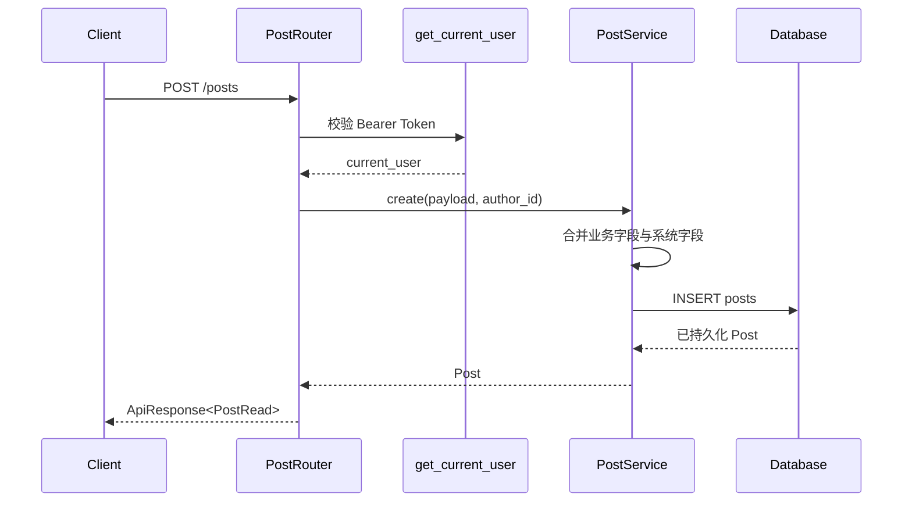

#### 3.5.5 异常与边界

| 场景 | 处理 |
|:---|:---|
| 未登录或 Token 无效 | 返回 `401` |
| 用户被封禁 | 返回 `403` |
| 请求体格式不合法 | 返回 `422` |
| 板块不存在或不可用 | 需求设计中应拒绝创建；当前实现层尚需补齐显式校验 |

#### 3.5.6 关键数据变化

| 数据对象 | 变化 |
|:---|:---|
| `posts` | 新增一条记录 |
| `posts.author_id` | 由系统从 JWT 用户身份注入 |
| `posts.published_at` | 由系统自动写入 |

### 3.6 KP-4 评论/回复与通知联动

#### 3.6.1 过程目标

用户对帖子发表评论或回复评论时，系统在保存评论的同时维护计数，并根据事件类型创建通知。

#### 3.6.2 当前状态

评论与通知 Router 已建立，但当前仓库中尚未实现对应 Service 逻辑。以下内容描述目标设计，应作为后续开发与测试的过程规范。

#### 3.6.3 参与元素

| 层次 | 元素 |
|:---|:---|
| Router | `CommentRouter`、`NotificationRouter` |
| Service | `CommentService`、`NotificationService` |
| Model | `Comment`、`Post`、`Notification` |
| 数据字段 | `parent_comment_id`、`root_comment_id`、`comment_count`、`reply_count`、`is_read` |

#### 3.6.4 主流程

1. 已登录用户提交评论内容；
2. 系统校验目标帖子存在且未被删除；
3. 若 `parent_comment_id` 为空，则创建一级评论；保存后将 `root_comment_id` 指向自身；
4. 若 `parent_comment_id` 不为空，则查询父评论并继承其根评论编号，创建回复；
5. 在同一业务处理中同步更新帖子 `comment_count`；若是回复，则同时更新父评论 `reply_count`；
6. `CommentService` 根据事件类型调用 `NotificationService`：
   - 评论帖子时，通知帖子作者；
   - 回复评论时，通知被回复评论作者；
7. 创建 `notifications` 记录，默认 `is_read = false`；
8. 返回评论结果，前端后续可通过未读计数接口展示提醒。

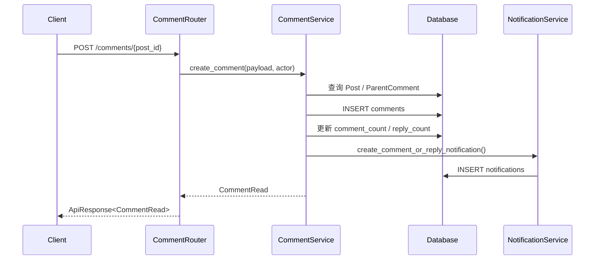

#### 3.6.5 异常流程

| 场景 | 处理 |
|:---|:---|
| 帖子不存在或已删除 | 返回 `404` |
| 父评论不存在或已删除 | 返回 `404` |
| 未登录 | 返回 `401` |
| 被封禁用户尝试评论 | 返回 `403` |

#### 3.6.6 关键数据变化

| 数据对象 | 变化 |
|:---|:---|
| `comments` | 新增一级评论或回复 |
| `posts.comment_count` | `+1` |
| `comments.reply_count` | 回复场景下父评论 `+1` |
| `notifications` | 新增 `comment` 或 `reply` 类型通知 |

### 3.7 KP-5 点赞/取消点赞与计数同步

#### 3.7.1 过程目标

用户对帖子或评论执行点赞与取消点赞，系统通过唯一约束防止重复点赞，并同步维护冗余计数和通知。

#### 3.7.2 当前状态

点赞 Router 已建立，但当前仓库尚未实现 LikeService 及对应持久化逻辑。以下为目标设计。

#### 3.7.3 主流程：点赞

1. 已登录用户请求点赞帖子或评论；
2. 系统确认目标对象存在且可见；
3. 检查当前用户是否已有点赞记录；
4. 若不存在，则新增 `post_likes` 或 `comment_likes` 记录；
5. 将目标对象的 `like_count` 加一；
6. 根据目标对象作者创建 `like` 类型通知；
7. 返回最新点赞状态与计数。

#### 3.7.4 主流程：取消点赞

1. 已登录用户请求取消点赞；
2. 系统定位现有点赞记录；
3. 删除对应记录；
4. 将目标对象 `like_count` 减一，并保证结果不低于零；
5. 返回最新点赞状态与计数。

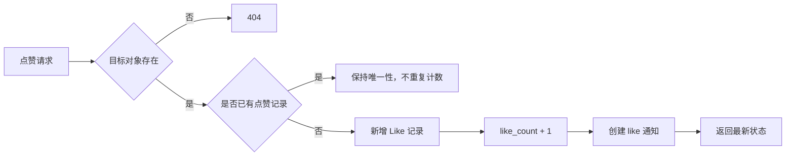

#### 3.7.5 关键约束

| 约束 | 说明 |
|:---|:---|
| 幂等性 | 同一用户对同一对象只能保留一条有效点赞记录 |
| 一致性 | 点赞记录与 `like_count` 应在同一事务中更新，避免计数漂移 |
| 下界保护 | 取消点赞后计数不得小于零 |
| 读取效率 | 列表和详情页优先读取冗余计数，不在每次请求中实时聚合 |

#### 3.7.6 关键数据变化

| 操作 | 数据变化 |
|:---|:---|
| 点赞 | 新增 `post_likes` / `comment_likes`；目标对象 `like_count + 1`；新增通知 |
| 取消点赞 | 删除点赞记录；目标对象 `like_count - 1` |

### 3.8 KP-6 管理员封禁用户

#### 3.8.1 过程目标

管理员修改目标用户状态，使其无法继续正常登录，并在后续受保护请求中被拒绝。

#### 3.8.2 参与元素

| 层次 | 元素 |
|:---|:---|
| Router | `PATCH /api/v1/admin/users/{id}/status` |
| Dependency | `require_admin()` |
| Service | `UserService.update_status()` |
| Schema | `UpdateUserStatusRequest`、`AdminUserData` |
| Model | `User` |

#### 3.8.3 主流程

1. 管理员携带 Token 调用用户状态更新接口；
2. `require_admin()` 先完成当前用户认证，再校验其角色为 `admin`；
3. FastAPI 校验目标用户 ID 与请求体中的状态值；
4. `UserService.update_status()` 按 ID 定位目标用户；
5. 将目标用户 `status` 更新为 `banned` 并提交事务；
6. 返回更新后的管理视图数据；
7. 目标用户后续再次登录时会被 `AuthService.login()` 拒绝；
8. 若目标用户仍持有旧 Token，受保护请求也会被 `get_current_user()` 拦截。

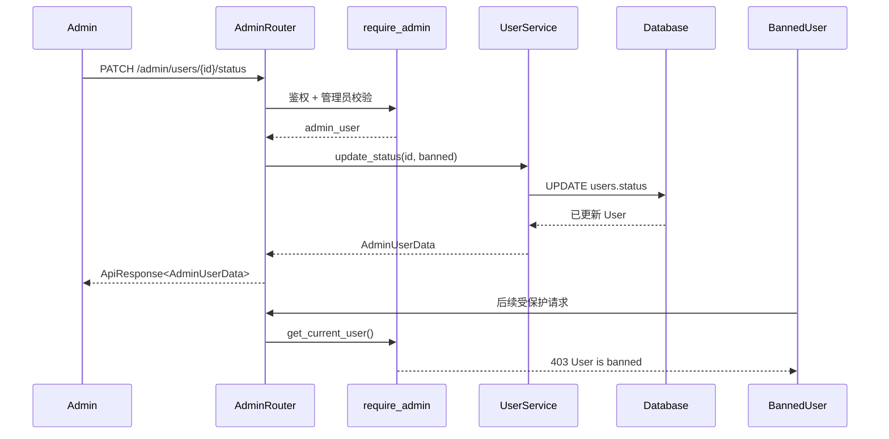

#### 3.8.4 异常流程

| 场景 | 处理 |
|:---|:---|
| 普通用户访问管理接口 | 返回 `403 Admin required` |
| 目标用户不存在 | 返回 `404 User not found` |
| 状态值非法 | 返回 `422` |
| 管理员 Token 无效 | 返回 `401` |

#### 3.8.5 关键数据变化

| 数据对象 | 变化 |
|:---|:---|
| `users.status` | 从 `active` / `inactive` 改为 `banned` |
| 访问控制结果 | 登录与后续受保护请求均被拒绝 |

### 3.9 关键过程之间的协作关系

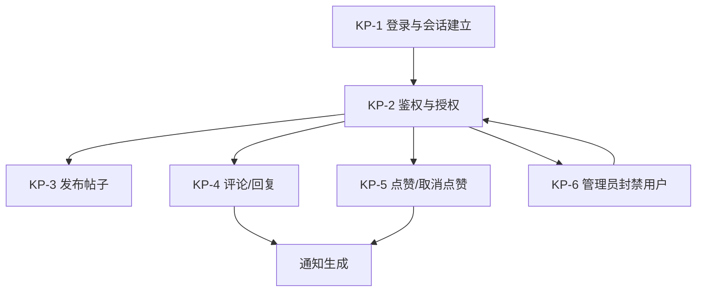

| 协作关系 | 说明 |
|:---|:---|
| KP-1 → KP-2 | 登录签发的 JWT 是后续鉴权链路的输入 |
| KP-2 → KP-3/KP-4/KP-5/KP-6 | 所有受保护业务都依赖统一认证结果 |
| KP-4/KP-5 → 通知子系统 | 评论、回复、点赞事件均会触发通知 |
| KP-6 → KP-2 | 用户被封禁后，统一鉴权链路会立即收紧其访问能力 |

---

## 四、组件设计

### 设计任务与过程

#### 设计目标与方法

本系统详细设计遵循结构化与面向对象相结合的设计方法（Structured + OO Design），以需求分析文档（`docs/RequirementAnalysis.md`）中定义的 18 个用例和 6 个子系统为输入，自顶向下逐层精化，最终产出包含子系统构件、类规约、状态模型及数据持久化方案的完整设计规约。

#### 设计流程

设计活动按以下六个阶段顺序推进，各阶段之间通过设计评审形成反馈闭环：

| 阶段 | 输入 | 输出 | 对应本文档章节 |
|:---|:---|:---|:---|
| **用例解析** | 需求用例规约 | 用例实现方案（步骤分解+伪代码） | 第 2 节 |
| **子系统与构件划分** | 用例实现方案 | 子系统设计元素表、构件规约 | 第 1 节、第 5 节 |
| **类设计与精化** | 子系统设计元素 | 实体类+控制类属性/方法精化、UML 类图 | 第 3 节 |
| **状态建模** | 类规约 | 核心对象状态机图及转移规则表 | 第 4 节 |
| **数据模型设计** | 类规约 | 关系型表结构、ORM 映射策略、索引方案 | 第 6 节 |
| **设计整合与验证** | 全部设计产物 | 设计评审检查单、测试验证策略 | 第 7 节 |

#### 设计原则

本系统设计遵循以下核心原则：

- **高内聚低耦合**：每个子系统仅负责单一业务边界内的事务；层间通过接口（FastAPI Depends）解耦，上层不感知下层实现细节。
- **单一职责**：Router 仅负责 HTTP 协议适配，Service 负责业务规则，Model 负责持久化映射，各层职责不交叉。
- **开闭原则**：通过 Mixin 模式（`IDMixin`、`TimestampMixin`）扩展实体，新增实体无需修改基类。
- **依赖倒置**：Router 依赖 Service 抽象（通过依赖注入工厂），不直接实例化具体类。

---

### 4.1 子系统内部设计元素确立

#### 4.1.1 后端分层架构

本系统后端采用经典的三层架构（Three-Tier Architecture），将关注点严格分离为控制层（Router）、业务层（Service）和数据访问层（Model/DAO），各层之间通过依赖注入（Dependency Injection）实现松耦合。各层的职责与设计约束如下表所示。

| 层次 | 对应目录 | 职责 | 依赖方向 |
|:---|:---|:---|:---|
| **控制层** (Router) | `routers/` | 接收 HTTP 请求，校验输入参数，调用业务层，组装响应 | → Service + Schema + Deps |
| **业务层** (Service) | `services/` | 实现核心业务规则，编排事务，协调多个数据访问对象 | → Model + Schema |
| **数据访问层** (Model/DAO) | `models/` | 映射数据库表结构为 ORM 实体，封装持久化逻辑 | → database.py (Engine) |
| **横切关注点** (Cross-cutting) | `deps/`, `utils/`, `schemas/` | 认证鉴权、密码哈希、缓存、请求/响应数据结构定义 | 被各层单向引用 |

上述分层遵循**单向依赖原则**：上层可依赖下层，下层不可反向依赖上层。具体而言，Router 可依赖 Service 和 Model；Service 可依赖 Model；Model 不依赖任何上层模块。横切模块（`schemas`、`utils`、`deps`）被各层共同依赖，但其本身不依赖任何业务层。

#### 4.1.2 帖子管理子系统的设计元素

以"帖子管理子系统"为例，通过分析其在三层架构中的位置与协作关系，识别出以下核心设计元素。

**控制层元素：**

| 元素 | 类型 | 职责描述 |
|:---|:---|:---|
| `PostRouter` | APIRouter 实例 | 定义帖子相关 RESTful 端点（CRUD + 置顶/加精），绑定路径、HTTP 方法与响应模型；本身不含业务逻辑，所有请求委托 `PostService` 处理 |
| `get_current_user` | 依赖注入函数 | 从请求头 Bearer Token 解析当前用户身份，注入路由处理函数 |
| `get_db` | 依赖注入函数 | 为每个请求创建独立的数据库会话，请求结束后自动释放 |

**业务层元素：**

| 元素 | 类型 | 职责描述 |
|:---|:---|:---|
| `PostService` | 业务服务类 | 封装帖子相关的全部业务逻辑：创建帖子时自动设置作者与发布时间；查询帖子时预加载作者信息并按置顶优先排序；更新帖子时校验字段变更集；软删除帖子时同步设置删除时间与状态标记 |

**数据访问层元素：**

| 元素 | 类型 | 职责描述 |
|:---|:---|:---|
| `Post` | ORM 实体类 | 映射 `posts` 表，定义字段、约束、外键及与 User/Board 的双向关联关系 |
| `PostStatus` | 枚举类 | 定义帖子生命周期状态常量：`NORMAL`（正常）、`HIDDEN`（隐藏）、`DELETED`（已删除） |

**数据传输元素：**

| 元素 | 类型 | 职责描述 |
|:---|:---|:---|
| `PostCreate` | 请求 Schema | 约束创建帖子的入参字段：`title`（标题）、`content`（正文）、`board_id`（目标板块） |
| `PostUpdate` | 请求 Schema | 约束更新帖子的可选入参字段，所有字段均非必填，仅提交变更部分 |
| `PostRead` | 响应 Schema | 定义帖子查询的出参结构，含嵌套的作者摘要 `AuthorInfo` 及 `from_attributes=True` 以支持 ORM 实例直接序列化 |

**子系统内部协作**：当客户端发起 `PATCH /api/v1/posts/{id}` 请求时，控制流依次经过 `PostRouter.update_post()` → `get_current_user`（鉴权）→ `PostService.get_by_id()`（查询实体）→ 权限校验（作者或管理员）→ `PostService.update()`（部分更新并持久化）→ 返回 `PostRead` 响应。各元素间的调用严格沿 Router → Service → Model 方向进行，不存在跨层直接访问。

#### 4.1.3 认证子系统的设计元素

认证子系统负责用户身份的生命周期管理，涵盖注册、登录、登出及密码重置四个核心场景。其设计元素如下。

**控制层元素：**

| 元素 | 类型 | 职责描述 |
|:---|:---|:---|
| `AuthRouter` | APIRouter 实例 | 定义认证类 RESTful 端点（含 `/verify-email`），注册 OAuth2 密码凭证流（`OAuth2PasswordBearer`），所有请求委托 `AuthService` 处理 |
| `oauth2_scheme` | OAuth2PasswordBearer 实例 | 从请求头提取 Bearer Token，tokenUrl 指向 `/api/v1/auth/login` |

**业务层元素：**

| 元素 | 类型 | 职责描述 |
|:---|:---|:---|
| `AuthService` | 业务服务类 | 封装认证全流程：注册时校验用户名/邮箱唯一性、哈希密码并调用 EmailService 发送验证邮件；登录时支持用户名或邮箱双标识、校验密码与 email_verified 状态并签发 JWT；登出时计算 Token 剩余有效期并写入 Redis 黑名单；密码重置时校验旧密码并写回新哈希 |
| `EmailService` | 业务服务类 | 签发/解码邮箱验证 Token（JWT, 24h 有效期，含 `type="email_verify"` 声明）；通过 SMTP 发送验证邮件（开发环境使用 Mailpit） |

**数据访问层元素：**

| 元素 | 类型 | 职责描述 |
|:---|:---|:---|
| `User` | ORM 实体类 | 映射 `users` 表，存储用户身份凭证与状态信息 |

**数据传输元素：**

| 元素 | 类型 | 职责描述 |
|:---|:---|:---|
| `RegisterRequest` | 请求 Schema | 注册入参：`username`(3–32)、`email`(EmailStr)、`password`(≥8)、`nickname`(可选) |
| `LoginRequest` | 请求 Schema | 登录入参：`account`（用户名或邮箱）、`password` |
| `LoginData` | 响应 Schema | 登录出参：`access_token`、`token_type`("bearer")、`expires_in`(秒)、用户摘要 |
| `ResetPasswordRequest` | 请求 Schema | 改密入参：`old_password`、`new_password`(≥8) |
| `VerifyEmailRequest` | 请求 Schema | 邮箱验证入参：`token`（JWT 字符串） |
| `VerifyEmailData` | 响应 Schema | 邮箱验证出参：`message` |

**横切元素：**

| 元素 | 类型 | 职责描述 |
|:---|:---|:---|
| `get_current_user` | 依赖注入函数 | JWT 认证链：校验黑名单 → 解码 Token → 查询用户 → 校验非封禁状态 → 返回 User 实例 |
| `require_admin` | 依赖注入函数 | 在 `get_current_user` 基础上追加 `role=="admin"` 校验 |
| `hash_password / verify_password` | 工具函数 | 基于 pwdlib `PasswordHash.recommended()` 的密码哈希与验证 |
| `get_email_service` | 依赖注入函数 | 构造 EmailService 实例供路由层注入 |

#### 4.1.4 管理后台子系统的设计元素

管理后台子系统为管理员提供用户管理、板块管理和系统统计功能，所有路由全局注入 `require_admin` 依赖。

**控制层元素：**

| 元素 | 类型 | 职责描述 |
|:---|:---|:---|
| `AdminRouter` | APIRouter 实例 | 定义管理类端点，全局依赖 `require_admin`，自身不含业务逻辑 |

**业务层元素：**

| 元素 | 类型 | 职责描述 |
|:---|:---|:---|
| `UserService` | 业务服务类 | 提供用户列表分页查询（管理视图）及用户状态变更（封禁/解封） |
| `BoardService` | 业务服务类 | 封装板块 CRUD 全部业务逻辑：`get_all`（按 sort_order 排序）、`get_by_id`、`get_by_slug`、`create`、`update`（部分更新）、`remove`（软删除） |

**数据传输元素：**

| 元素 | 类型 | 职责描述 |
|:---|:---|:---|
| `AdminStatsResponse` | 响应 Schema | 系统统计：`total_users`、`total_posts`、`total_comments`、`new_posts_today` |
| `BoardCreate` | 请求 Schema | 创建板块入参：`name`、`slug`、`description`(可选)、`sort_order` |
| `BoardUpdate` | 请求 Schema | 更新板块入参：全部字段可选，仅提交变更部分 |

**数据访问层元素：** 复用 `User`、`Board`、`Post`、`Comment` 四个 ORM 实体类。

#### 4.1.5 评论与互动子系统的设计元素

评论与互动子系统负责帖子下的评论发布、楼中楼回复及点赞/取消点赞。当前子系统处于设计阶段，路由骨架已建立但业务逻辑尚未实现，以下为完整设计。

**控制层元素：**

| 元素 | 类型 | 职责描述 |
|:---|:---|:---|
| `CommentRouter` | APIRouter 实例 | 定义评论端点：按帖子列出评论、创建评论（一级/回复）、删除评论 |
| `LikeRouter` | APIRouter 实例 | 定义点赞端点：帖子点赞/取消、评论点赞/取消，支持乐观更新 |

**业务层元素：**

| 元素 | 类型 | 职责描述 |
|:---|:---|:---|
| `CommentService` | 业务服务类 | 创建一级评论（设置 root_comment_id 指向自身）；创建回复（继承 parent_comment_id 和 root_comment_id）；查询帖子评论列表（按时间排序，含嵌套回复组装）；软删除评论；同步更新帖子 comment_count 和父评论 reply_count |
| `LikeService` | 业务服务类 | 处理帖子/评论点赞与取消；写入/删除 post_likes 或 comment_likes 记录；同步更新目标对象的 like_count 计数器；确保同一用户对同一对象仅可点赞一次（UNIQUE 约束） |

**数据访问层元素：**

| 元素 | 类型 | 职责描述 |
|:---|:---|:---|
| `Comment` | ORM 实体类 | 映射 `comments` 表，支持自引用嵌套（parent_comment_id / root_comment_id） |
| `PostLike` | ORM 实体类 | 映射 `post_likes` 表，联合唯一约束 `(post_id, user_id)` |
| `CommentLike` | ORM 实体类 | 映射 `comment_likes` 表，联合唯一约束 `(comment_id, user_id)` |
| `CommentStatus` | 枚举类 | 定义评论生命周期状态：`NORMAL`、`HIDDEN`、`DELETED` |

**数据传输元素：**

| 元素 | 类型 | 职责描述 |
|:---|:---|:---|
| `CommentCreate` | 请求 Schema | 评论入参：`content`、`parent_comment_id`(可选，指定时表示回复) |
| `CommentRead` | 响应 Schema | 评论出参：含嵌套作者信息、点赞数、回复数、子回复列表 |

#### 4.1.6 通知与消息子系统的设计元素

通知与消息子系统监听系统事件（评论、回复、点赞），生成通知记录并推送给目标用户，支持未读计数与已读管理。当前处于设计阶段。

**控制层元素：**

| 元素 | 类型 | 职责描述 |
|:---|:---|:---|
| `NotificationRouter` | APIRouter 实例 | 定义通知端点：获取通知列表、获取未读计数、单条已读标记、全部已读标记 |

**业务层元素：**

| 元素 | 类型 | 职责描述 |
|:---|:---|:---|
| `NotificationService` | 业务服务类 | 事件监听与通知生成（根据事件类型匹配通知模板）；通知列表查询（按接收人过滤、未读优先、时间倒序）；未读计数实时查询；单条/批量已读标记（设置 read_at 时间戳） |

**数据访问层元素：**

| 元素 | 类型 | 职责描述 |
|:---|:---|:---|
| `Notification` | ORM 实体类 | 映射 `notifications` 表，存储通知类型、标题、内容、关联对象、已读状态 |

**数据传输元素：**

| 元素 | 类型 | 职责描述 |
|:---|:---|:---|
| `NotificationRead` | 响应 Schema | 通知出参：`id`、`type`、`title`、`content`、`related_type`、`related_id`、`is_read`、`created_at` |

**事件-通知映射表**（由 `NotificationService` 在 CommentService/LikeService 调用后触发）：

| 触发事件 | 通知类型 | 接收人 | 通知内容模板 |
|:---------|:---------|:-------|:-------------|
| 用户 A 评论了用户 B 的帖子 | `comment` | B (帖子作者) | "{A.nickname} 评论了你的帖子 {post.title}" |
| 用户 A 回复了用户 B 的评论 | `reply` | B (被回复者) | "{A.nickname} 回复了你的评论" |
| 用户 A 点赞了用户 B 的帖子 | `like` | B (帖子作者) | "{A.nickname} 赞了你的帖子" |
| 用户 A 点赞了用户 B 的评论 | `like` | B (评论作者) | "{A.nickname} 赞了你的评论" |

#### 4.1.7 搜索与推荐子系统的设计元素

搜索与推荐子系统是迭代二/三目标，MVP 阶段不实现。本节给出完整设计以保持系统设计文档的完整性。

**控制层元素：**

| 元素 | 类型 | 职责描述 |
|:---|:---|:---|
| `SearchRouter` | APIRouter 实例 | 定义搜索端点：关键词全文搜索（帖子标题+正文）、按板块/时间范围筛选、热门排序 |

**业务层元素：**

| 元素 | 类型 | 职责描述 |
|:---|:---|:---|
| `SearchService` | 业务服务类 | 接收用户查询关键词，构建 SQL 全文搜索（PostgreSQL `ts_vector` 或 ILIKE 模糊匹配）；支持按板块筛选、时间范围过滤、按热度/时间排序；记录搜索日志供推荐算法使用 |
| `RecommendationService` | 业务服务类 | 基于协同过滤或内容相似度推荐热门/相关帖子；`get_trending(limit)` 返回近期高互动帖子；`get_related(post_id, limit)` 返回同板块或同标签的相关帖子 |

**数据访问层元素：**

| 元素 | 类型 | 职责描述 |
|:---|:---|:---|
| `SearchLog` | ORM 实体类（待建） | 记录用户搜索历史：`user_id`、`keyword`、`searched_at`，用于趋势分析和个性化推荐 |

**数据传输元素：**

| 元素 | 类型 | 职责描述 |
|:---|:---|:---|
| `SearchRequest` | 请求 Schema | 搜索入参：`keyword`(必填)、`board_id`(可选)、`start_date/end_date`(可选)、`sort_by`(relevance/hot/new)、`page/page_size` |
| `SearchResult` | 响应 Schema | 搜索结果项：帖子摘要 + 相关性评分/高亮片段 |
| `TrendingPost` | 响应 Schema | 热门帖子摘要（含热度分），用于首页推荐位 |

**搜索与推荐技术选型（设计阶段）**：

| 阶段 | 方案 | 说明 |
|:---|:---|:---|
| MVP 后第一迭代（全文搜索） | PostgreSQL `ts_vector` + GIN 索引 | 中文分词可用 `zhparser` 扩展或 jieba 分词后存储 |
| 后续迭代（推荐） | 基于交互数据的协同过滤（隐式反馈：点赞、评论、浏览） | 可离线计算帖子相似度矩阵，在线实时查询 |

---

### 4.2 核心用例实现方案

#### 4.2.1 用例一：发布帖子（Create Post）

**用例名称**：发布帖子（Create Post）

**参与者**：已认证用户（Authenticated User）

**前置条件**：
1. 用户已登录且持有有效 JWT 令牌
2. 用户状态为 `active`（未被封禁或停用）
3. 目标板块存在且处于启用状态

**后置条件**：
1. 系统创建一条新的帖子记录，状态为 `normal`，`published_at` 记录当前时间
2. 帖子关联当前用户为作者、关联指定板块为所属板块
3. 返回完整的帖子信息（含作者摘要）

#### 4.2.2 实现逻辑步骤

发布帖子用例的实现分为五个阶段，共八个步骤。以下结合代码层说明每一步的具体操作。

**阶段一：请求准入（步骤 1）**

FastAPI 接收到 `POST /api/v1/posts` 请求后，首先由 `get_current_user` 依赖函数执行准入控制：(a) 从 `Authorization` 头提取 Bearer Token；(b) 查询 Redis 黑名单，若 Token 已被登出则拒绝；(c) 解码 JWT 提取 `sub`（用户 ID）；(d) 查询 User 表确认用户存在且状态非 `banned`。任一步骤失败则返回 401 或 403，请求终止。

**阶段二：输入校验（步骤 2–3）**

Pydantic 自动将请求体反序列化为 `PostCreate` 实例，校验 `title`（字符串）、`content`（字符串）、`board_id`（UUID 格式）的类型与必填约束。若校验失败，FastAPI 自动返回 422 及字段级错误详情，无需手动编写校验代码。

**阶段三：数据封装（步骤 4）**

Router 将校验后的 `PostCreate` 对象及从 Token 中解析出的 `author_id` 传入 `PostService.create()`。Service 层调用 `obj_in.model_dump()` 获取字段字典，与 `author_id` 及 `published_at=datetime.now()` 合并，构造 `Post` ORM 实例。

**阶段四：持久化（步骤 5–6）**

`Post` 实例通过 `db.add()` 加入 SQLAlchemy 会话，随后 `db.commit()` 将 INSERT 语句发送至 PostgreSQL 执行。数据库自动生成主键 UUID（由 ORM 默认值 `uuid.uuid4()` 提供），触发器写入 `created_at` 和 `updated_at` 时间戳。`db.refresh()` 重新加载实例以获取数据库生成的完整字段。

**阶段五：响应输出（步骤 7–8）**

`PostService.create()` 将持久化后的 `Post` ORM 实例返回给 Router。FastAPI 根据路由声明的 `response_model=ApiResponse[PostRead]`，将 ORM 实例序列化为 `PostRead` Schema（通过 `from_attributes=True` 自动映射字段），嵌套的 `author` 关系被序列化为 `AuthorInfo` 对象，最终包装为 `{code: 201, message: "success", data: {...}}` 格式的 JSON 响应。

#### 4.2.3 业务层实现伪代码

以下伪代码展示 `PostService.create()` 方法的核心逻辑，对应上述步骤 4–6，体现了业务层如何协调 ORM 实体与数据库会话。

```python
class PostService:
    """帖子业务服务 —— 封装帖子生命周期所有业务规则。"""

    def create(
        self,
        db: Session,
        *,
        obj_in: PostCreate,    # Pydantic 校验后的输入数据
        author_id: UUID        # 由 Router 从 JWT 中提取的作者标识
    ) -> Post:
        """
        创建帖子并持久化到数据库。

        前置条件：author_id 对应的用户已通过认证且状态为 active。
        后置条件：数据库 posts 表中新增一行，published_at 置为当前时刻。
        返回值：  数据库刷新后的 Post ORM 实例（含生成的主键和时间戳）。
        """
##        # 步骤 4：将输入 Schema 字段与系统自动填充字段合并，构造 ORM 对象
        db_obj = Post(
            **obj_in.model_dump(),      # 展开 title, content, board_id
            author_id=author_id,        # 从 JWT 中提取的作者
            published_at=datetime.now()  # 自动设为当前时间
        )

##        # 步骤 5：加入会话（INSERT 进入待提交队列）
        db.add(db_obj)

##        # 步骤 6：提交事务（数据库执行 INSERT，生成 UUID 和时间戳）
        db.commit()

##        # 步骤 6a：重新加载实例以同步数据库生成的默认值
        db.refresh(db_obj)

##        # 步骤 7：返回已持久化的 ORM 实例（Router 层负责序列化输出）
        return db_obj
```

该设计体现了单一职责原则：`PostService` 仅关注帖子创建的业务逻辑（数据组装、持久化时机、默认值策略），而输入校验由 Pydantic（`PostCreate` Schema）完成，鉴权由 `deps/auth.py`（`get_current_user`）完成，响应序列化由 FastAPI 框架（`response_model`）完成。

#### 4.2.4 用例二：管理员封禁用户（Admin Ban User）

**用例名称**：管理员封禁用户

**参与者**：管理员（Admin）

**前置条件**：
1. 管理员已登录且持有有效 JWT 令牌
2. 管理员角色为 `admin`
3. 目标用户存在且未被软删除

**后置条件**：
1. 目标用户的 `status` 字段变更为 `"banned"`
2. 目标用户无法再登录（`AuthService.login()` 拒绝非 `active` 状态用户）

**实现逻辑步骤**：

**阶段一：权限准入** — `require_admin` 依赖函数在 `get_current_user` 基础上追加角色校验：(a) 提取并校验 Bearer Token；(b) 确认当前用户角色为 `"admin"`，否则返回 403。

**阶段二：输入校验** — FastAPI 将 URL 路径参数 `{id}` 和请求体反序列化为 `UpdateUserStatusRequest`（含正则校验 `^(active|inactive|banned)$`）。若 `id` 非合法 UUID 格式或状态值不符正则，自动返回 422。

**阶段三：实体定位** — `UserService.update_status()` 将字符串 `user_id` 转换为 `UUID` 对象；若转换失败则返回 404。随后查询 User 表（过滤 `deleted_at IS NULL`），目标不存在同样返回 404。

**阶段四：状态变更与持久化** — 将 `user.status` 赋值为 `payload.status`，调用 `db.add(user)` 与会话，`db.commit()` 提交 UPDATE 至 PostgreSQL，触发器自动刷新 `updated_at`。

**阶段五：响应输出** — 返回 `AdminUserData` Schema（含 `id`、`username`、`email`、`role`、`status`、`last_login_at`、`created_at`），包装为 `ApiResponse[AdminUserData]` 格式的 JSON 响应。

**业务层实现伪代码**：

```python
class UserService:
    def update_status(
        self, db: Session, user_id: str, payload: UpdateUserStatusRequest
    ) -> AdminUserData:
##        # 阶段三：字符串 → UUID，定位用户实体
        try:
            uid = UUID(user_id)
        except ValueError:
            raise HTTPException(status_code=404, detail="User not found")

        user = db.query(User).filter(
            User.id == uid, User.deleted_at.is_(None)
        ).first()
        if not user:
            raise HTTPException(status_code=404, detail="User not found")

##        # 阶段四：变更状态并持久化
        user.status = payload.status
        db.add(user)
        db.commit()
        db.refresh(user)

##        # 阶段五：返回管理视图数据
        return AdminUserData(
            id=str(user.id),
            username=user.username,
            email=user.email,
            nickname=user.nickname,
            avatar_url=user.avatar_url,
            role=user.role,
            status=user.status,
            last_login_at=user.last_login_at.isoformat() if user.last_login_at else None,
            created_at=user.created_at.isoformat(),
        )
```

该用例展示了不同于"创建帖子"的控制流模式：Service 层自行校验实体存在性并在失败时抛出 HTTP 异常（而非 Router 层校验），体现了"异常即控制流"的 FastAPI 惯用模式。

---

### 4.3 精化类设计与类间关系

#### 4.3.1 类间关系概述

帖子管理子系统的核心域类包括 `User`（用户）、`Board`（板块）和 `Post`（帖子）。它们之间的关联关系如下：

| 关联方向 | 关系类型 | 多重性 | ORM 实现 | 业务语义 |
|:---|:---|:---|:---|:---|
| User → Post | 双向一对多 | 1 : 0..* | `User.posts: list[Post]` ↔ `Post.author: User` | 一个用户可以发布零或多篇帖子；每篇帖子有且仅有一个作者 |
| Board → Post | 双向一对多 | 1 : 0..* | `Board.posts: list[Post]` ↔ `Post.board: Board` | 一个板块可以包含零或多篇帖子；每篇帖子属于且仅属于一个板块 |

上述两种关联均为**组合关系（Composition）**的弱化形式——帖子生命周期独立于用户（删除用户时不级联删除帖子，采用软删除保留数据），但帖子必须归属于某个板块。此外，控制类 `PostService` 与实体类 `Post` 之间为**依赖关系（Dependency）**——Service 方法接收 `Post` 实例作为参数或返回值，但不持有持久引用。

#### 4.3.2 核心类精化

以下依次精化 `User`、`Board`、`Post` 三个实体类及 `PostService` 控制类，列出完整的属性与方法签名。

**User（用户实体）** —— 映射 `users` 表。

| 成员 | 可见性 | 类型 | 说明 |
|:---|:---|:---|:---|
| `id` | public | `UUID` | 主键，`gen_random_uuid()` 生成 |
| `username` | public | `str(32)` | 用户名，唯一约束，NOT NULL |
| `email` | public | `str(255)` | 邮箱地址，唯一约束，NOT NULL |
| `password_hash` | public | `str(255)` | 密码哈希值，NOT NULL |
| `nickname` | public | `str(64) \| None` | 展示昵称，可为空 |
| `avatar_url` | public | `str(1024) \| None` | 头像 URL，可为空 |
| `role` | public | `str(20)` | 角色，CHECK `'user' \| 'admin'`，默认 `'user'` |
| `status` | public | `str(20)` | 状态，CHECK `'active' \| 'inactive' \| 'banned'`，默认 `'active'` |
| `email_verified` | public | `bool` | 邮箱验证标记，默认 `False`，NOT NULL |
| `last_login_at` | public | `datetime \| None` | 最后登录时间 |
| `created_at` | public | `datetime(tz)` | 创建时间，`server_default=now()` |
| `updated_at` | public | `datetime(tz)` | 更新时间，`onupdate=now()` |
| `deleted_at` | public | `datetime(tz) \| None` | 软删除时间 |
| `posts` | public | `list[Post]` | 关联的帖子集合（ORM relationship） |

**Board（板块实体）** —— 映射 `boards` 表。

| 成员 | 可见性 | 类型 | 说明 |
|:---|:---|:---|:---|
| `id` | public | `UUID` | 主键 |
| `name` | public | `str(64)` | 板块名称，唯一约束，NOT NULL |
| `slug` | public | `str(64)` | URL 标识，唯一约束，NOT NULL |
| `description` | public | `str(255) \| None` | 板块描述，可为空 |
| `sort_order` | public | `int` | 排序值（越小越靠前），默认 0 |
| `created_at` / `updated_at` / `deleted_at` | （继承自 TimestampMixin） | | |
| `posts` | public | `list[Post]` | 关联的帖子集合（ORM relationship） |

**Post（帖子实体）** —— 映射 `posts` 表。

| 成员 | 可见性 | 类型 | 说明 |
|:---|:---|:---|:---|
| `id` | public | `UUID` | 主键 |
| `title` | public | `str(255)` | 帖子标题，NOT NULL |
| `content` | public | `str(Text)` | 帖子正文（纯文本内容），NOT NULL |
| `author_id` | public | `UUID` | 外键 → `users.id`，NOT NULL |
| `board_id` | public | `UUID` | 外键 → `boards.id`，NOT NULL |
| `is_pinned` | public | `bool` | 是否置顶，默认 `False` |
| `is_featured` | public | `bool` | 是否加精，默认 `False` |
| `status` | public | `str(20)` | 生命周期状态，默认 `"normal"` |
| `published_at` | public | `datetime(tz)` | 发布时间，默认当前时刻 |
| `created_at` / `updated_at` / `deleted_at` | （继承自 TimestampMixin） | | |
| `author` | public | `User` | 多对一关联到 User |
| `board` | public | `Board` | 多对一关联到 Board |

**PostService（帖子业务控制类）** —— 无状态，方法级依赖 `Session`。

| 方法签名 | 返回值 | 职责 |
|:---|:---|:---|
| `create(db: Session, *, obj_in: PostCreate, author_id: UUID)` | `Post` | 构造并持久化新帖子 |
| `get_multi(db: Session, *, board_id: UUID \| None, page: int, page_size: int)` | `tuple[list[Post], int]` | 分页查询帖子列表，支持按板块筛选，置顶优先排序，预加载作者信息，返回 `(items, total)` |
| `get_by_id(db: Session, id: UUID)` | `Post \| None` | 按主键查询单个帖子，预加载作者，过滤已删除记录 |
| `update(db: Session, *, db_obj: Post, obj_in: PostUpdate)` | `Post` | 部分更新帖子字段（仅更新 `exclude_unset` 的字段），刷新 `updated_at` |
| `update_special_status(db: Session, *, db_obj: Post, field: str, val: bool)` | `Post` | 切换帖子特殊标记（`is_pinned` / `is_featured`） |
| `remove(db: Session, *, db_obj: Post)` | `Post` | 软删除帖子：设置 `deleted_at=now()` 且 `status=DELETED` |

#### 4.3.3 UML 设计类图

以下 Mermaid 类图展示帖子管理子系统核心类的属性、方法及类间关系。

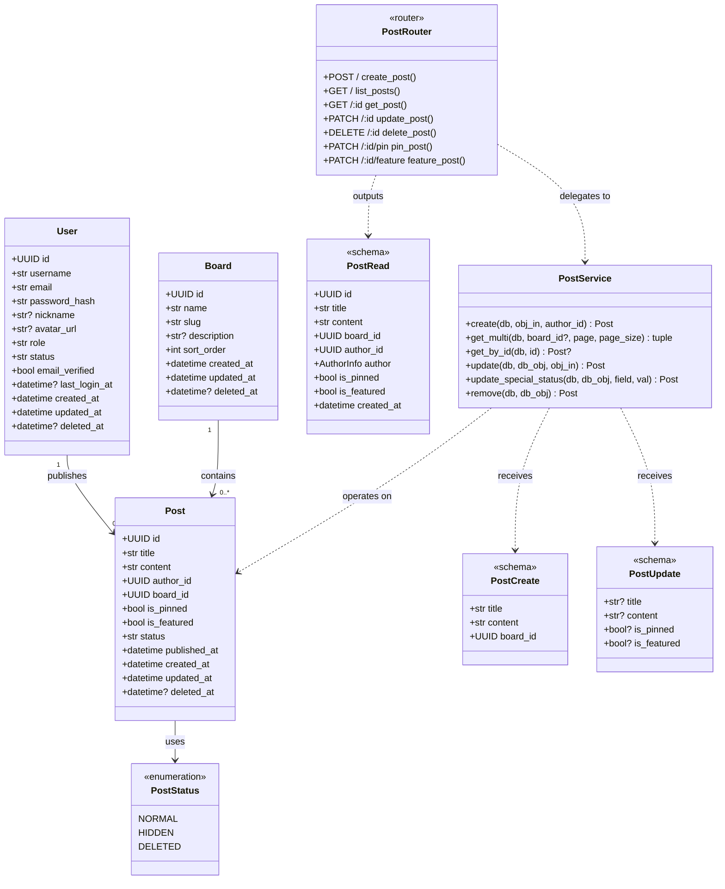

**图注**：实线空心三角箭头 `▷` 表示继承（泛化），实线空心菱形 `◇` 表示聚合，虚线箭头 `..>` 表示依赖。为简化展示，`IDMixin` 和 `TimestampMixin` 基类的属性已展开至各实体类中。

#### 4.3.4 评论子系统类设计

评论（`Comment`）是帖子管理之外的另一个核心域类，支持楼中楼嵌套回复。其设计与 `Post` 共享 `User` 作者关联，同时自引用实现父子关系。

**Comment（评论实体）** —— 映射 `comments` 表。

| 成员 | 可见性 | 类型 | 说明 |
|:---|:---|:---|:---|
| `id` | public | `UUID` | 主键 |
| `post_id` | public | `UUID` | 外键 → `posts.id`，NOT NULL |
| `author_id` | public | `UUID` | 外键 → `users.id`，NOT NULL |
| `parent_comment_id` | public | `UUID \| None` | 外键 → `comments.id`（父评论），可为空 |
| `root_comment_id` | public | `UUID \| None` | 外键 → `comments.id`（根评论/楼层），可为空 |
| `content` | public | `str(Text)` | 评论文本内容，NOT NULL |
| `status` | public | `str(20)` | 生命周期状态，CHECK `'normal' \| 'hidden' \| 'deleted'`，默认 `"normal"` |
| `like_count` | public | `int` | 点赞数，`BIGINT DEFAULT 0` |
| `reply_count` | public | `int` | 回复数，`BIGINT DEFAULT 0` |
| `created_at` / `updated_at` / `deleted_at` | （继承自 TimestampMixin） | | |
| `author` | public | `User` | 多对一关联到 User |
| `post` | public | `Post` | 多对一关联到 Post |

**CommentStatus 枚举**：

| 常量 | 值 | 说明 |
|:---|:---|:---|
| `NORMAL` | `"normal"` | 正常可见 |
| `HIDDEN` | `"hidden"` | 被管理员隐藏 |
| `DELETED` | `"deleted"` | 软删除终态 |

**类间关系扩展**：

| 关联方向 | 关系类型 | 多重性 | 业务语义 |
|:---|:---|:---|:---|
| User → Comment | 双向一对多 | 1 : 0..* | 一个用户可以发表零或多条评论 |
| Post → Comment | 双向一对多 | 1 : 0..* | 一篇帖子可以包含零或多条评论 |
| Comment → Comment（自引用） | 一对多 | 0..1 : 0..* | 一条评论可以有零或多条子回复；一条回复有零或一个父评论 |

#### 4.3.5 扩展 UML 设计类图（评论与认证子系统）

以下 Mermaid 类图补充展示 `Comment` 实体、`CommentStatus` 枚举、`AuthService` 控制类及其与已有类的关联关系。

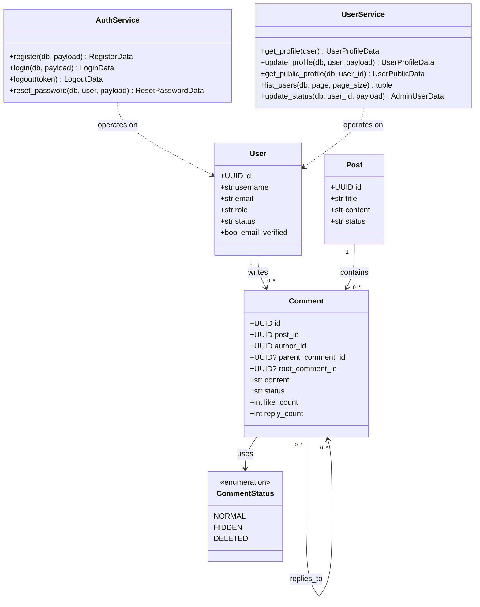

**图注**：Comment 的自引用关系通过 `parent_comment_id` 外键实现，支持无限层级嵌套但在业务层限制为两层（楼中楼模式）以保证可读性和查询性能。

#### 4.3.6 通知与点赞实体精化

**Notification（通知实体）** —— 映射 `notifications` 表。

| 成员 | 可见性 | 类型 | 说明 |
|:---|:---|:---|:---|
| `id` | public | `UUID` | 主键 |
| `recipient_id` | public | `UUID` | 外键 → `users.id`，通知接收人，NOT NULL |
| `actor_id` | public | `UUID \| None` | 外键 → `users.id`，触发操作的用户 |
| `type` | public | `str(30)` | 通知类型，CHECK `'comment' \| 'reply' \| 'like' \| 'system'` |
| `title` | public | `str(120)` | 通知标题，NOT NULL |
| `content` | public | `str(500)` | 通知内容，NOT NULL |
| `related_type` | public | `str(20) \| None` | 关联对象类型（post/comment） |
| `related_id` | public | `UUID \| None` | 关联对象 ID |
| `is_read` | public | `bool` | 是否已读，默认 `False` |
| `read_at` | public | `datetime(tz) \| None` | 已读时间 |
| `created_at` / `updated_at` / `deleted_at` | （继承自 TimestampMixin） | | |
| `recipient` | public | `User` | 多对一关联到 User |
| `actor` | public | `User` | 多对一关联到 User |

**PostLike / CommentLike（点赞实体）** —— 关系表，不含 TimestampMixin（仅创建时间）。

| 成员 | 可见性 | 类型 | 说明 |
|:---|:---|:---|:---|
| `id` | public | `UUID` | 主键 |
| `post_id / comment_id` | public | `UUID` | 外键 → 目标对象 |
| `user_id` | public | `UUID` | 外键 → `users.id`，点赞用户 |
| `created_at` | public | `datetime(tz)` | 点赞时间 |
| — | — | UNIQUE(`target_id`, `user_id`) | 同一用户对同一对象仅可点赞一次 |

**CommentService / LikeService / NotificationService（业务控制类）** —— 无状态，Session 按方法注入。

| 类 | 关键方法 | 返回值 | 职责 |
|:---|:---|:---|:---|
| `CommentService` | `create(db, *, obj_in, author_id, post_id)` | `Comment` | 创建评论（一级或回复），同步 post.comment_count 和 parent.reply_count |
| | `get_by_post(db, post_id, page, page_size)` | `tuple[list, int]` | 按帖子查询评论列表，组装树形结构 |
| | `remove(db, *, db_obj)` | `Comment` | 软删除评论 |
| `LikeService` | `like_post(db, user_id, post_id)` | `PostLike` | 点赞帖子，like_count +1，唯一性约束防重复 |
| | `unlike_post(db, user_id, post_id)` | `None` | 取消点赞，like_count -1 |
| | `like_comment / unlike_comment` | 同上 | 评论点赞/取消 |
| `NotificationService` | `create(db, *, recipient_id, actor_id, type, ...)` | `Notification` | 创建通知记录（由 CommentService/LikeService 调用） |
| | `list_for_user(db, user_id, page, page_size)` | `tuple[list, int]` | 查询用户通知列表，未读优先 |
| | `mark_read(db, notification_id)` | `None` | 标记单条已读 |
| | `mark_all_read(db, user_id)` | `None` | 批量标记已读 |
| | `get_unread_count(db, user_id)` | `int` | 查询未读通知数量 |

---

### 4.4 核心对象状态设计

#### 4.4.1 帖子生命周期状态

帖子（`Post`）是系统中生命周期最丰富的核心实体。从创建到销毁，帖子经历六种逻辑状态，由 `Post.status`（枚举字段）和 `Post.is_pinned`、`Post.is_featured`（布尔标记字段）共同描述。

| 状态 | 判定条件 | 说明 |
|:---|:---|:---|
| **草稿** (Draft) | `status = "draft"` | 用户保存但尚未发布，仅作者和管理员可见，不出现在公开列表中 |
| **正常** (Normal) | `status = "normal"`, `is_pinned = False`, `is_featured = False` | 帖子发布后的默认状态，可见于板块列表 |
| **置顶** (Pinned) | `status = "normal"`, `is_pinned = True` | 管理员置顶，在列表中以最高优先级排序 |
| **加精** (Featured) | `status = "normal"`, `is_featured = True` | 管理员加精，标记为优质内容 |
| **隐藏** (Hidden) | `status = "hidden"` | 被管理员隐藏，对普通用户不可见但保留数据 |
| **已删除** (Deleted) | `status = "deleted"`, `deleted_at ≠ NULL` | 软删除终态，数据留存但不可恢复 |

> **注**：草稿（Draft）状态当前尚未在 `PostStatus` 枚举中实现，为设计规划状态。MVP 阶段帖子创建即为发布（直接进入 Normal），草稿功能列入后续迭代。

#### 4.4.2 状态转移规则

帖子状态转移由用户操作触发，部分操作受角色权限约束。下表列出全部合法转移及触发条件。

| 转移编号 | 源状态 | 目标状态 | 触发操作 | 权限要求 | 调用方法 |
|:---|:---|:---|:---|:---|:---|
| T0 | —（保存草稿） | Draft | 用户点击"保存草稿" | 已认证用户 | `PostService.create(status="draft")` |
| T1 | Draft | Normal | 用户点击"发布" | 作者 | `PostService.update(status="normal", published_at=now)` |
| T2 | Normal / Featured | Pinned | 管理员点击"置顶" | Admin | `PostService.update_special_status(field="is_pinned", val=True)` |
| T3 | Pinned | Normal / Featured | 管理员取消置顶 | Admin | `PostService.update_special_status(field="is_pinned", val=False)` |
| T4 | Normal / Pinned | Featured | 管理员点击"加精" | Admin | `PostService.update_special_status(field="is_featured", val=True)` |
| T5 | Featured | Normal / Pinned | 管理员取消加精 | Admin | `PostService.update_special_status(field="is_featured", val=False)` |
| T6 | Normal / Pinned / Featured | Hidden | 管理员隐藏帖子 | Admin | `PostService.update()` 将 `status` 设为 `"hidden"` |
| T7 | Hidden | Normal | 管理员恢复显示 | Admin | `PostService.update()` 将 `status` 设为 `"normal"` |
| T8 | 任意非删除状态 | Deleted | 作者删除 / 管理员删除 | 作者或 Admin | `PostService.remove()`（设置 `deleted_at` 和 `status="deleted"`） |
| T9 | Draft | Deleted | 作者删除草稿 | 作者 | `PostService.remove()` |

**设计约束**：
- 置顶（Pinned）和加精（Featured）并非排他状态——一篇帖子可以同时处于置顶和加精状态（`is_pinned=True ∧ is_featured=True`）。
- 隐藏（Hidden）期间，帖子的置顶/加精标记保持不变，恢复显示时可还原。
- 已删除（Deleted）为终态，系统不提供恢复接口；如需恢复须由管理员直接操作数据库。
- 状态转移 T2–T7 的前置条件是帖子未被软删除（`deleted_at IS NULL`），该校验在 `PostService.get_by_id()` 的查询条件中完成：若帖子已删除，查询返回 `None`，Router 层返回 404，转移不会执行。

#### 4.4.3 状态机图

以下 Mermaid 状态图描述帖子对象在整个生命周期中的状态变迁。

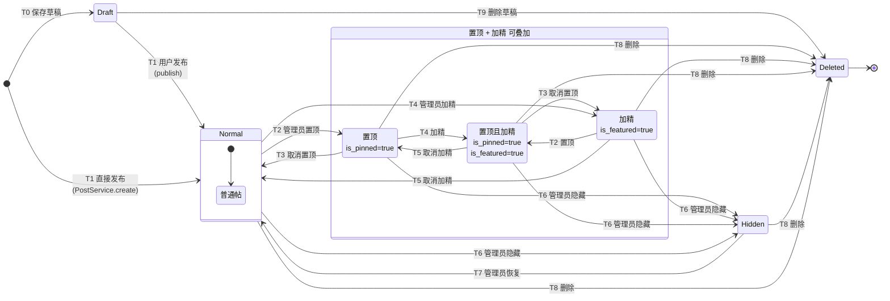

**图注**：`Normal` 状态内部包含一个子状态 `Plain`（普通帖），`is_pinned` 和 `is_featured` 两个布尔标记可在 Normal 状态下叠加组合形成四种可见性变体，图中将其独立绘制为 `Pinned`、`Featured` 及 `PinnedAndFeatured` 以展示状态转移路径。`Hidden` 状态下同样保留置顶/加精标记，恢复时还原。`Deleted` 为吸收态（Absorbing State），一旦进入不可离开。

#### 4.4.4 用户对象状态设计

**用户生命周期状态**：用户（`User`）的状态由 `status` 字段控制，数据库 CHECK 约束限定了三种合法取值。用户状态变更仅能由管理员操作触发（普通用户无权自行变更）。

| 状态 | 判定条件 | 说明 |
|:---|:---|:---|
| **活跃** (Active) | `status = "active"` | 注册后的默认状态，可正常登录和使用系统 |
| **停用** (Inactive) | `status = "inactive"` | 由管理员手动停用，登录时被 `AuthService.login()` 拒绝（返回 403） |
| **封禁** (Banned) | `status = "banned"` | 由管理员封禁，登录被拒绝且 `get_current_user` 也会拦截现有 Token（返回 403） |

**用户状态转移规则**：

| 转移编号 | 源状态 | 目标状态 | 触发操作 | 权限要求 | 调用方法 |
|:---|:---|:---|:---|:---|:---|
| U1 | —（注册） | Active | 用户注册成功 | 公开 | `AuthService.register()` |
| U2 | Active | Banned | 管理员封禁用户 | Admin | `UserService.update_status(status="banned")` |
| U3 | Active | Inactive | 管理员停用用户 | Admin | `UserService.update_status(status="inactive")` |
| U4 | Banned | Active | 管理员解封用户 | Admin | `UserService.update_status(status="active")` |
| U5 | Inactive | Active | 管理员重新激活用户 | Admin | `UserService.update_status(status="active")` |

**用户状态机图**：

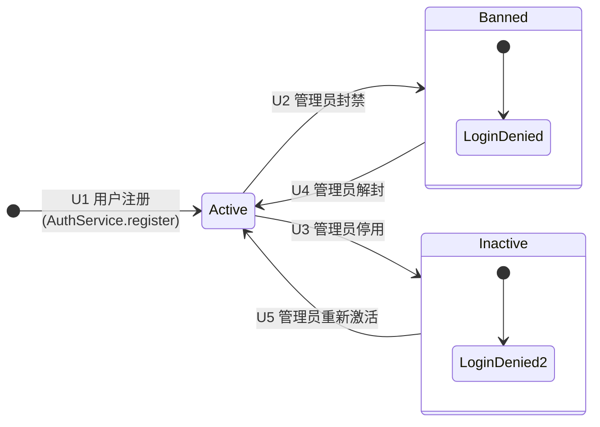

**图注**：`Active` 为正常运作状态，`Banned` 和 `Inactive` 均为受限状态——处于这两个状态的用户无法登录（`AuthService.login()` 返回 403 `"User is banned/inactive"`），但已签发的 JWT 在封禁前不会自动失效；`get_current_user` 在每次请求时校验 `status != "banned"` 作为补充拦截。与 Post 不同，User 不使用软删除（`deleted_at`），因为账户数据需长期留存以备审计。

#### 4.4.5 评论对象状态设计

**评论生命周期状态**：评论（`Comment`）的状态由 `status` 字段控制，其状态流转模式与帖子高度一致但更为简化——评论不支持置顶与加精标记，仅包含基本的三态生命周期。

| 状态 | 判定条件 | 说明 |
|:---|:---|:---|
| **正常** (Normal) | `status = "normal"` | 评论发布后的默认状态，对用户可见 |
| **隐藏** (Hidden) | `status = "hidden"` | 被管理员隐藏，对普通用户不可见但保留数据 |
| **已删除** (Deleted) | `status = "deleted"`, `deleted_at ≠ NULL` | 软删除终态，数据留存但不可恢复 |

**评论状态转移规则**：

| 转移编号 | 源状态 | 目标状态 | 触发操作 | 权限要求 | 调用方法 |
|:---|:---|:---|:---|:---|:---|
| C1 | —（创建） | Normal | 用户发布评论/回复 | 已认证用户 | `CommentService.create()` |
| C2 | Normal | Hidden | 管理员隐藏评论 | Admin | `CommentService.update(status="hidden")` |
| C3 | Hidden | Normal | 管理员恢复显示 | Admin | `CommentService.update(status="normal")` |
| C4 | Normal / Hidden | Deleted | 作者删除 / 管理员删除 | 作者或 Admin | `CommentService.remove()` |

**评论状态机图**：

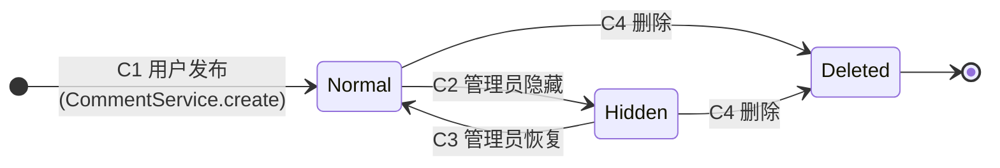

**图注**：`Deleted` 为吸收态，一旦进入不可离开。与 Post 不同，Comment 不存在置顶/加精的附加状态标记，状态机更为简洁。

#### 4.4.6 通知对象状态设计

**通知生命周期状态**：通知（`Notification`）的状态由 `is_read` 布尔字段和 `read_at` 时间戳字段共同描述，生命周期极简——仅包含未读和已读两个语义状态。

| 状态 | 判定条件 | 说明 |
|:---|:---|:---|
| **未读** (Unread) | `is_read = False`, `read_at = NULL` | 通知已生成但用户尚未查阅，前端显示未读红点 |
| **已读** (Read) | `is_read = True`, `read_at ≠ NULL` | 用户已点击查阅，红点消失 |

**通知状态转移规则**：

| 转移编号 | 源状态 | 目标状态 | 触发操作 | 权限要求 | 调用方法 |
|:---|:---|:---|:---|:---|:---|
| N1 | —（事件触发） | Unread | 评论/回复/点赞事件发生 | 系统自动 | `NotificationService.create()` |
| N2 | Unread | Read | 用户点击通知 / 全部已读 | 通知接收人 | `NotificationService.mark_read()` / `mark_all_read()` |

**通知状态机图**：

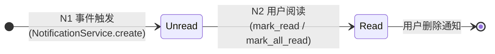

**图注**：通知状态机的设计要点在于"写时创建、读时标记"的异步模式——通知的创建由 CommentService 和 LikeService 在完成业务操作后以同步方式调用 `NotificationService.create()` 完成，确保通知不丢失；而已读标记由前端用户交互驱动。通知不设软删除的 `deleted_at` 中间态，因为通知数据不具备恢复价值，用户删除即为物理删除。

---

### 4.5 独立构件设计

独立构件（Standalone Component）是指不专属于任一业务子系统、可被多个模块复用的通用组件。本系统识别并设计了以下五类独立构件，遵循"高内聚、接口稳定、可替换"的构件设计原则。

#### 4.5.1 ORM 基础构件：IDMixin 与 TimestampMixin

**设计动机**：系统中所有实体均需主键（UUID）和时间戳（创建/更新/删除），若每个实体重复定义将导致大量代码冗余。采用 Mixin 模式将通用字段提取为独立构件，任何新增实体通过多重继承即可复用。

**构件规约**：

| 构件 | 文件 | 提供能力 | 接口 |
|:---|:---|:---|:---|
| `IDMixin` | `models/base.py` | 为实体注入 UUID 主键 | `id: Mapped[UUID]` — PK，默认值 `uuid.uuid4()` |
| `TimestampMixin` | `models/base.py` | 为实体注入生命周期时间戳 | `created_at: datetime(tz)` — 服务端默认 `now()`；`updated_at: datetime(tz)` — 自动 `onupdate=now()`；`deleted_at: datetime(tz) \| None` — 软删除标记 |

**复用方式**：实体类声明为 `class Entity(Base, IDMixin, TimestampMixin)` 即可获得全部字段，无需编写额外代码。当前所有 ORM 实体（User、Board、Post、Comment）均复用此构件。

#### 4.5.2 密码安全构件：PasswordHasher

**设计动机**：密码哈希与验证是认证子系统的核心安全操作，基于 pwdlib（Argon2）实现。将其封装为独立构件而非内嵌于 AuthService，确保：(a) 算法升级时仅需修改一处；(b) 禁止其他模块自行实现密码操作。

**构件规约**：

| 接口 | 签名 | 说明 |
|:---|:---|:---|
| `hash_password` | `(password: str) → str` | 输入明文密码，返回 pwdlib (Argon2) 哈希字符串 |
| `verify_password` | `(password: str, hash: str) → bool` | 比对明文与哈希是否匹配 |

**实现**（`utils/security.py`）：基于 `pwdlib.PasswordHash.recommended()` 初始化全局 `pwd_hasher` 实例，所有密码操作通过该实例委派。

#### 4.5.3 Token 黑名单构件：RedisTokenBlacklist

**设计动机**：JWT 签发后无法服务端撤销是其固有限制。本构件利用 Redis 的 `SETEX` 命令实现带 TTL 的 Token 黑名单，使登出操作可即时生效。

**构件规约**：

| 接口 | 签名 | 说明 |
|:---|:---|:---|
| `blacklist_token` | `(token: str, ttl: int) → None` | 将 token 的 SHA256 摘要写入 Redis，TTL = 剩余有效期（秒） |
| `is_token_blacklisted` | `(token: str) → bool` | 查询 token 是否在黑名单中 |

**Key 设计**：`token_blacklist:{sha256(token)}`，值 = `"1"`。使用 SHA256 缩短 Redis Key 长度，避免原始 JWT（可达数百字符）占用过多内存。

#### 4.5.4 API 响应封装构件：ApiResponse / PaginatedResponse

**设计动机**：所有 API 端点须以统一格式返回数据，避免前端需要适配不同端点的响应结构差异。将此构件设计为 Pydantic Generic Model，利用类型参数 `T` 适配不同实体类型。

**构件规约**（`schemas/response.py`）：

| 构件 | 结构 | 适用场景 |
|:---|:---|:---|
| `ApiResponse[T]` | `{code, message, data: T, request_id}` | 单对象返回 |
| `PaginatedResponse[T]` | `{code, message, data: {items: [T], pagination: {page, page_size, total, total_pages}}, request_id}` | 分页列表 |
| `ErrorResponse` | `{code, message, errors: [{field, message}], request_id}` | 校验/业务异常 |

#### 4.5.5 枚举状态构件

系统中多个实体共享相似的状态语义（normal/hidden/deleted），将其定义为 Python Enum，既可被 ORM 用作 CHECK 约束的来源，也可被 Pydantic Schema 用作校验正则的来源。

| 构件 | 枚举值 | 使用方 |
|:---|:---|:---|
| `PostStatus` | `NORMAL` / `HIDDEN` / `DELETED` | Post 模型、PostService、PostRouter |
| `CommentStatus` | `NORMAL` / `HIDDEN` / `DELETED` | Comment 模型、CommentService |

**设计约束**：枚举值定义为字符串（`str, Enum`），确保存储到数据库时是可读字符串而非整数，便于调试和 SQL 直接查询。

---

### 4.6 数据模型设计

数据模型设计将面向对象的类图映射为关系型数据库表结构。完整设计规约见本文档 二（数据库设计），本节仅从组件设计角度阐述持久化策略和关键设计决策，避免重复。

#### 4.6.1 ORM 映射策略

系统采用 SQLAlchemy ORM 的声明式映射（Declarative Mapping），将 Python 类声明式地映射到 PostgreSQL 表。核心映射约定如下：

| 面向对象概念 | 关系型映射 | ORM 实现 |
|:---|:---|:---|
| 实体类 | 数据库表 | `class Entity(Base, IDMixin, TimestampMixin)` → `__tablename__` |
| 对象属性 | 表列（Column） | `Mapped[type]` + `mapped_column(...)` |
| 类关联（1:N） | 外键（Foreign Key） | `ForeignKey("table.column")` + `relationship()` |
| 继承（Mixin） | 列组合复用 | Python 多重继承，列定义展开至子表 |
| 枚举属性 | CHECK 约束 | `CheckConstraint("col IN (...)")` |

#### 4.6.2 软删除策略

所有核心业务实体（User、Board、Post、Comment）采用软删除（Soft Delete）而非物理删除。设计要点：

- **实现**：`TimestampMixin.deleted_at` 字段，默认 `NULL` 表示有效记录；删除操作设置 `deleted_at = now()`。
- **查询过滤**：所有 Service 层查询均添加 `filter(Model.deleted_at.is_(None))`，确保已删除记录对业务逻辑透明不可见。
- **状态同步**：Post/Comment 删除时除设置 `deleted_at` 外，同时将 `status` 设为 `DELETED`，双重标记确保前端即使绕过 `deleted_at` 过滤也能通过状态字段识别。

#### 4.6.3 索引策略

完整索引策略见本文档 二-2.4（索引策略），此处不再重复列出。核心要点：高频查询字段建索引、UNIQUE 约束自动创建唯一索引、软删除过滤字段（`deleted_at`）建索引、复合索引按筛选选择性排列字段顺序。

#### 4.6.4 事务管理

系统采用 FastAPI 依赖注入模式的"请求级会话"策略：每个 HTTP 请求由 `get_db()` 生成独立的 `Session` 实例，请求处理完毕后自动释放。Service 层不管理事务边界——事务的 `commit()` 由 Service 方法在完成业务操作后显式调用，`rollback` 由 FastAPI 异常处理中间件隐式触发（未捕获异常时自动回滚）。

**关键规则**：Service 方法遵循"一次业务操作 = 一次 commit"原则，避免长事务锁表。复杂业务（如创建评论同时生成通知）在同一个 Session 内串行执行两个独立 commit，利用数据库原子性保证数据一致性。

#### 4.6.5 数据库迁移管理

使用 Alembic 进行数据库版本管理，所有 schema 变更均通过迁移脚本记录。设计约束：(a) 迁移脚本必须可逆（含 `upgrade()` 和 `downgrade()`）；(b) 生产环境仅执行 `upgrade`，`downgrade` 仅在开发调试时使用；(c) 应用启动时自动执行 `alembic upgrade head`（`database.init_db()`），确保部署时数据库 schema 与代码一致。

---

## 五、可靠性及安全性设计

### 5.1 设计目标

Campus Bulletin Board System 是面向校园用户的论坛系统，核心业务包括用户注册、登录、登出、发帖、评论、回复、点赞、通知、搜索、举报处理和后台管理等功能。系统后端采用 Python、FastAPI、SQLAlchemy、Pydantic、PyJWT、pwdlib，数据层采用 PostgreSQL 与 Redis，工程侧使用 Docker Compose、uv、black、ruff、pytest 和 Husky。

可靠性设计的目标是保证系统在正常访问、并发操作、缓存异常、数据库短暂故障等情况下仍能稳定运行，并保证用户、帖子、评论、点赞、通知等核心数据不丢失、不重复、不紊乱。

安全性设计的目标是保证用户身份可信、权限边界清晰、敏感数据受保护、后台操作可追踪，并降低 SQL 注入、XSS、暴力登录、越权访问、恶意上传、接口刷取等常见风险。

---

### 5.2 可靠性设计

#### 5.2.1 数据一致性设计

系统以 PostgreSQL 作为主数据库，用户、帖子、评论、点赞等核心业务数据以数据库为最终可信数据源。数据库设计中，核心业务数据保持强一致，大文件走对象存储，数据库仅保存元数据。主键统一使用 UUID，时间字段统一使用 `created_at / updated_at`，软删除字段统一使用 `deleted_at`，计数字段统一要求非负。

具体设计如下：

1. **核心写操作使用事务保证原子性**

   发帖、评论、点赞、取消点赞、举报处理、用户封禁等操作必须在数据库事务中完成。  
   例如，用户点赞帖子时，系统同时写入 `post_likes` 记录并更新 `posts.like_count`，两个步骤必须同时成功或同时回滚。

2. **点赞与取消点赞设计为幂等操作**

   对 `post_likes` 与 `comment_likes` 增加唯一约束，例如：

   ```sql
   UNIQUE(post_id, user_id)
   UNIQUE(comment_id, user_id)
   ```

   这样可以保证同一用户对同一帖子或评论只能产生一条点赞记录。重复点赞不会产生多条记录，重复取消点赞也不会导致计数错误。

3. **计数字段采用数据库原子更新**

   帖子的 `like_count`、`comment_count`、`view_count`，评论的 `like_count`、`reply_count` 采用数据库表达式更新，同时通过数据库约束保证计数字段不小于 0，避免并发情况下出现负数计数。

4. **软删除保护历史数据**

   用户、帖子、评论、媒体等核心数据不直接物理删除，而是写入 `deleted_at` 或更新 `status` 字段。这样可以支持误删恢复、举报取证、后台审计和数据追踪。

5. **外键约束保证引用完整性**

   帖子必须关联存在的板块与作者，评论必须关联存在的帖子与作者，媒体附件必须关联有效媒体资源。  
   系统数据表之间应通过外键约束保证引用完整性，避免出现“帖子作者不存在”“评论所属帖子不存在”等异常数据。

---

#### 5.2.2 服务可用性设计

系统使用 Docker Compose 管理 PostgreSQL 与 Redis 依赖服务。PostgreSQL 与 Redis 均配置重启策略、健康检查和数据卷挂载，能够在容器异常退出或服务重启后尽快恢复服务。

具体设计如下：

1. **依赖服务健康检查**

   PostgreSQL 使用 `pg_isready` 检查数据库状态，Redis 使用 `redis-cli ping` 检查缓存状态。后端服务启动前应检查 PostgreSQL 与 Redis 是否可用。

   - PostgreSQL 不可用时，系统拒绝启动核心业务接口；
   - Redis 不可用时，系统进入降级模式；
   - 依赖恢复后，系统自动恢复对应能力。

2. **Redis 故障降级**

   Redis 用于缓存、会话、限流计数、热点数据等辅助能力，不作为核心业务最终数据源。Redis 异常时：

   - 帖子列表、帖子详情、用户信息等缓存查询回退到 PostgreSQL；
   - 会话校验失败时返回重新登录或重新鉴权；
   - 热门榜、未读数等非核心功能可短暂降级；
   - 写入数据库的核心数据不受缓存故障影响。

3. **数据库连接池控制**

   后端通过 SQLAlchemy 连接 PostgreSQL，应设置连接池大小、连接超时时间和连接回收时间，避免高并发下连接耗尽。

4. **接口超时与重试控制**

   后端对数据库、Redis、对象存储等外部依赖设置超时时间。查询类操作允许短重试，写入类操作不盲目重试，避免重复发帖、重复点赞或重复更新计数。

---

#### 5.2.3 缓存可靠性设计

Redis 主要用于提升查询效率，并支持会话、限流、热点数据等能力。系统设计中应明确 PostgreSQL 与 Redis 的职责边界：PostgreSQL 保存最终数据，Redis 只保存可重建数据。

具体设计如下：

1. **缓存与数据库分层**

   PostgreSQL 保存最终可信数据，Redis 只保存缓存数据。缓存丢失后，系统可以从 PostgreSQL 重新加载数据。

2. **缓存更新策略**

   对帖子详情、用户信息、板块列表等读多写少数据，采用“更新数据库后删除缓存”的策略。  
   对热门帖子、未读通知数等聚合数据设置较短 TTL，避免缓存长期不一致。

3. **防止缓存穿透**

   对不存在的帖子、用户、板块查询结果写入短 TTL 空值缓存，减少恶意请求或异常请求对数据库造成的压力。

4. **防止缓存击穿**

   对热门帖子详情、热门板块列表等高频访问数据设置互斥锁或逻辑过期机制，避免缓存过期瞬间大量请求同时访问数据库。

5. **Redis 持久化**

   Redis 使用 AOF 持久化，降低缓存、会话和限流状态在容器重启时丢失的风险。即使 Redis 数据丢失，核心业务数据仍可从 PostgreSQL 恢复。

---

#### 5.2.4 接口可靠性设计

系统接口采用 RESTful 风格，并使用统一响应格式、分页响应、错误响应和 `request_id` 追踪字段。接口层应保证返回结构稳定，便于前端处理成功、失败、分页和异常状态。

2. **请求追踪**

   每个请求生成 `request_id`，并写入响应、日志和错误信息中。出现故障时，可以根据 `request_id` 快速定位接口、用户、时间和异常原因。

3. **分页限制**

   帖子列表、评论列表、通知列表、用户管理列表必须分页。`page_size` 设置上限，例如最大 100，避免一次性查询大量数据导致数据库压力过高。

4. **统一异常处理**

   后端统一处理业务异常和系统异常。业务异常返回明确错误码，系统异常返回通用错误信息，不向前端暴露数据库连接串、堆栈信息、服务器路径等内部细节。

5. **限流保护**

   对登录、注册、发帖、评论、点赞、搜索、上传等接口进行限流。超过频率限制时返回 429，保护系统免受刷接口和暴力请求影响。

---

#### 5.2.5 备份与恢复设计

1. **数据库备份**

   PostgreSQL 每日进行一次完整备份，重要版本迭代前进行手动备份。备份内容包括用户、帖子、评论、点赞、通知、举报、审核记录、管理员操作日志等核心表。

3. **恢复演练**

   每个版本迭代结束后至少进行一次恢复验证，确认备份文件可以恢复到测试数据库，并能正常查询用户、帖子、评论等核心数据。

4. **对象存储一致性**

   媒体文件保存在对象存储，数据库保存 `bucket`、`object_key`、`mime_type`、`file_size`、`sha256` 等元数据。恢复时应同时校验数据库元数据与对象存储文件是否一致。

---

#### 5.2.6 日志与监控设计

1. **业务日志**

   记录用户登录、注册、发帖、评论、点赞、举报、后台封禁、公告发布等关键行为。

2. **错误日志**

   记录接口异常、数据库异常、Redis 异常、对象存储异常，并附带 `request_id`、用户 ID、接口路径、HTTP 方法和状态码。

3. **审计日志**

   管理员操作写入 `admin_audit_logs`，举报与审核处理写入 `moderation_logs`，用于追踪后台操作责任。

4. **监控指标**

   重点监控以下指标：

   - 接口响应时间；
   - 接口错误率；
   - 数据库连接数；
   - Redis 命中率；
   - 慢查询数量；
   - 登录失败次数；
   - 发帖与评论频率；
   - 上传失败率；
   - 后台高风险操作次数。

---

### 5.3 安全性设计

#### 5.3.1 身份认证设计

用户与认证子系统负责用户身份管理与访问控制，包括用户注册、登录、登出、密码加密存储与重置、JWT 鉴权、会话管理、用户角色与权限控制等功能。

具体设计如下：

1. **密码安全存储**

   用户密码不以明文保存，使用 `pwdlib` 进行加盐哈希后写入 `users.password_hash` 字段。登录时只比较哈希结果，不返回、不记录明文密码。

2. **JWT 访问令牌**

   用户登录成功后签发 JWT，令牌中包含用户 ID、角色、签发时间、过期时间和令牌编号。访问受保护接口时，客户端必须在请求头中携带有效令牌。

3. **会话状态管理**

   Redis 保存用户会话状态或 JWT 黑名单。用户登出、修改密码、管理员封禁用户后，将对应会话置为失效，防止旧令牌继续访问系统。

4. **令牌过期机制**

   Access Token 设置较短有效期，Refresh Token 设置较长有效期并支持轮换。刷新令牌泄露时，可以通过 Redis 会话记录快速吊销。

5. **登录失败保护**

   对连续登录失败的账号或 IP 设置短期限制。超过阈值后暂时拒绝登录请求，返回 429 或业务错误码，降低暴力破解风险。

---

#### 5.3.2 权限控制设计

系统用户角色至少包括未登录用户、普通用户和管理员。用户表中应通过 `role` 字段区分角色，通过 `status` 字段区分账号状态，例如 `active`、`inactive`、`banned`。

| 角色 | 权限范围 |
|---|---|
| 未登录用户 | 浏览公开帖子、查看公开板块 |
| 普通用户 | 注册登录、发帖、评论、点赞、举报、查看通知、编辑或删除自己的内容 |
| 管理员 | 用户管理、板块管理、公告管理、举报处理、隐藏内容、封禁用户、查看审计日志 |

权限设计原则如下：

1. **接口级鉴权**

   所有需要登录的接口必须校验 JWT。所有后台接口必须校验管理员角色。

2. **资源级鉴权**

   用户只能编辑、删除自己的帖子或评论；管理员可根据后台权限处理违规内容。

3. **状态级鉴权**

   被封禁用户不得发帖、评论、点赞、上传文件。被隐藏或软删除的帖子、评论不得被普通用户访问。

4. **最小权限原则**

   后台功能按模块授权。用户管理、板块管理、公告管理、举报处理、审计查看可进一步拆分权限，避免单个账号拥有过宽权限。

---

#### 5.3.3 输入校验与注入防护

后端采用 Pydantic 进行数据校验，采用 SQLAlchemy 访问数据库。接口层应在数据进入业务逻辑之前完成格式、类型、长度和范围校验。

具体设计如下：

1. **请求参数校验**

   用户名、邮箱、密码、帖子标题、评论内容、分页参数、上传文件类型等必须经过 Pydantic Schema 校验。非法数据在进入业务逻辑前被拦截。

2. **SQL 注入防护**

   数据库查询使用 SQLAlchemy ORM 或参数化 SQL，不拼接用户输入到 SQL 字符串中。

3. **XSS 防护**

   帖子正文和评论正文使用结构化内容保存。服务端需要对富文本节点、链接、图片地址、HTML 标签进行白名单过滤，前端渲染时避免直接插入未经清洗的 HTML。

4. **内容长度限制**

   对标题、评论、通知、昵称等字段设置长度上限。接口层校验与数据库字段约束保持一致，避免异常长文本影响存储和渲染。

5. **错误信息控制**

   参数错误返回明确字段错误；系统错误只返回通用错误信息，不暴露 SQL、服务器路径、依赖服务地址、堆栈信息等内部细节。

---

#### 5.3.4 敏感数据保护

1. **配置与密钥管理**

   数据库密码、JWT 密钥、Redis 地址、对象存储密钥等配置通过环境变量注入，不写入业务代码。本地开发环境可以使用默认配置，生产环境必须更换默认密码和默认密钥。

2. **密码与令牌保护**

   `password_hash` 不出现在任何 API 响应、日志、错误信息和前端页面中。JWT 只在登录、刷新时返回，不写入普通业务日志。

3. **传输安全**

   生产环境统一使用 HTTPS。登录、注册、修改密码、上传文件、后台管理等接口必须通过加密传输访问。

4. **数据库最小权限**

   应用数据库账号只授予业务所需权限，不使用数据库超级用户运行应用。备份账号、迁移账号、应用账号分离。

5. **日志脱敏**

   日志中对邮箱、Token、IP、上传文件路径等敏感字段进行脱敏处理，避免排障日志变成敏感信息泄露源。

---

#### 5.3.5 文件上传安全设计

系统通过 `media_assets` 表保存上传用户、存储桶、对象 Key、原始文件名、MIME 类型、文件大小、图片宽高、SHA256 哈希、来源类型、公开状态等元数据。文件本体不直接保存在数据库中，而是保存到对象存储或文件存储服务中。

具体设计如下：

1. **文件类型白名单**

   只允许上传图片和指定附件类型，例如：

   - `image/png`
   - `image/jpeg`
   - `image/webp`
   - `application/pdf`

   禁止上传脚本、可执行文件和未知 MIME 类型文件。

2. **文件大小限制**

   头像、帖子图片、附件分别设置大小上限，避免大文件耗尽存储和带宽。

3. **文件名安全处理**

   不直接使用用户上传的原始文件名作为存储路径。对象存储 Key 使用 UUID 或哈希生成，原始文件名仅作为展示字段保存。

4. **文件哈希校验**

   使用 `sha256` 判断重复文件，降低重复上传带来的存储浪费。

5. **访问权限控制**

   私有文件不直接暴露永久公开 URL，使用后端鉴权后生成临时访问链接。用户只能访问自己有权限查看的媒体资源。

---

#### 5.3.6 账号与后台安全设计

管理后台子系统用于平台运营与维护，包括用户管理、板块管理、公告管理、举报处理、审核统计、操作审计与日志查看等功能。

具体设计如下：

1. **管理员操作二次校验**

   封禁用户、删除帖子、隐藏评论、发布公告、调整权限等高风险操作必须校验管理员身份，并记录操作原因。

2. **后台审计日志**

   管理员操作记录写入 `admin_audit_logs`，内容包括管理员 ID、操作类型、目标对象、操作前后状态、操作时间和请求 IP。

3. **举报处理留痕**

   用户举报进入 `reports`，管理员处理后写入 `moderation_logs`。处理结果包括通过、驳回、隐藏内容、封禁用户等。

4. **封禁状态实时生效**

   用户被封禁后，系统立即禁止其发帖、评论、点赞、上传文件，并使其已有会话失效。

5. **后台接口隔离**

   后台接口统一以 `/api/v1/admin` 等路径隔离，并强制管理员权限校验。普通用户即使知道接口路径也无法访问。


---


## 六、用户界面设计

---

### 6.1 文档目的与范围

#### 6.1.1 文档目的

本文档为 Campus Bulletin Board System（校园论坛）的用户界面设计规约，定义全部页面的布局结构、元素组成、状态转换、交互行为及视觉规范。

#### 6.1.2 文档范围

| 章节 | 内容 |
|:---|:---|
| 二、设计总纲 | 设计目标、设计原则、权限与接口约束 |
| 三、技术选型概览 | 前端技术栈与目录结构概要 |
| 四、页面设计规约 | 全部 12 个核心页面的布局、元素、状态、交互规约 |
| 五、交互设计规约 | 全局交互模式、反馈机制、动画过渡、无障碍访问 |
| 六、视觉设计规范 | 设计变量（Design Tokens）、布局栅格、排版、色彩、图标 |
| 附录 | 页面-API 映射表 |

---

### 6.2 设计总纲

#### 6.2.1 设计目标

| 目标 | 描述 | 衡量标准 |
|:---|:---|:---|
| **一致性** | 所有页面遵循统一的视觉语言和交互模式 | 组件复用率 ≥ 70%；设计变量覆盖率 = 100% |
| **可用性** | 核心任务（发帖、评论、浏览）≤ 3 步完成；表单错误提示即时可见 | 关键路径点击次数 ≤ 3；表单校验反馈 < 200ms |
| **可访问性** | 遵循 WCAG 2.1 AA 标准，支持键盘导航和屏幕阅读器 | 色彩对比度 ≥ 4.5:1；所有交互元素支持 Tab 键聚焦 |

#### 6.2.2 设计原则

| 原则 | 描述 | 实践约束 |
|:---|:---|:---|
| **状态驱动视图** | UI 是应用状态的纯函数，视图随 Store 状态变化自动更新 | 禁止直接操作 DOM；所有可变 UI 元素绑定至响应式状态 |
| **关注点分离** | 视图（Template）、逻辑（Script）、样式（Style）物理分离 | 使用 Vue SFC 的 `<template>` / `<script setup lang="ts">` / `<style scoped>` |
| **移动优先** | 样式采用 min-width 断点，从移动端布局向上增强至桌面端 | 基础样式 = 移动端；`@media (min-width: 768px)` 和 `(min-width: 1024px)` 递增 |
| **最少惊讶** | 交互行为与主流互联网产品（V2EX、知乎、Reddit）保持一致 | 点赞按钮位置、评论排序、通知红点等不标新立异 |
| **容错与降级** | 网络异常、服务端异常、数据为空等边界状态均有对应 UI 呈现 | 每个数据加载组件至少覆盖 Loading / Empty / Error / Normal 四种状态 |

#### 6.2.3 设计约束

##### 6.2.3.1 后端接口约束

| 约束项 | 说明 |
|:---|:---|
| API 基础路径 | `/api/v1/` |
| 认证方式 | Bearer Token（JWT），存储在 `localStorage`，每次请求自动附加 `Authorization` 头 |
| 响应格式 | 统一封装 `{ code, message, data, request_id }`；分页响应含 `pagination: { page, page_size, total, total_pages }` |
| 错误格式 | `{ code, message, errors: [{ field, message }] }` |

##### 6.2.3.2 RBAC 权限约束

| 角色 | 可见路由 | 约束 |
|:---|:---|:---|
| 访客（未登录） | 登录/注册页、首页（板块列表）、板块帖子列表、帖子详情 | 无法执行发帖、评论、点赞等操作；操作按钮置灰并提示登录 |
| 注册用户（user） | 访客可见 + 发帖/编辑帖（自己的）、评论/回复、点赞、个人中心、通知列表 | 帖子编辑/删除按钮仅自己的内容可见 |
| 管理员（admin） | 注册用户可见 + 管理后台（用户管理、板块管理、内容审核、系统统计） | 全局可编辑/删除按钮对所有内容可见；置顶/加精操作可用 |

---

### 6.3 技术选型概览

| 层 | 技术 | 选型理由 |
|:---|:---|:---|
| 框架 | Vue 3 (Composition API) + TypeScript | 响应式系统成熟、TypeScript 支持完备 |
| 构建 | Vite | 开发热更新 < 1s |
| UI 库 | Element Plus | 中文生态友好、组件覆盖度高、与 Vue 3 深度集成 |
| 路由 | Vue Router 4 | Vue 官方路由方案、导航守卫、懒加载 |
| 状态管理 | Pinia | Vue 3 官方推荐、TypeScript 友好 |
| HTTP 客户端 | Axios | 请求/响应拦截器、超时控制 |
| CSS 方案 | SCSS + CSS Variables | Element Plus 原生使用 SCSS；CSS Variables 用于主题定制 |
| 富文本编辑 | Tiptap | 基于 ProseMirror、Vue 3 深度集成 |

> 前端详细目录结构、路由配置、状态管理、API 集成层设计等架构级内容见系统体系结构设计文档（由组内其他成员负责）。

---

### 6.4 页面设计规约

#### 6.4.1 页面总览

| 编号 | 页面名称 | 路由 | 所需权限 | 核心功能 |
|:---|:---|:---|:---|:---|
| P1 | 登录/注册页 | `/login` | 访客 | 账号密码登录、注册表单切换、登录后跳转 |
| P2 | 首页（板块列表） | `/` | 公开 | 板块卡片网格展示、板块帖子数统计、导航入口 |
| P3 | 板块帖子列表 | `/boards/:slug` | 公开 | 帖子上拉加载列表、置顶优先排序、发帖悬浮按钮 |
| P4 | 帖子详情页 | `/posts/:id` | 公开 | 帖子正文渲染、评论树查看、点赞交互 |
| P5 | 发帖/编辑帖子 | `/posts/new`、`/posts/:id/edit` | 注册用户 | 板块选择、标题输入、富文本编辑、发布/保存草稿 |
| P6 | 个人中心 | `/profile` | 注册用户 | 用户信息展示与编辑、密码修改、我的帖子/评论入口 |
| P7 | 通知列表 | `/notifications` | 注册用户 | 时间倒序通知列表、未读标记、全部已读、点击跳转 |
| P8 | 管理后台首页 | `/admin` | 管理员 | 系统统计卡片（总用户/帖子/评论数、今日新增） |
| P9 | 管理后台-用户管理 | `/admin/users` | 管理员 | 用户表格（分页/搜索/筛选）、封禁/解封/角色调整 |
| P10 | 管理后台-板块管理 | `/admin/boards` | 管理员 | 板块表格、CRUD 弹窗、排序值调整 |
| P11 | 管理后台-举报处理 | `/admin/reports` | 管理员 | 举报列表、处理操作、处理记录（迭代一） |
| P12 | 密码重置 | `/reset-password` | 注册用户 | 旧密码验证、新密码设置 |

#### 6.4.2 P1 — 登录/注册页

##### 6.4.2.1 布局结构

```
┌────────────────────────────────────────────┐
│              [系统 Logo + 名称]             │
│                                            │
│   ┌──────────────────────────────────┐     │
│   │  [登录 Tab]  [注册 Tab]           │     │
│   │  ────────────────────────────    │     │
│   │  登录模式:                        │     │
│   │  ┌─────────────────────────┐     │     │
│   │  │ 账号 (用户名/邮箱)       │     │     │
│   │  ├─────────────────────────┤     │     │
│   │  │ 密码                    │     │     │
│   │  ├─────────────────────────┤     │     │
│   │  │ [     登  录     ]      │     │     │
│   │  └─────────────────────────┘     │     │
│   │                                  │     │
│   │  注册模式:                        │     │
│   │  ┌─────────────────────────┐     │     │
│   │  │ 用户名 (3-32字符)        │     │     │
│   │  │ 邮箱                    │     │     │
│   │  │ 昵称 (可选)              │     │     │
│   │  │ 密码 (≥8字符)            │     │     │
│   │  │ 确认密码                 │     │     │
│   │  ├─────────────────────────┤     │     │
│   │  │ [     注  册     ]      │     │     │
│   │  └─────────────────────────┘     │     │
│   └──────────────────────────────────┘     │
│                                            │
│      还没有账号？立即注册 / 已有账号？去登录  │
└────────────────────────────────────────────┘
```

##### 6.4.2.2 元素清单

| 元素 | 类型 | 描述 | 行为/约束 |
|:---|:---|:---|:---|
| Logo + 名称 | 静态 | 系统标志和"Campus BBS"标题 | 点击跳转至首页 |
| 登录/注册 Tab | `el-tabs` | 切换登录与注册表单 | 默认显示登录 |
| 登录-账号输入框 | `el-input` | 支持用户名或邮箱 | placeholder: "请输入用户名或邮箱"；必填 |
| 登录-密码输入框 | `el-input type="password"` | 密码输入，可切换显示/隐藏 | placeholder: "请输入密码"；必填；Enter 键提交 |
| 登录-提交按钮 | `el-button type="primary"` | 触发登录请求 | 请求中显示 loading + 禁用 |
| 注册-用户名输入框 | `el-input` | 3-32 字符限制 | 实时唯一性校验（debounce 500ms） |
| 注册-邮箱输入框 | `el-input` | 邮箱格式 | 实时唯一性校验 |
| 注册-昵称输入框 | `el-input` | 最多 64 字符 | 可选字段 |
| 注册-密码输入框 | `el-input type="password"` | ≥ 8 字符 | 含强度指示条（弱/中/强） |
| 注册-确认密码输入框 | `el-input type="password"` | 与密码一致 | 实时一致性校验 |
| 注册-提交按钮 | `el-button type="primary"` | 触发注册请求 | 所有校验通过后启用 |
| 切换提示文字 | 文本链接 | "还没有账号？立即注册" / "已有账号？去登录" | 点击切换 Tab |

##### 6.4.2.3 状态与校验

| 状态 | 触发条件 | 呈现 |
|:---|:---|:---|
| 初始 | 页面加载完成 | 表单为空，登录 Tab 激活 |
| 校验中 | 用户输入用户名/邮箱 | 输入框右方显示 loading 图标；debounce 500ms |
| 校验通过 | 后端返回可用 | 输入框右方显示绿色对勾 |
| 校验失败 | 用户名/邮箱已存在 | 输入框下方显示红色错误提示 "该用户名已被注册" |
| 提交中 | 点击登录/注册按钮 | 按钮显示 loading spinner + "登录中..."/"注册中..." |
| 登录成功 | 后端返回 200 + Token | Token 写入 localStorage → 跳转至首页 |
| 登录失败-凭证错误 | 后端返回 401 | 表单顶部显示 Alert "账号或密码错误" |
| 登录失败-被封禁 | 后端返回 403 | 表单顶部显示 Alert "账号已被封禁" |
| 注册成功 | 后端返回 201 | 提示"注册成功"→ 自动切换至登录 Tab 并填充用户名 |
| 注册失败-冲突 | 后端返回 409 | 对应字段下方显示错误提示 |
| 网络异常 | 请求超时/网络断开 | 表单顶部显示 Alert "网络连接失败，请检查网络后重试" |

#### 6.4.3 P2 — 首页（板块列表）

##### 6.4.3.1 布局结构

```
┌──────────────────────────────────────────────────────┐
│ [Logo] 校园论坛      搜索框    消息         头像       │  ← AppHeader
├──────────────────────────────────────────────────────┤
│                                                      │
│   ┌──────────────┐  ┌──────────────┐  ┌───────────┐  │
│   │    课程讨论  │  │    社团活动   │   │  校园生活 │  │
│   │              │  │              │  │           │  │
│   │ 交流课程学习  │  │ 社团宣传与活动│  │ 日常生活分享│  │
│   │ 128 篇帖子   │  │ 56 篇帖子     │  │ 203 篇帖子 │  │
│   └──────────────┘  └──────────────┘  └───────────┘  │
│                                                      │
│   ┌──────────────┐  ┌──────────────┐  ┌───────────┐  │
│   │  学术科研     │  │  实习就业    │  │   休闲娱乐 │  │
│   │              │  │              │  │           │  │
│   │ 学术交流与讨论│  │ 实习招聘与求职│  │ 兴趣爱好分享│  │
│   │ 45 篇帖子    │  │ 89 篇帖子    │  │ 167 篇帖子 │   │
│   └──────────────┘  └──────────────┘  └───────────┘  │
│                                                      │
│                 公告栏 (滚动横幅)                     │
├──────────────────────────────────────────────────────┤
│  © 2026 Campus BBS. All rights reserved.             │  ← AppFooter
└──────────────────────────────────────────────────────┘
```

##### 6.4.3.2 元素清单

| 元素 | 类型 | 描述 |
|:---|:---|:---|
| AppHeader | 全局组件 | 顶部导航栏（Logo、搜索、铃铛、头像） |
| 板块卡片网格 | CSS Grid 布局 | 响应式列数：移动端 1 列 → 平板 2 列 → 桌面 3 列 |
| 板块卡片 (BoardCard) | 复用组件 | 含图标、名称、描述、帖子总数 |
| 公告栏 | `el-carousel` | 系统公告横幅轮播，自动播放 5s 间隔 |
| AppFooter | 全局组件 | 底部版权信息 |

##### 6.4.3.3 状态

| 状态 | 呈现 |
|:---|:---|
| 加载中 | 6 个卡片骨架屏（灰色占位块带 shimmer 动画） |
| 空数据 | "暂无板块，请稍后再来" |
| 加载失败 | "加载失败" + [重试] 按钮 |
| 正常 | 板块卡片网格 |

##### 6.4.3.4 响应式适配

| 断点 | 卡片列数 | 卡片间距 | 水平边距 |
|:---|:---|:---|:---|
| < 768px | 1 列 | 12px | 16px |
| 768–1023px | 2 列 | 16px | 24px |
| ≥ 1024px | 3 列 | 20px | 48px (max-width: 1200px 居中) |

#### 6.4.4 P3 — 板块帖子列表

##### 6.4.4.1 布局结构

```
┌──────────────────────────────────────────────────────┐
│ [Logo] 校园论坛     🔍     🔔(N)   👤               │
├──────────────────────────────────────────────────────┤
│   ← 返回首页                                         │
│                                                      │
│   📚 课程讨论                                        │
│   交流课程学习心得、分享学习资源                       │  ← 板块信息头
│   共 128 篇帖子                                      │
│                                                      │
│   ┌──────────────────────────────────────────────┐   │
│   │ [排序: 最新发布 ▼]                    [发帖]  │   │  ← 工具栏
│   └──────────────────────────────────────────────┘   │
│                                                      │
│   ┌──────────────────────────────────────────────┐   │
│   │ 📌 [置顶]  期末考试复习资料整理               │   │
│   │           作者 · 2小时前 · ❤️ 15 · 💬 8      │   │
│   ├──────────────────────────────────────────────┤   │
│   │ 📌 [置顶]  板块规则 - 发帖前必读              │   │
│   │           管理员 · 3天前 · ❤️ 42 · 💬 23     │   │
│   ├──────────────────────────────────────────────┤   │
│   │ 🌟 [加精]  线性代数学习笔记分享                │   │  ← 帖子列表项
│   │           作者名 · 5小时前 · ❤️ 32 · 💬 12   │   │
│   ├──────────────────────────────────────────────┤   │
│   │            数据结构练习题求助                  │   │
│   │           作者名 · 1天前 · ❤️ 8 · 💬 15      │   │
│   ├──────────────────────────────────────────────┤   │
│   │            ...更多帖子...                     │   │
│   └──────────────────────────────────────────────┘   │
│                                                      │
│              第 1/13 页   [上一页] [下一页]           │  ← 分页栏
│                                                      │
│                                        [+ 发帖] FAB  │  ← 移动端悬浮按钮
└──────────────────────────────────────────────────────┘
```

##### 6.4.4.2 元素清单

| 元素 | 类型 | 描述 |
|:---|:---|:---|
| 面包屑导航 | `el-breadcrumb` | "首页 > 板块名称" |
| 板块信息头 | 静态区域 | 板块名称、描述、帖子总数 |
| 排序选择器 | `el-select` | 选项：最新发布/最新回复/最多点赞 |
| 发帖按钮 | `el-button type="primary"` | 桌面端工具栏中；移动端为右下角 FAB |
| 帖子列表 | 列表容器 | 每条为 PostListItem 组件 |
| PostListItem | 复用组件 | 标题（含置顶/加精标记）、作者、相对时间、点赞数、评论数 |
| 分页栏 | 复用组件 | 页码列表、上一页/下一页、每页条数选择（10/20/50） |
| FAB 发帖按钮 | 悬浮按钮 | 仅移动端（< 768px）显示，右下角固定定位 |

##### 6.4.4.3 排序策略

| 排序方式 | 说明 |
|:---|:---|
| 最新发布 | 默认排序；置顶帖始终优先 |
| 最新回复 | 按最后评论时间降序 |
| 最多点赞 | 按点赞数降序 |

##### 6.4.4.4 状态

| 状态 | 呈现 |
|:---|:---|
| 加载中 | 5 条帖子骨架屏（模拟标题行 + 元信息行） |
| 空数据 | "该板块暂无帖子，快来发布第一篇吧！" + [去发帖] 按钮 |
| 加载失败 | "帖子加载失败" + [重试] 按钮 |
| 正常 | 帖子列表 + 分页栏 |

#### 6.4.5 P4 — 帖子详情页

##### 6.4.5.1 布局结构

```
┌──────────────────────────────────────────────────────┐
│ [Logo] 校园论坛     🔍     🔔(N)   👤                │
├──────────────────────────────────────────────────────┤
│   首页 > 课程讨论 > 期末考试复习资料整理               │
│                                                      │
│   ┌──────────────────────────────────────────────┐   │
│   │  🌟 期末考试复习资料整理          [编辑] [删除]│   │  ← 帖子操作（作者可见）
│   │                                              │   │
│   │  👤 作者名 · 发布于 2026-05-15 14:30          │   │
│   │  📍 课程讨论                                  │   │
│   │                                              │   │
│   │  ┌──────────────────────────────────────┐    │   │
│   │  │      (帖子正文)                       │    │   │
│   │  └──────────────────────────────────────┘    │   │
│   │                                              │   │
│   │ ❤️ 点赞 (42)    💬 评论 (23)    👁️ 浏览 (256) │   │  ← 互动栏
│   └──────────────────────────────────────────────┘   │
│                                                      │
│   ── 23 条评论 ───────────────────────────────────   │
│                                                      │
│   ┌──────────────────────────────────────────────┐   │
│   │ 👤 评论者A · 2天前                            │   │
│   │ 感谢分享！非常有帮助                           │   │
│   │ ❤️ 5  [回复]                                 │   │
│   │                                              │   │
│   │   └─ 👤 作者 · 2天前                         │   │  ← 楼中楼回复
│   │      不客气～                                 │   │
│   │      ❤️ 2                                   │   │
│   │                                              │   │
│   │   └─ 👤 评论者B · 1天前                     │   │
│   │      同问第三章的习题答案                     │   │
│   │      ❤️ 1                                   │   │
│   ├──────────────────────────────────────────────┤   │
│   │ 👤 评论者C · 1天前                           │   │
│   │ 第四章的公式有误吧？                          │   │
│   │ ❤️ 0  [回复]                                 │   │
│   └──────────────────────────────────────────────┘   │
│                                                      │
│   ── 发表评论 ───────────────────────────────────     │
│   ┌──────────────────────────────────────────────┐   │
│   │  (评论输入框)                                 │   │
│   │                              [发表评论]       │   │
│   └──────────────────────────────────────────────┘   │
└──────────────────────────────────────────────────────┘
```

##### 6.4.5.2 元素清单

| 元素 | 类型 | 描述 |
|:---|:---|:---|
| 面包屑导航 | `el-breadcrumb` | "首页 > 板块名称 > 帖子标题" |
| 帖子标题 | 文本 | 含状态标签：🌟 加精 / 📌 置顶 |
| 帖子元信息 | 文本行 | 作者（可点击进入公开资料）、发布时间（绝对+相对）、所属板块 |
| 操作按钮 | `el-button-group` | 编辑/删除（仅作者可见）；置顶/加精/隐藏（仅管理员可见） |
| 帖子正文 | HTML 渲染区 | 由 Tiptap 生成的 JSON 转为 HTML，XSS 过滤后渲染 |
| 互动栏 | 按钮行 | 点赞（可切换已赞/未赞状态 + 数字）、评论数展示、浏览数展示 |
| 评论树 | 递归组件 | 一级评论为根节点；子回复缩进 24px；最多展示 2 层 |
| 评论项 | 复用组件 | 含头像、昵称、相对时间、内容、点赞按钮、回复按钮 |
| 评论输入框 | 复用组件 | 支持 Enter 提交（Ctrl+Enter 换行）；回复模式下显示"回复 @xxx" |
| 登录提示 | Alert 条 | 未登录用户显示"登录后参与评论"并引导至登录页 |

##### 6.4.5.3 互动状态

| 状态 | 触发 | 呈现 |
|:---|:---|:---|
| 未点赞 | — | 空心心形图标 + 点赞数 |
| 已点赞 | 用户点击点赞 | 实心心形图标（红色）+ 点赞数；乐观更新后确认 |
| 点赞失败 | 后端返回错误 | Toast 提示"操作失败"；回滚点赞状态 |
| 评论为空 | 帖子无评论 | "暂无评论，来说点什么吧" |
| 评论加载中 | 进入页面 | 评论区骨架屏 |
| 评论失败 | 请求错误 | "评论加载失败" + [重试] |
| 登录提示 | 未登录用户尝试评论 | "请先登录后再评论" + [去登录] 链接 |

#### 6.4.6 P5 — 发帖/编辑帖子

##### 6.4.6.1 布局结构

```
┌──────────────────────────────────────────────────────┐
│ [Logo] 校园论坛     🔍     🔔(N)   👤               │
├──────────────────────────────────────────────────────┤
│   首页 > 发帖 / 首页 > 编辑帖子                        │
│                                                      │
│   ┌──────────────────────────────────────────────┐   │
│   │  选择板块:  [课程讨论          ▼]             │   │
│   │                                              │   │
│   │  标题:  ┌──────────────────────────────┐     │   │
│   │         │ (最多 255 字符)               │    │   │
│   │         └──────────────────────────────┘     │   │
│   │                                              │   │
│   │  内容:  ┌──────────────────────────────┐    │   │
│   │         │  (Tiptap 富文本编辑器)        │    │   │
│   │         │  [B] [I] [U] [H1] [H2]       │    │   │
│   │         │  [Quote] [Code] [Image]      │    │   │
│   │         └──────────────────────────────┘    │   │
│   │                                              │   │
│   │         [保存草稿]          [发布]            │   │
│   └──────────────────────────────────────────────┘   │
└──────────────────────────────────────────────────────┘
```

##### 6.4.6.2 元素清单

| 元素 | 类型 | 描述 |
|:---|:---|:---|
| 板块选择器 | `el-select` | 按 sort_order 排序展示所有启用板块；必选 |
| 标题输入框 | `el-input` | maxlength=255，实时显示剩余字符数 |
| 富文本编辑器 | Tiptap 编辑器 | 工具栏：加粗/斜体/下划线/标题/引用/代码块/图片/链接 |
| 保存草稿按钮 | `el-button` | 暂存文章，仅作者可见 |
| 发布按钮 | `el-button type="primary"` | 发布帖子并跳转至帖子详情页 |
| 取消按钮 | `el-button` | 返回上一页；有未保存内容时弹出确认对话框 |

##### 6.4.6.3 校验规则

| 字段 | 规则 | 错误提示 |
|:---|:---|:---|
| 板块 | 必选 | "请选择发布板块" |
| 标题 | 必填，1-255 字符，禁止纯空格 | "标题不能为空" / "标题过长（最多255字符）" |
| 内容 | 必填，至少 1 个非空白字符 | "请输入帖子内容" |

##### 6.4.6.4 状态

| 状态 | 呈现 |
|:---|:---|
| 编辑模式 | 表单预填充帖子原有标题、板块和内容 |
| 提交中 | 发布按钮 loading + 禁用 |
| 提交成功 | Toast "发布成功" → 跳转 `router.push('/posts/{id}')` |
| 提交失败-校验 | 表单字段下方显示错误提示；聚焦至第一个错误字段 |
| 提交失败-网络 | Toast "发布失败，请稍后重试" |
| 离开确认 | 有未保存内容时离开页面：弹出确认对话框 "确定离开？未保存的内容将会丢失" |

#### 6.4.7 P6 — 个人中心

##### 6.4.7.1 布局结构

```
┌──────────────────────────────────────────────────────┐
│ [Logo] 校园论坛     🔍     🔔(N)   👤               │
├──────────────────────────────────────────────────────┤
│                                                      │
│   ┌──────────────────────────────────────────────┐   │
│   │  👤 [头像 - 可点击上传]                       │   │
│   │                                              │   │
│   │  用户名:    user1                            │   │
│   │  邮箱:      user1@example.com                │   │
│   │  昵称:      [user1             ]  [保存]      │   │
│   │  角色:      注册用户                         │   │
│   │  注册时间:  2026-05-01                       │   │
│   │                                              │   │
│   │  [修改密码]  [我的帖子]  [我的评论]            │   │
│   └──────────────────────────────────────────────┘   │
│                                                      │
│   ┌─ 修改密码弹窗（Dialog）   ────────────────────┐    │
│   │  旧密码:  [              ]                   │    │
│   │  新密码:  [              ]                   │    │
│   │  确认密码:[              ]                   │    │
│   │                    [取消]  [确认修改]         │    │
│   └──────────────────────────────────────────────┘    │
└──────────────────────────────────────────────────────┘
```

##### 6.4.7.2 元素清单

| 元素 | 类型 | 描述 |
|:---|:---|:---|
| 头像 | `el-avatar` + 上传 | 点击触发文件选择 |
| 用户信息卡片 | 静态区域 | 用户名（只读）、邮箱（只读）、昵称（可编辑）、角色、注册时间 |
| 昵称编辑行 | `el-input` + 保存按钮 | 内联编辑；保存成功 Toast "资料已更新" |
| 修改密码按钮 | `el-button` | 打开修改密码 Dialog |
| 修改密码 Dialog | `el-dialog` | 含旧密码/新密码/确认密码输入框 |
| 我的帖子入口 | `el-button` / 链接 | 跳转至 `/profile/posts` |
| 我的评论入口 | `el-button` / 链接 | 跳转至 `/profile/comments`（后续迭代） |

#### 6.4.8 P7 — 通知列表

##### 6.4.8.1 布局结构

```
┌──────────────────────────────────────────────────────┐
│ [Logo] 校园论坛     🔍     🔔(N)   👤                │
├──────────────────────────────────────────────────────┤
│   通知                        [全部标为已读]          │
│                                                      │
│   ┌──────────────────────────────────────────────┐   │
│   │ 🔴 用户A 评论了你的帖子                       │   │  ← 未读通知
│   │    "期末考试复习资料整理"                      │   │
│   │    2 分钟前                                   │   │
│   ├──────────────────────────────────────────────┤   │
│   │ 🔴 用户B 回复了你的评论                       │   │
│   │    "感谢分享"                                 │   │
│   │    15 分钟前                                  │   │
│   ├──────────────────────────────────────────────┤   │
│   │    用户C 赞了你的帖子                         │   │  ← 已读通知
│   │    "数据结构练习题求助"                        │   │
│   │    1 小时前                                   │   │
│   ├──────────────────────────────────────────────┤   │
│   │    ...更多通知...                             │   │
│   └──────────────────────────────────────────────┘   │
│                                                      │
│              第 1/5 页   [上一页] [下一页]            │
└──────────────────────────────────────────────────────┘
```

##### 6.4.8.2 元素清单

| 元素 | 类型 | 描述 |
|:---|:---|:---|
| 页面标题 | 文本 | "通知" + 未读总数标注 |
| 全部已读按钮 | `el-button` | 调用 API 后所有红点消失 |
| 通知列表 | 列表容器 | 未读优先排序，每项为 NotificationItem |
| NotificationItem | 复用组件 | 红点（未读时显示）+ 通知类型图标 + 标题 + 内容预览 + 相对时间 |
| 点击行为 | — | 点击通知项 → 标记已读 + 跳转至关联帖子/评论 |

#### 6.4.9 P8 — 管理后台首页（统计面板）

```
┌──────────────────────────────────────────────────────┐
│ Admin Panel                                          │
├──────────┬───────────────────────────────────────────┤
│          │                                           │
│  📊 统计  │   ┌─────────┐ ┌─────────┐ ┌─────────┐   │
│  👥 用户  │   │ 总用户   │ │ 总帖子   │ │ 总评论  │   │
│  📁 板块  │   │  1,234  │ │   456   │ │  2,345  │   │
│  🚩 举报  │   └─────────┘ └─────────┘ └─────────┘   │
│          │                                           │
│          │   ┌──────────────────────────────────┐    │
│          │   │ 今日新增帖子:  12                 │    │
│          │   │ 今日新增用户:  5                  │    │
│          │   │ 待处理举报:    3                  │    │
│          │   └──────────────────────────────────┘    │
│          │                                           │
│  ← 返回  │                                           │
│  首页    │                                           │
└──────────┴───────────────────────────────────────────┘
```

管理后台采用**侧栏 + 内容区**布局：
- 侧栏（左侧 220px 固定宽度）：菜单项包含统计面板、用户管理、板块管理、举报处理 + "返回首页"
- 内容区（剩余宽度）：渲染子路由页面
- 移动端（< 768px）：侧栏变为顶部汉堡菜单下拉

#### 6.4.10 P9 — 管理后台-用户管理

```
│  👥 用户管理                                         │
│                                                      │
│  🔍 [搜索用户名/邮箱...    ]  [角色: 全部 ▼]  [状态: 全部 ▼]  │  ← 筛选栏
│                                                      │
│  ┌──────────────────────────────────────────────────┐│
│  │ 用户名   │ 邮箱            │ 角色  │ 状态   │ 操作 ││
│  ├──────────┼─────────────────┼───────┼────────┼──────┤│
│  │ alice    │ alice@xxx.com   │ user  │ active │ 封禁 ││
│  │ bob      │ bob@xxx.com     │ user  │ banned │ 解封 ││
│  │ admin    │ admin@xxx.com   │ admin │ active │ —    ││
│  └──────────────────────────────────────────────────┘│
│                                                      │
│              第 1/25 页   [上一页] [下一页]            │
```

| 目标用户状态 | 显示按钮 | 点击后行为 |
|:---|:---|:---|
| `active` | [封禁] | 弹出确认框 → 确认后调用 API |
| `banned` | [解封] | 弹出确认框 → 确认后调用 API |
| 自身 | 操作按钮置灰 | 不允许管理员操作自己的账户 |

#### 6.4.11 P10 — 管理后台-板块管理

与用户管理布局类似，表格列：板块名称、Slug、描述、排序值、状态（启用/禁用）、操作（编辑/删除/启用/禁用）。创建/编辑板块通过 `el-dialog` 弹窗完成。

#### 6.4.12 P11 — 管理后台-举报处理

迭代一实现。表格列：举报人、被举报对象（帖子/评论 + 链接）、举报原因、举报时间、状态（待处理/已处理）、处理人、操作（标记已处理/忽略）。

#### 6.4.13 P12 — 密码重置页

仅已登录用户可访问。表单：旧密码、新密码（≥8 字符）、确认新密码。提交后调用 API，成功提示"密码修改成功，请重新登录"，清除 Token 并跳转至登录页。

---

### 6.5 交互设计规约

#### 6.5.1 全局交互模式

| 模式 | 场景 | 实现 |
|:---|:---|:---|
| **即时校验** | 表单字段失焦时校验 | `el-form` 的 `validate-on-blur` |
| **防抖输入** | 搜索框、用户名唯一性校验 | 300–500ms debounce |
| **乐观更新** | 点赞/取消点赞 | 先更新 UI → 发 API → 失败回滚 + Toast |
| **确认操作** | 删除帖子/评论、封禁用户 | 弹出确认对话框，危险操作为红色按钮 |
| **离开确认** | 表单有未保存内容时离开页面 | `beforeRouteLeave` 守卫 |
| **无限滚动** | 帖子列表（移动端） | 触底加载下一页 |
| **分页加载** | 帖子列表（桌面端）、管理后台表格 | 翻页后滚动至列表顶部 |
| **骨架屏** | 首次加载数据 | 使用骨架屏而非全局 spinner，减少布局跳动 |
| **Toast 通知** | 操作成功/失败反馈 | 位置顶部居中，持续 3 秒 |
| **键盘快捷键** | 高频操作 | `Ctrl+Enter` 提交表单、`Esc` 关闭弹窗 |

#### 6.5.2 反馈机制

| 操作 | 成功反馈 | 失败反馈 |
|:---|:---|:---|
| 登录/注册 | 跳转首页 + Toast "欢迎回来" | 表单内联错误 / Alert |
| 发帖 | 跳转帖子详情 + Toast "发布成功" | Toast "发布失败，请重试" |
| 编辑帖子 | 跳转帖子详情 + Toast "已更新" | Toast "更新失败" |
| 删除帖子 | 列表移除该项 + Toast "已删除" | Toast "删除失败" |
| 评论 | 评论列表追加 + 滚动至新评论 | Toast "评论失败" |
| 点赞 | 图标/数字即时更新（乐观） | 回滚 + Toast "操作失败" |
| 封禁用户 | 表格状态列更新 + Toast "操作成功" | Toast "操作失败" |
| 全部已读 | 所有红点消失 + Toast "已全部标记为已读" | Toast "操作失败" |

#### 6.5.3 动画与过渡

| 场景 | 动画 | 时长 |
|:---|:---|:---|
| 页面切换 | `<router-view>` fade 过渡（opacity 0→1） | 200ms |
| 弹窗打开/关闭 | Element Plus 默认 dialog 动画（scale + opacity） | 300ms |
| 列表项插入/移除 | Vue `<TransitionGroup>` move 动画 | 300ms |
| 骨架屏 | shimmer 渐变动画（从左到右光亮扫过） | 1.5s 循环 |
| 点赞图标切换 | scale 弹跳（1→1.3→1） | 300ms |

#### 6.5.4 无障碍访问（Accessibility / A11y）

| 要求 | 实现方式 |
|:---|:---|
| 色彩对比度 | 正文与背景对比度 ≥ 4.5:1（WCAG AA）；错误提示使用文字 + 图标双重指示 |
| 键盘导航 | Tab 键可聚焦所有交互元素；Enter/Space 激活；Esc 关闭弹窗和下拉菜单 |
| 焦点指示器 | 保留浏览器默认 focus-visible 轮廓；自定义 `:focus-visible` 使用主题色边框 |
| 表单标注 | 所有输入框关联 `<label>`（通过 `el-form-item` 的 `label` prop 或 `aria-label`） |
| 屏幕阅读器 | 图标按钮添加 `aria-label`（如铃铛图标 `aria-label="通知，3条未读"`）；动态内容更新使用 `aria-live` |
| 跳过导航 | 页面顶部提供 "跳到主内容" 隐藏链接（focus 时显示） |
| 图片替代文本 | 头像图片提供 `alt` 属性（用户昵称）；纯装饰性图片使用 `alt=""` |

---

### 6.6 视觉设计规范

#### 6.6.1 设计变量（Design Tokens）

```css
/* styles/variables.css */

:root {
  /* ========== 品牌色 ========== */
  --color-primary: #409eff;
  --color-primary-light: #66b1ff;
  --color-primary-dark: #3a8ee6;
  --color-success: #67c23a;
  --color-warning: #e6a23c;
  --color-danger: #f56c6c;
  --color-info: #909399;

  /* ========== 中性色 ========== */
  --color-text-primary: #303133;
  --color-text-regular: #606266;
  --color-text-secondary: #909399;
  --color-text-placeholder: #c0c4cc;
  --color-border: #dcdfe6;
  --color-bg-page: #f2f3f5;
  --color-bg-card: #ffffff;

  /* ========== 排版 ========== */
  --font-family-base: -apple-system, BlinkMacSystemFont, 'Segoe UI', 'PingFang SC',
    'Hiragino Sans GB', 'Microsoft YaHei', sans-serif;
  --font-family-mono: 'JetBrains Mono', 'Fira Code', 'Consolas', monospace;
  --font-size-xs: 12px;
  --font-size-sm: 13px;
  --font-size-base: 14px;
  --font-size-md: 16px;
  --font-size-lg: 18px;
  --font-size-xl: 20px;
  --font-size-xxl: 24px;
  --font-size-title: 28px;
  --line-height-base: 1.6;
  --line-height-heading: 1.3;

  /* ========== 间距 ========== */
  --spacing-xs: 4px;
  --spacing-sm: 8px;
  --spacing-md: 16px;
  --spacing-lg: 24px;
  --spacing-xl: 32px;
  --spacing-xxl: 48px;

  /* ========== 圆角 ========== */
  --radius-sm: 4px;
  --radius-md: 8px;
  --radius-lg: 12px;
  --radius-round: 50%;

  /* ========== 阴影 ========== */
  --shadow-sm: 0 1px 2px rgba(0, 0, 0, 0.05);
  --shadow-md: 0 4px 12px rgba(0, 0, 0, 0.08);
  --shadow-lg: 0 8px 24px rgba(0, 0, 0, 0.12);

  /* ========== 布局 ========== */
  --header-height: 56px;
  --footer-height: 48px;
  --sidebar-width: 220px;
  --content-max-width: 1200px;

  /* ========== 过渡 ========== */
  --transition-fast: 0.15s ease;
  --transition-normal: 0.3s ease;
  --transition-slow: 0.5s ease;
}
```

#### 6.6.2 响应式断点

| 断点名称 | 宽度范围 | 目标设备 |
|:---|:---|:---|
| `mobile` | < 768px | 手机竖屏 |
| `tablet` | 768px – 1023px | 手机横屏 / 平板竖屏 |
| `desktop` | ≥ 1024px | 桌面显示器 / 平板横屏 |
| `wide` | ≥ 1440px | 大屏桌面 |

#### 6.6.3 布局栅格

采用 CSS Grid + Flexbox 混合布局，内容区最大宽度 1200px，水平居中。

```css
.content-container {
  max-width: var(--content-max-width);
  margin: 0 auto;
  padding: 0 var(--spacing-md);
}

/* 卡片网格（首页板块列表） */
.board-grid {
  display: grid;
  grid-template-columns: repeat(1, 1fr);
  gap: var(--spacing-md);
}

@media (min-width: 768px) {
  .board-grid {
    grid-template-columns: repeat(2, 1fr);
    gap: var(--spacing-lg);
  }
}

@media (min-width: 1024px) {
  .board-grid {
    grid-template-columns: repeat(3, 1fr);
    gap: var(--spacing-lg);
  }
}
```

#### 6.6.4 排版层级

| 层级 | 标签 | 字号 | 字重 | 用途 |
|:---|:---|:---|:---|:---|
| H1 | 页面标题 | 28px | 700 | 页面主标题（如帖子标题） |
| H2 | 区块标题 | 24px | 600 | 板块名称、区块分隔标题 |
| H3 | 卡片标题 | 18px | 600 | PostListItem 标题、BoardCard 名称 |
| Body | 正文 | 14px | 400 | 帖子正文、评论内容 |
| Body-Small | 辅助文字 | 13px | 400 | 作者名、时间戳 |
| Caption | 标注文字 | 12px | 400 | 统计数字、标签 |

#### 6.6.5 图标使用规范

| 场景 | 图标 | 来源 |
|:---|:---|:---|
| 导航-首页 | `HomeFilled` | Element Plus Icons |
| 导航-通知铃铛 | `Bell` | Element Plus Icons |
| 操作-点赞 | `Star` / `StarFilled`（填充时） | Element Plus Icons |
| 操作-评论 | `ChatDotRound` | Element Plus Icons |
| 操作-浏览 | `View` | Element Plus Icons |
| 操作-发帖 | `Plus` (FAB) | Element Plus Icons |
| 操作-编辑 | `Edit` | Element Plus Icons |
| 操作-删除 | `Delete` | Element Plus Icons |
| 操作-搜索 | `Search` | Element Plus Icons |
| 状态-置顶 | `Top` | Element Plus Icons |
| 状态-加精 | `Star` | Element Plus Icons |
| 状态-成功 | `CircleCheckFilled` | Element Plus Icons |
| 状态-警告 | `WarningFilled` | Element Plus Icons |
| 状态-错误 | `CircleCloseFilled` | Element Plus Icons |
| 状态-未读通知 | 红色圆点（CSS） | — |

---