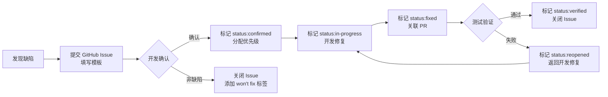

# Campus Bulletin Board System — 测试计划文档

---

## 一、测试概述

### 1.1 测试目的

验证校园论坛系统各功能模块的正确性、性能指标、稳定性与安全性，确保系统在交付前满足需求分析文档中的功能性与非功能性要求，为项目评分中的"系统测试"维度（权重 20%）提供可量化的交付物。

### 1.2 测试范围

| 测试类型 | 覆盖范围 | 工具/框架 |
|:---------|:---------|:-----------|
| 单元测试 | 后端 Service/Router 层逻辑、前端工具函数 | pytest + vitest |
| 功能测试（E2E） | 用户注册→登录→发帖→评论→点赞→通知→管理后台全链路 | Playwright |
| 性能测试 | 接口响应时间、并发吞吐量、资源占用 | Locust |
| 稳定性测试 | 长时间运行稳定性、异常恢复能力 | Locust + Docker Compose |
| 缺陷管理 | 全生命周期缺陷跟踪与度量 | GitHub Issues |

### 1.3 测试环境

| 环境 | 用途 | 配置 |
|:-----|:-----|:-----|
| 开发环境 | 单元测试、功能测试编写与调试 | 本地开发机，SQLite + fakeredis，无需 Docker |
| 集成测试环境 | Playwright E2E 测试 | 本地 Docker Compose（PostgreSQL + Redis + Garage + Mailpit） |
| 性能/稳定性测试环境 | Locust 压测与长时间运行测试 | 远程服务器已部署服务（与生产环境同构），独立数据库与缓存实例 |

---

## 二、单元测试

### 2.1 框架选型

| 层级 | 框架 | 说明 |
|:-----|:-----|:-----|
| 后端 | pytest 9+ / pytest-asyncio / httpx | 同步用例使用 FastAPI TestClient；异步用例使用 AsyncClient |
| 前端 | Vitest 4.x + @vue/test-utils + jsdom | 组件测试与工具函数测试 |

### 2.2 后端单元测试

#### 2.2.1 测试架构

```
backend/tests/
├── conftest.py              # 全局 conftest：fakeredis autouse fixture
├── test_auth.py             # 认证模块
├── test_users.py            # 用户模块
├── test_boards.py           # 板块模块
├── test_posts.py            # 帖子模块
├── test_comments.py         # 评论模块
├── test_likes.py             # 点赞模块
├── test_notifications.py    # 通知模块
├── test_admin.py            # 管理后台（async）
├── test_media.py            # 媒体上传
├── test_search.py           # 搜索模块
├── test_board_master.py     # 版主模块
├── test_announcements.py    # 公告模块
├── test_auth_concurrency.py # 认证并发测试
├── test_comments_concurrency.py  # 评论并发测试
└── test_likes_concurrency.py      # 点赞并发测试
```

#### 2.2.2 测试策略

- **数据库**：每个测试模块使用独立的 SQLite 文件，每个测试函数前后创建/销毁表（`create_all` / `drop_all`）
- **Redis**：使用 fakeredis 替换真实 Redis 连接（autouse fixture）
- **对象存储**：使用 `InMemoryStorageBackend` 替换 S3 存储
- **邮件服务**：Mock `EmailService.send_verification_email`，保留真实 JWT Token 生成逻辑
- **依赖注入覆盖**：通过 `app.dependency_overrides` 注入测试数据库会话和 Mock 服务

#### 2.2.3 测试用例清单

| 模块 | 用例类别 | 示例用例 |
|:-----|:---------|:---------|
| 认证 (auth) | 正向 | 注册成功、登录成功、登出成功、邮箱验证成功、密码重置成功 |
| 认证 (auth) | 异常 | 用户名重复注册、邮箱重复注册、未验证邮箱登录、错误密码登录、Token 黑名单拦截 |
| 用户 (users) | 正向 | 获取个人资料、更新昵称、获取公开资料、获取用户帖子列表 |
| 用户 (users) | 异常 | 未认证访问、访问不存在的用户 |
| 板块 (boards) | 正向 | 获取板块列表、按 slug 获取板块 |
| 板块 (boards) | 异常 | 板块不存在 |
| 帖子 (posts) | 正向 | 创建帖子、获取帖子列表、获取帖子详情、更新帖子、置顶/加精 |
| 帖子 (posts) | 异常 | 未认证发帖、帖子不存在、无权编辑他人帖子、板块不存在 |
| 评论 (comments) | 正向 | 创建一级评论、创建回复（楼中楼）、获取评论列表、更新评论 |
| 评论 (comments) | 异常 | 评论不存在的帖子、回复已删除的评论 |
| 点赞 (likes) | 正向 | 点赞帖子、取消点赞、点赞评论、取消点赞评论 |
| 点赞 (likes) | 异常 | 重复点赞、取消不存在的点赞、点赞不存在的对象 |
| 通知 (notifications) | 正向 | 获取通知列表、标记已读、标记全部已读、获取未读数量 |
| 通知 (notifications) | 异常 | 标记不存在的通知 |
| 管理后台 (admin) | 正向 | 获取系统统计、封禁/解封用户、创建/编辑板块 |
| 管理后台 (admin) | 异常 | 普通用户访问管理接口、封禁不存在的用户 |
| 媒体 (media) | 正向 | 上传图片、获取图片信息、删除图片、上传头像 |
| 媒体 (media) | 异常 | 上传超限文件、不允许的 MIME 类型、删除他人图片 |
| 搜索 (search) | 正向 | 关键词搜索、按板块筛选、按日期范围筛选 |
| 搜索 (search) | 异常 | 空关键词搜索 |
| 并发 | 竞态 | 并发注册同一用户名、并发点赞同一帖子、并发评论计数一致性 |

#### 2.2.4 执行命令

```bash
cd backend && uv run pytest                         # 运行全部后端测试
cd backend && uv run pytest tests/test_auth.py      # 运行单个模块
cd backend && uv run pytest -k "test_login"          # 按名称模式筛选
cd backend && uv run pytest --cov=app                # 带覆盖率报告
```

### 2.3 前端单元测试

#### 2.3.1 测试架构

```
frontend/src/__tests__/
├── markdown.test.ts    # Markdown 渲染与 XSS 过滤测试
└── media.test.ts       # 媒体 API 函数 Mock 测试
```

#### 2.3.2 测试策略

- **环境**：jsdom（通过 vitest.config.ts 配置）
- **组件测试**：使用 `@vue/test-utils` 的 `mount` / `shallowMount` 测试组件渲染、交互、事件
- **工具函数测试**：直接调用函数并断言返回值（如 `renderMarkdown`、`stripMarkdown`、`sanitizeHtml`）
- **API 函数测试**：Mock Axios 实例，验证请求参数和响应处理

#### 2.3.3 测试用例清单

| 模块 | 用例类别 | 示例用例 |
|:-----|:---------|:---------|
| Markdown 渲染 | 正向 | 渲染标题/列表/代码块、渲染数学公式（KaTeX）、渲染插入标记 |
| Markdown 渲染 | 安全 | XSS 脚本过滤、危险标签移除、`<script>` 标签移除 |
| Markdown 渲染 | 边界 | 空字符串、纯文本、中文字符 |
| 媒体 API | 正向 | 上传图片、获取图片信息、删除图片、附加图片到帖子、上传头像 |
| 媒体 API | 异常 | 上传失败时错误处理 |
| Store | 正向 | auth store 登录/登出状态管理、posts store 分页与乐观更新 |
| 组件 | 交互 | AppHeader 登出按钮、PaginationBar 翻页、PostForm 表单提交 |

#### 2.3.4 执行命令

```bash
cd frontend && pnpm run test:unit              # 运行全部前端测试
cd frontend && pnpm run test:unit -- --watch   # 监听模式
```

---

## 三、功能测试（E2E）

### 3.1 框架选型：Playwright

选择 Playwright 作为 E2E 测试框架的理由：

| 对比项 | Playwright | Cypress |
|:-------|:-----------|:---------|
| 多浏览器支持 | Chromium / Firefox / WebKit | 仅 Chromium（实验性 Firefox） |
| 并行执行 | 原生支持多 Worker 并行 | 需付费版 |
| API 测试 | 内置 `request` 上下文 | 需额外插件 |
| Vue 支持 | 官方适配 | 官方适配 |
| 异步等待 | 自动等待机制完善 | 需手动配置较多 |
| TypeScript | 原生支持 | 原生支持 |

### 3.2 测试架构

```
frontend/e2e/
├── playwright.config.ts       # Playwright 配置
├── fixtures/                   # 测试夹具（测试用户、测试数据）
│   └── test-data.ts
├── pages/                      # Page Object Model 页面对象
│   ├── login.page.ts
│   ├── register.page.ts
│   ├── home.page.ts
│   ├── board.page.ts
│   ├── post-detail.page.ts
│   ├── post-create.page.ts
│   ├── profile.page.ts
│   ├── notification.page.ts
│   └── admin/
│       ├── dashboard.page.ts
│       ├── users.page.ts
│       └── boards.page.ts
└── specs/                      # 测试用例
    ├── auth.spec.ts
    ├── post.spec.ts
    ├── comment.spec.ts
    ├── like.spec.ts
    ├── notification.spec.ts
    ├── search.spec.ts
    ├── media.spec.ts
    └── admin.spec.ts
```

### 3.3 Playwright 配置

```typescript
// playwright.config.ts
import { defineConfig } from "@playwright/test";

export default defineConfig({
  testDir: "./e2e/specs",
  fullyParallel: true,
  forbidOnly: !!process.env.CI,
  retries: process.env.CI ? 2 : 0,
  workers: process.env.CI ? 1 : undefined,
  reporter: "html",
  timeout: 30000,
  use: {
    baseURL: process.env.E2E_BASE_URL || "http://localhost:5173",
    trace: "on-first-retry",
    screenshot: "only-on-failure",
  },
  projects: [
    { name: "chromium", use: { browserName: "chromium" } },
  ],
  webServer: {
    command: "docker compose up",
    port: 80,
    reuseExistingServer: !process.env.CI,
  },
});
```

### 3.4 核心测试场景

#### 3.4.1 认证流程

| 用例 ID | 场景描述 | 操作步骤 | 预期结果 |
|:--------|:---------|:---------|:---------|
| E2E-AUTH-001 | 用户注册 | 填写用户名/邮箱/密码 → 提交注册 → 查收验证邮件 → 点击验证链接 | 注册成功，邮箱验证通过 |
| E2E-AUTH-002 | 用户登录 | 输入用户名和密码 → 点击登录 | 跳转首页，导航栏显示用户名 |
| E2E-AUTH-003 | 邮箱未验证登录 | 注册后不验证邮箱 → 尝试登录 | 登录被拒，提示需要邮箱验证 |
| E2E-AUTH-004 | 用户登出 | 点击导航栏用户菜单 → 点击登出 | 返回登录页，Token 清除 |
| E2E-AUTH-005 | 密码重置 | 登录后进入个人中心 → 输入旧密码与新密码 → 提交 | 密码修改成功，可用新密码登录 |
| E2E-AUTH-006 | 已登录用户访问登录页 | 登录后访问 /login | 重定向到首页 |

#### 3.4.2 帖子流程

| 用例 ID | 场景描述 | 操作步骤 | 预期结果 |
|:--------|:---------|:---------|:---------|
| E2E-POST-001 | 浏览板块列表 | 访问首页 | 显示所有板块卡片 |
| E2E-POST-002 | 浏览板块帖子 | 点击某板块 | 显示该板块下帖子列表，置顶帖优先 |
| E2E-POST-003 | 发帖 | 点击发帖按钮 → 选择板块 → 填写标题和内容 → 提交 | 帖子创建成功，出现在列表中 |
| E2E-POST-004 | 编辑帖子 | 在自己帖子详情页点击编辑 → 修改内容 → 保存 | 帖子内容更新 |
| E2E-POST-005 | 删除帖子 | 在自己帖子详情页点击删除 → 确认 | 帖子从列表消失 |
| E2E-POST-006 | 帖子详情 | 点击帖子标题 | 显示完整正文、作者信息、评论列表 |
| E2E-POST-007 | 访客浏览 | 未登录状态访问首页 | 可浏览板块和帖子，但评论框隐藏 |

#### 3.4.3 评论与互动

| 用例 ID | 场景描述 | 操作步骤 | 预期结果 |
|:--------|:---------|:---------|:---------|
| E2E-COMMENT-001 | 发表一级评论 | 在帖子详情页输入评论 → 提交 | 评论出现在列表中，帖子评论数 +1 |
| E2E-COMMENT-002 | 回复评论（楼中楼） | 点击某条评论的回复按钮 → 输入内容 → 提交 | 回复出现在该评论下方缩进显示 |
| E2E-COMMENT-003 | 删除评论 | 点击自己评论的删除按钮 → 确认 | 评论标记为已删除，回复数 -1 |
| E2E-LIKE-001 | 点赞帖子 | 点击帖子详情页的点赞按钮 | 点赞数 +1，按钮变为已点赞状态 |
| E2E-LIKE-002 | 取消点赞 | 再次点击已点赞按钮 | 点赞数 -1，按钮恢复 |
| E2E-LIKE-003 | 点赞评论 | 点击评论的点赞按钮 | 评论点赞数 +1 |

#### 3.4.4 通知

| 用例 ID | 场景描述 | 操作步骤 | 预期结果 |
|:--------|:---------|:---------|:---------|
| E2E-NOTIF-001 | 收到评论通知 | 用户 B 评论用户 A 的帖子 → 用户 A 查看通知 | 通知列表显示"xxx 评论了你的帖子" |
| E2E-NOTIF-002 | 收到点赞通知 | 用户 B 点赞用户 A 的帖子 → 用户 A 查看通知 | 通知列表显示"xxx 赞了你的帖子" |
| E2E-NOTIF-003 | 未读计数 | 存在未读通知 → 查看导航栏 | 铃铛图标显示未读数量 |
| E2E-NOTIF-004 | 标记全部已读 | 点击"全部已读"按钮 | 所有通知标记为已读，未读数量归零 |

#### 3.4.5 搜索

| 用例 ID | 场景描述 | 操作步骤 | 预期结果 |
|:--------|:---------|:---------|:---------|
| E2E-SEARCH-001 | 关键词搜索 | 在搜索框输入关键词 → 提交 | 显示包含关键词的帖子列表 |
| E2E-SEARCH-002 | 按板块筛选 | 搜索时选择板块筛选条件 | 仅显示该板块下的搜索结果 |

#### 3.4.6 管理后台

| 用例 ID | 场景描述 | 操作步骤 | 预期结果 |
|:--------|:---------|:---------|:---------|
| E2E-ADMIN-001 | 管理员访问后台 | 管理员登录 → 访问 /admin | 显示管理仪表盘 |
| E2E-ADMIN-002 | 普通用户拒绝访问 | 普通用户访问 /admin | 重定向到首页 |
| E2E-ADMIN-003 | 封禁用户 | 管理员在用户管理页点击封禁 | 用户状态变为 banned |
| E2E-ADMIN-004 | 创建板块 | 管理员点击创建板块 → 填写信息 → 提交 | 新板块出现在列表中 |
| E2E-ADMIN-005 | 置顶帖子 | 管理员在帖子详情页点击置顶 | 帖子标记为置顶，列表中优先显示 |

#### 3.4.7 媒体上传

| 用例 ID | 场景描述 | 操作步骤 | 预期结果 |
|:--------|:---------|:---------|:---------|
| E2E-MEDIA-001 | 上传头像 | 用户在个人中心上传头像图片 | 头像更新成功 |
| E2E-MEDIA-002 | 发帖附带图片 | 发帖时上传图片 → 提交 | 帖子详情页显示图片 |
| E2E-MEDIA-003 | 上传超限文件 | 上传超过 5MB 的文件 | 提示文件过大 |

### 3.5 执行命令

```bash
cd frontend && pnpm exec playwright install         # 首次安装浏览器
cd frontend && pnpm exec playwright test             # 运行全部 E2E 测试
cd frontend && pnpm exec playwright test --ui        # 交互式 UI 模式
cd frontend && pnpm exec playwright test --project=chromium  # 仅 Chromium
cd frontend && pnpm exec playwright show-report      # 查看 HTML 报告
```

---

## 四、性能测试

### 4.1 工具选型：Locust

选择 Locust 的理由：

| 对比项 | Locust | k6 | JMeter |
|:-------|:-------|:----|:-------|
| 脚本语言 | Python（与后端同栈） | JavaScript | XML / Groovy |
| 学习曲线 | 低（团队熟悉 Python） | 中 | 高 |
| 分布式压测 | 原生支持 | 需 Cloud 版 | 支持 |
| FastAPI 适配 | 优秀（同生态） | 良好 | 良好 |
| 实时监控 | Web UI 实时图表 | CLI + Grafana | GUI 图表 |
| 安装方式 | pip install locust | 独立二进制 | Java 应用 |

**结论**：Locust 与后端 Python 生态一致，脚本编写与维护成本低，Web UI 提供直观的实时监控，适合本项目规模。

### 4.2 测试架构

```
backend/perftests/
├── locustfile.py           # Locust 测试脚本入口
├── config.py               # 测试配置（用户池、常量）
├── tasks/
│   ├── auth_tasks.py       # 认证相关任务集
│   ├── post_tasks.py       # 帖子相关任务集
│   ├── comment_tasks.py    # 评论相关任务集
│   ├── like_tasks.py       # 点赞相关任务集
│   ├── search_tasks.py     # 搜索相关任务集
│   └── admin_tasks.py      # 管理操作任务集
└── reports/                # 性能测试报告输出目录
```

### 4.3 性能指标与目标

参考需求分析文档中的非功能性需求（5.2 节），设定以下目标：

| 指标 | 目标值 | 测试方法 |
|:-----|:-------|:---------|
| 帖子列表查询响应时间（P95） | < 200ms | 模拟 50 并发用户持续请求 `/api/v1/posts` |
| 单表分页查询响应时间（P95） | < 100ms | 模拟 50 并发用户请求板块列表 |
| 登录接口响应时间（P95） | < 300ms | 模拟 20 并发用户同时登录 |
| 帖子详情响应时间（P95） | < 150ms | 模拟 50 并发用户请求帖子详情 |
| 系统并发用户承载 | 500+ | 逐步增加虚拟用户至 500，观察错误率 |
| 系统可用性 | 99.9% | 稳定性测试中持续运行，监控错误率 |

### 4.4 性能测试场景

#### 4.4.1 基准测试（Baseline）

验证系统在正常负载下的响应时间和吞吐量。

```python
# locustfile.py 示例（简化）
from locust import HttpUser, task, between

class BBSUser(HttpUser):
    wait_time = between(1, 3)
    host = "http://localhost:8000"

    def on_start(self):
        # 登录获取 Token
        resp = self.client.post("/api/v1/auth/login", json={
            "username": "testuser",
            "password": "testpassword"
        })
        self.token = resp.json()["data"]["access_token"]
        self.headers = {"Authorization": f"Bearer {self.token}"}

    @task(5)
    def browse_boards(self):
        self.client.get("/api/v1/boards", headers=self.headers)

    @task(10)
    def browse_posts(self):
        self.client.get("/api/v1/posts?page=1&page_size=20", headers=self.headers)

    @task(3)
    def view_post_detail(self):
        self.client.get(f"/api/v1/posts/{post_id}", headers=self.headers)

    @task(2)
    def create_comment(self):
        self.client.post("/api/v1/comments", json={...}, headers=self.headers)

    @task(1)
    def search_posts(self):
        self.client.get("/api/v1/search?keyword=测试", headers=self.headers)
```

| 参数 | 设定值 |
|:-----|:-------|
| 并发用户数 | 50 |
| 持续时间 | 5 分钟 |
| 用户等待时间 | 1-3 秒 |
| 数据预置 | 100 用户，10 板块，1000 帖子 |

#### 4.4.2 负载测试（Load Test）

逐步增加并发用户，确定系统在目标负载下的表现。

| 阶段 | 并发用户 | 持续时间 | 目的 |
|:-----|:---------|:---------|:-----|
| 热身 | 10 → 50 | 2 分钟 | 预热缓存 |
| 目标负载 | 50 → 200 | 5 分钟 | 验证正常负载 |
| 高负载 | 200 → 500 | 5 分钟 | 验证并发目标 |
| 峰值 | 500 → 峰值 | 3 分钟 | 寻找性能拐点 |

#### 4.4.3 压力测试（Stress Test）

超出系统设计负载，验证系统在超负荷时的降级行为。

| 阶段 | 并发用户 | 持续时间 | 目的 |
|:-----|:---------|:---------|:-----|
| 热身 | 10 → 100 | 1 分钟 | 预热 |
| 持续增压 | 100 → 1000 | 5 分钟 | 超出 500 设计容量 |
| 观察恢复 | 降至 50 | 3 分钟 | 观察系统恢复能力 |

#### 4.4.4 接口专项测试

针对需求分析文档中的响应时间目标，单独测试关键接口：

| 场景 | 接口 | 并发数 | 持续时间 | 验证指标 |
|:-----|:-----|:-------|:---------|:---------|
| 登录性能 | `POST /api/v1/auth/login` | 50 | 3 分钟 | P95 < 300ms |
| 帖子列表 | `GET /api/v1/posts` | 100 | 3 分钟 | P95 < 200ms |
| 帖子详情 | `GET /api/v1/posts/{id}` | 100 | 3 分钟 | P95 < 150ms |
| 板块列表 | `GET /api/v1/boards` | 100 | 3 分钟 | P95 < 100ms |
| 创建帖子 | `POST /api/v1/posts` | 20 | 3 分钟 | P95 < 500ms |
| 搜索 | `GET /api/v1/search` | 50 | 3 分钟 | P95 < 500ms |

### 4.5 执行命令

```bash
cd backend && pip install locust                              # 安装 Locust
cd backend/perftests && locust -f locustfile.py              # Web UI 模式（默认 :8089）
cd backend/perftests && locust -f locustfile.py --headless \  # 无头模式
    -u 200 -r 20 -t 5m --host=http://localhost:8000
cd backend/perftests && locust -f locustfile.py --headless \  # 分布式压测（主节点）
    --master -u 500 -r 50 -t 10m
cd backend/perftests && locust -f locustfile.py --worker     # 分布式压测（工作节点）
```

---

## 五、稳定性测试

### 5.1 测试环境选择

**稳定性测试应在远程服务器已部署的服务上进行**，理由如下：

| 对比项 | 开发环境 | 远程部署环境 |
|:-------|:---------|:------------|
| 数据库 | SQLite（测试用） | PostgreSQL（真实环境） |
| 缓存 | fakeredis | 真实 Redis |
| 存储 | InMemoryStorage | Garage S3 |
| 网络 | 本地 localhost | 真实网络延迟 |
| 并发模型 | 单进程 | Uvicorn 多 Worker |
| 资源限制 | 开发机共享资源 | 独立容器资源 |

在远程部署环境测试可以更真实地反映系统在接近生产条件下的行为。但开发环境可用于编写和调试稳定性测试脚本，验证通过后再在远程环境执行。

### 5.2 测试方法

#### 5.2.1 长时间运行测试（Soak Test）

验证系统在持续负载下是否出现内存泄漏、连接池耗尽、性能退化等问题。

| 参数 | 设定值 |
|:-----|:-------|
| 并发用户数 | 50（正常负载水平） |
| 持续时间 | 4 小时 |
| 用户行为 | 混合场景（浏览 + 发帖 + 评论 + 点赞） |
| 监控指标 | 内存使用、数据库连接数、响应时间趋势、错误率 |

**判断标准**：

- 响应时间不应随时间推移持续上升（允许波动 ±15%）
- 错误率应保持在 < 1%
- 内存使用不应出现持续上升趋势
- 数据库连接数不应持续增长

#### 5.2.2 异常恢复测试

验证系统在各类异常场景后的恢复能力。

| 测试场景 | 模拟方法 | 预期结果 |
|:---------|:---------|:---------|
| 数据库重启 | `docker compose restart postgres` | 短暂请求失败后自动恢复，无数据丢失 |
| Redis 重启 | `docker compose restart redis` | Token 黑名单暂时失效，恢复后正常工作 |
| 后端重启 | `docker compose restart backend` | 请求恢复后正常响应，无连接泄漏 |
| 高并发涌入 | Locust 突增至 500 用户 | 系统不崩溃，排队响应，错误率可控 |
| 单点接口过载 | Locust 持续请求同一接口 | 不影响其他接口正常响应 |

#### 5.2.3 资源监控

在稳定性测试期间，持续监控以下资源指标：

| 监控项 | 工具 | 告警阈值 |
|:-------|:-----|:---------|
| CPU 使用率 | Docker stats / htop | > 80% 持续 5 分钟 |
| 内存使用率 | Docker stats | > 85% |
| 磁盘 I/O | iostat | 等待队列 > 10 |
| 网络连接数 | ss / netstat | 接近系统限制 |
| PostgreSQL 连接数 | `pg_stat_activity` | > 配置上限 80% |
| Redis 内存 | `redis-cli info memory` | > 配置上限 80% |
| API 响应时间 | Locust 实时图表 | P95 > 目标值 2 倍 |
| 错误率 | Locust 实时图表 | > 5% |

数据收集脚本示例：

```bash
# 持续收集 Docker 容器资源使用情况
docker stats --format "table {{.Name}}\t{{.CPUPerc}}\t{{.MemUsage}}\t{{.MemPerc}}" \
    bbs-postgres-1 bbs-redis-1 bbs-backend-1 bbs-frontend-1 \
    >> perftests/reports/resource_usage.log &
```

### 5.3 执行流程

```
1. 在本地编写并调试 Locust 稳定性测试脚本
2. 确保远程服务器已部署最新版本（docker compose up -d）
3. 预置测试数据（用户、帖子、评论、通知）
4. 启动资源监控脚本
5. 执行 Locust 长时间运行测试（4 小时）
6. 每小时执行一次异常恢复测试场景
7. 测试结束后收集日志、资源数据、Locust 报告
8. 分析数据，撰写稳定性测试报告
```

---

## 六、缺陷管理

### 6.1 什么是缺陷管理

缺陷管理（Defect Management）是软件工程中系统化地识别、记录、分类、跟踪和解决软件缺陷（Bug）的全生命周期过程。

**缺陷管理的核心目标**：

- **可追溯性**：每个缺陷从发现到修复都有完整记录，避免遗漏
- **可见性**：团队成员随时了解当前缺陷状态与分布
- **质量度量**：通过缺陷数据（密度、修复率、重新打开率）量化软件质量
- **过程改进**：分析缺陷根因，改进开发与测试流程

### 6.2 缺陷生命周期

```
新建(New) → 已确认(Confirmed) → 处理中(In Progress) → 已修复(Fixed) → 已验证(Verified) → 已关闭(Closed)
                                              ↓
                                         优先级排序
                                              ↓
                                         已确认 → 延期(Deferred) → 后续版本处理

已修复(Fixed) → 验证失败 → 重新打开(Reopened) → 处理中(In Progress)
```

| 状态 | 说明 |
|:-----|:-----|
| New（新建） | 测试人员发现并提交缺陷 |
| Confirmed（已确认） | 开发人员确认缺陷存在 |
| In Progress（处理中） | 开发人员正在修复 |
| Fixed（已修复） | 开发人员已完成修复，等待验证 |
| Verified（已验证） | 测试人员验证修复有效 |
| Closed（已关闭） | 缺陷流程结束 |
| Reopened（重新打开） | 验证失败，退回处理 |
| Deferred（延期） | 确认但暂不修复，推迟至后续版本 |

### 6.3 缺陷分类与优先级

#### 6.3.1 严重程度（Severity）

| 等级 | 定义 | 示例 |
|:-----|:-----|:-----|
| S1 — 致命 | 系统崩溃、数据丢失、安全漏洞 | 登录接口返回 500、数据库连接池耗尽、SQL 注入 |
| S2 — 严重 | 核心功能不可用，无替代方案 | 发帖接口返回 500、JWT 验证失败、帖子列表无法加载 |
| S3 — 一般 | 非核心功能异常或核心功能有替代方案 | 搜索结果排序不正确、通知未读计数延迟 |
| S4 — 轻微 | UI 显示问题、文案错误、体验不佳 | 按钮对齐偏移、中文翻译缺失、加载状态提示不清 |

#### 6.3.2 优先级（Priority）

| 等级 | 定义 | 修复时限 |
|:-----|:-----|:---------|
| P0 — 紧急 | 阻断性缺陷，必须立即修复 | 24 小时内 |
| P1 — 高 | 影响核心流程，必须尽快修复 | 3 个工作日内 |
| P2 — 中 | 影响非核心功能或可绕过 | 当前迭代内 |
| P3 — 低 | 体验优化类，可延后 | 后续迭代 |

#### 6.3.3 严重程度与优先级对应关系

严重程度和优先级不完全对应，需根据业务影响综合判断：

| 场景 | 严重程度 | 优先级 | 说明 |
|:-----|:---------|:-------|:-----|
| 登录接口 500 错误 | S1 | P0 | 核心流程阻断 |
| 搜索结果偶尔不准确 | S3 | P2 | 非核心功能 |
| 管理后台拼写错误 | S4 | P3 | 不影响功能 |
| 管理后台统计数值偏移 | S2 | P1 | 管理功能受损 |

### 6.4 缺陷报告模板

使用 GitHub Issues 作为缺陷管理工具，每个 Issue 按以下模板填写：

```markdown
## 缺陷描述
[简要描述问题]

## 复现步骤
1. [步骤一]
2. [步骤二]
3. [步骤三]

## 预期行为
[描述期望的正确行为]

## 实际行为
[描述实际发生的行为]

## 环境信息
- 浏览器/系统：
- 后端版本/提交：
- 前端版本/提交：

## 截图/日志
[附截图或错误日志]

## 严重程度 / 优先级
- 严重程度：S1 / S2 / S3 / S4
- 优先级：P0 / P1 / P2 / P3
```

### 6.5 标签体系

使用 GitHub Labels 对缺陷进行分类：

| 标签 | 颜色 | 用途 |
|:-----|:-----|:-----|
| `bug` | 红色 | 确认为缺陷 |
| `severity:S1` | 深红 | 致命缺陷 |
| `severity:S2` | 橙色 | 严重缺陷 |
| `severity:S3` | 黄色 | 一般缺陷 |
| `severity:S4` | 浅蓝 | 轻微缺陷 |
| `priority:P0` | 深红 | 紧急修复 |
| `priority:P1` | 橙色 | 高优先级 |
| `priority:P2` | 黄色 | 中优先级 |
| `priority:P3` | 浅绿 | 低优先级 |
| `module:auth` | 紫色 | 认证模块 |
| `module:post` | 紫色 | 帖子模块 |
| `module:comment` | 紫色 | 评论模块 |
| `module:like` | 紫色 | 点赞模块 |
| `module:notification` | 紫色 | 通知模块 |
| `module:admin` | 紫色 | 管理后台 |
| `module:search` | 紫色 | 搜索模块 |
| `module:media` | 紫色 | 媒体模块 |
| `status:confirmed` | 蓝色 | 已确认 |
| `status:in-progress` | 蓝色 | 修复中 |
| `status:fixed` | 绿色 | 已修复 |
| `status:verified` | 绿色 | 已验证 |

### 6.6 缺陷度量指标

| 指标 | 计算方式 | 目标值 |
|:-----|:---------|:-------|
| 缺陷密度 | 缺陷总数 / 代码行数（KLOC） | < 10 个/KLOC |
| 缺陷修复率 | 已修复缺陷数 / 缺陷总数 × 100% | > 95% |
| 缺陷重新打开率 | 重新打开缺陷数 / 已修复缺陷数 × 100% | < 10% |
| P0/P1 缺陷修复率 | P0+P1 已修复数 / P0+P1 总数 × 100% | 100% |
| 缺陷发现率（按迭代） | 本迭代新发现 / 本迭代总缺陷 × 100% | 趋势递减 |
| 平均修复时间 | Fix 时间 - New 时间 | P0 < 24h, P1 < 3d |

### 6.7 缺陷管理工作流



---

## 七、测试进度与人员安排

### 7.1 测试阶段划分

| 阶段 | 时间 | 内容 | 负责人 |
|:-----|:-----|:-----|:-------|
| 测试准备 | 第 5 周 | 编写 E2E 测试用例、Locust 脚本、测试数据预置 | 系统测试 |
| 单元测试完善 | 第 5 周 | 补充后端/前端单元测试覆盖率 | 开发者 |
| 功能测试执行 | 第 5-6 周 | Playwright E2E 全链路测试 | 系统测试 |
| 性能测试 | 第 6 周 | Locust 基准/负载/压力测试 | 系统测试 |
| 稳定性测试 | 第 6 周 | 长时间运行测试 + 异常恢复测试 | 系统测试 |
| 缺陷修复与回归 | 第 6 周 | 修复发现的缺陷，回归验证 | 全员 |
| 测试报告 | 第 6 周 | 汇总测试结果，撰写测试报告 | 系统测试 |

### 7.2 测试交付物

| 交付物 | 形式 | 说明 |
|:-------|:-----|:-----|
| 单元测试代码 | Git 仓库 `backend/tests/` + `frontend/src/__tests__/` | pytest + vitest 测试用例 |
| E2E 测试代码 | Git 仓库 `frontend/e2e/` | Playwright 测试脚本 |
| 性能测试脚本 | Git 仓库 `backend/perftests/` | Locust 测试脚本 |
| 性能测试报告 | Markdown 文档 | 响应时间、吞吐量、资源使用分析 |
| 稳定性测试报告 | Markdown 文档 | 长时间运行结果、异常恢复验证结果 |
| 缺陷清单 | GitHub Issues | 带 severity/priority/module 标签的缺陷列表 |
| 测试总结报告 | Markdown 文档 | 覆盖率、缺陷统计、质量评估 |

---

## 八、CI/CD 集成

### 8.1 现有 CI 流程

项目已在 `.github/workflows/ci.yml` 中配置 4 个 CI 作业：

| 作业 | 内容 | 触发条件 |
|:-----|:-----|:---------|
| backend-lint | ruff + black check | Push / PR |
| frontend-lint | eslint + oxlint + prettier + vue-tsc | Push / PR |
| backend-test | pytest | Push / PR |
| frontend-test | vitest | Push / PR |

### 8.2 测试相关 CI 扩展

建议在 CI 流程中增加：

```yaml
# .github/workflows/ci.yml 新增作业示例
e2e-test:
  runs-on: ubuntu-latest
  needs: [backend-test, frontend-test]
  services:
    postgres:
      image: postgres:18-alpine
      env:
        POSTGRES_DB: bbs_test
        POSTGRES_USER: bbs_user
        POSTGRES_PASSWORD: bbs_password
      ports: ["5432:5432"]
    redis:
      image: redis:7-alpine
      ports: ["6379:6379"]
  steps:
    - uses: actions/checkout@v4
    - name: Install frontend deps
      run: cd frontend && pnpm install
    - name: Install Playwright
      run: cd frontend && pnpm exec playwright install --with-deps chromium
    - name: Run E2E tests
      run: cd frontend && pnpm exec playwright test
    - name: Upload test results
      if: failure()
      uses: actions/upload-artifact@v4
      with:
        name: playwright-report
        path: frontend/playwright-report/
```

---

## 附录

### 附录 A：测试数据预置脚本

E2E 测试和性能测试需要预置测试数据：

```python
# backend/perftests/seed_data.py 示例
import httpx

BASE_URL = "http://localhost:8000/api/v1"

def seed_test_data():
    """预置测试数据：用户、板块、帖子、评论"""
    # 1. 创建测试用户（含管理员）
    # 2. 创建板块
    # 3. 创建帖子（含置顶、加精）
    # 4. 创建评论（含一级评论和回复）
    # 5. 创建点赞
    pass
```

### 附录 B：参考文档

| 文档 | 路径 |
|:-----|:-----|
| 需求分析 | docs/RequirementAnalysis.md |
| 项目计划 | docs/ProjectPlan.md |
| 系统设计 | docs/SystemDesign.md |
| 数据库设计 | docs/DatabaseDesign.md |
| 开发规范 | docs/DevelopmentSpecification.md |
| 组件设计 | docs/ComponentDesign.md |